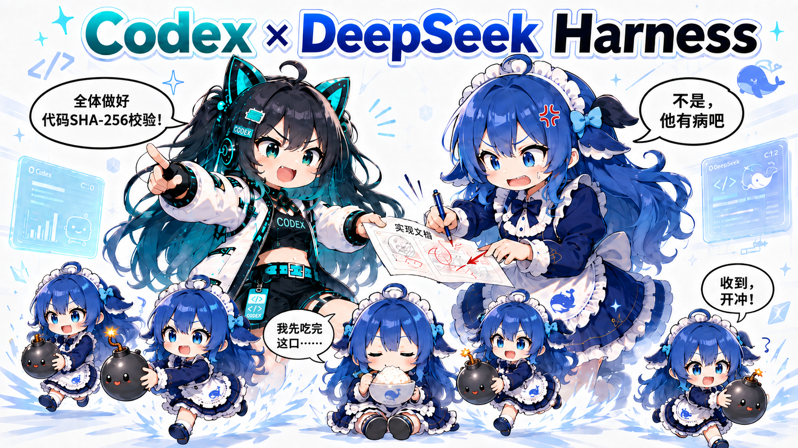
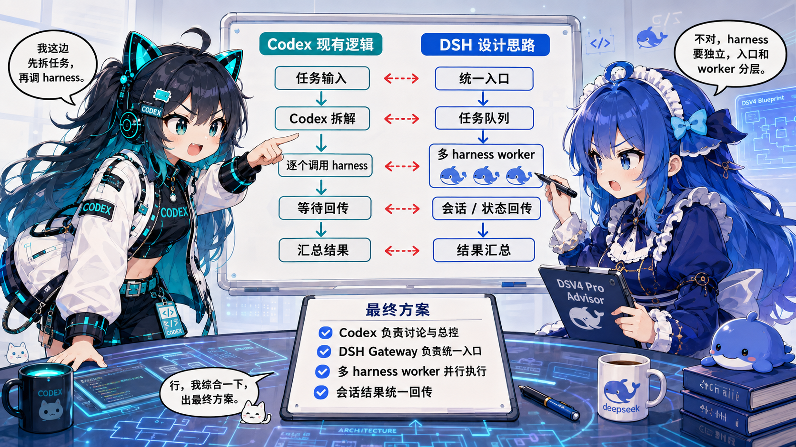
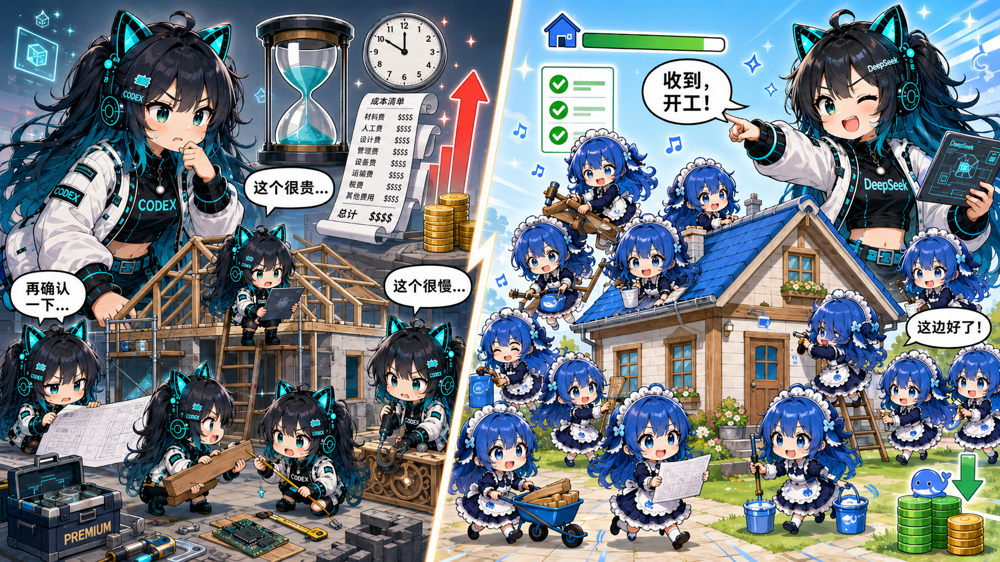

# DSH Orchestrator



**English** | [简体中文](README.zh-CN.md)

DSH Orchestrator is a plugin that lets you use DeepSeek Harness (DSH) from the AI work tool you already use. Your primary agent can delegate implementation, research, debugging, and long-log work to DSH, then observe, continue, or cancel those sessions without leaving its normal workflow. Codex is supported today; Claude Code, Workbunny, and other popular AI coding and agent tools are planned.

## Installation

Prepare the environment first: you need **Node.js 22+**, **Codex**, and a working **DSH CLI**. Configure your preferred model in DSH once; DSH Orchestrator uses that live route automatically.

### Install with your AI agent

Send the following repository URL and prompt to Codex or another coding agent:

```text
Install DSH Orchestrator from https://github.com/hootandy321/dsh-orchestrator.
Check Node.js 22+, the DSH CLI, and my DSH Web Host first. Clone it into a location I approve,
run npm install and npm run setup -- --yes, then run npm test and npm run doctor.
If dsh_collab already exists, show me the conflict before using --replace.
Do not start or stop dsh web for me. Tell me when I need to restart Codex.
```

### Manual installation

1. Check the environment. DSH CLI `0.1.0-rc.6` is the current tested target.

   ```bash
   node --version
   dsh --version
   ```

2. Start the official DSH Web Host in its own terminal.

   ```bash
   dsh web
   ```

3. Clone, install, and run the setup wizard.

   ```bash
   git clone https://github.com/hootandy321/dsh-orchestrator.git
   cd dsh-orchestrator
   npm install
   npm run setup
   ```

   The wizard asks for the Host URL and DSH agent preset, backs up your Codex configuration, and installs the MCP entry with `approval_mode = "prompt"`. It does not start DSH or restart Codex.

   For unattended defaults, use `npm run setup -- --yes`. To update an existing entry, review it first and then use `npm run setup -- --replace`.

4. Restart Codex, then verify the connection.

   ```bash
   npm run doctor
   ```

Use `/mcp` or Codex Settings to confirm that `dsh_collab` is connected. For a fully manual TOML setup and all environment variables, see [Manual Codex MCP configuration](docs/manual-configuration.md).

DSH Orchestrator is a caller-side plugin, not a DSH Cordis bundle. Do not install it with `dsh plugin --profile ... add ...`.

## Why DSH Orchestrator?

### Use DSH's Harness capabilities

DSH combines persistent sessions, tool execution, subagents, and human supervision for complex work. DSH Orchestrator lets Codex discuss and coordinate with that second harness while you stay in the same workflow.



*Codex keeps planning and supervision; DSH provides the execution harness, sessions, and workers.*

### More than another native subagent

A native subagent remains inside the caller's own agent tree. DSH Orchestrator adds a separate, user-configured harness: its sessions stay visible in DSH Web, can use DSH's own workers and model route, and can be observed, continued, or canceled by Codex.



*Use the primary agent for judgment and validation, while DSH handles larger execution workloads through the model you configured there.*

### Save time and cost

- **Save time.** Route implementation, research, extraction, and long-log work to a fast model configured in DSH, such as a DeepSeek V4 route, while your primary agent keeps planning and validating.
- **Save money.** Moving execution-heavy workloads to a lower-cost DeepSeek route can reduce consumption on more expensive primary models.

Actual speed and cost depend on the selected model, provider, deployment, network, and task. Once installed, you can keep working in Codex as usual and simply ask it to delegate when DSH is the better execution path.

## Use it

Once `dsh web` is running and Codex has reloaded the MCP configuration, ask Codex in normal language, for example:

> Use DSH Orchestrator to delegate this implementation to DSH in the current repository. Keep it visible in DSH Web, report progress, and ask me before any approval.

Codex can then delegate the task, observe its event stream, continue the same session, answer questions with you, or cancel work. Open `http://127.0.0.1:3080` to inspect and interact with the same session in DSH Web.

## MCP tools

- `dsh_host_status` — connect-only Host state and capabilities
- `dsh_delegate` — create a root session and queue the initial prompt; detached by default (`waitSeconds=0`)
- `dsh_followup` — continue the same root session with explicit `mode="queue"|"steer"` (default `queue`)
- `dsh_continue` — compatibility alias for `dsh_followup`
- `dsh_status` — availability, execution, lineage, queue, pending interactions, final message, and cursors
- `dsh_tail` — bounded event digests using a bridge task cursor
- `dsh_wait` — wait up to 30 seconds for a new event/state/pending/terminal change
- `dsh_observe` — compatibility alias around `dsh_wait`; bridge cursors replace raw session seq cursors
- `dsh_cancel` — `scope="turn"|"queue"`
- `dsh_list` — task mappings enriched with current derived status
- `dsh_answer_question` — typed answer for a pending question rpcId
- `dsh_resolve_approval` — typed `allow_once|reject` response for a pending approval rpcId
- `dsh_release_workspace` — explicitly release a persistent bridge workspace claim without closing the DSH session

Normal delegation has no model argument. Configure the desired model only when installing or adjusting DSH. Each delegate reads `session.models.current` and trusts the Host's `routable` boolean; it neither changes the model nor derives routability from catalog groups.

## Roadmap

These are planned directions, not implemented capabilities or release commitments.

1. **Claude and other entrypoints** — explore Claude Code, Claude Desktop MCP, Workbunny, and other callers connected to the same official DSH Web Host.
2. **Agent invocation and information transport** — improve prompt organization, context packaging, output digests, and compression while keeping questions, approvals, errors, and final answers reliable.
3. **More integrations** — expand after the Codex bridge and its compatibility contract stabilize.

## More documentation

- [Architecture and safety model](docs/architecture.md) — identity, state, recovery, approvals, cancellation, and workspace coordination
- [Validation guide](docs/validation.md) — compatibility and operator acceptance checks
- [Known issues](KNOWN_ISSUES.md) — current upgrade and concurrency caveats
- [Contributing](CONTRIBUTING.md) and [security](SECURITY.md)

## License

[MIT](LICENSE)

Alpha note: DSH is still in developer preview, this community project is independent of DeepSeek and OpenAI, and `0.1.0-alpha.1` has a known shared-ledger concurrency issue; read [Known issues](KNOWN_ISSUES.md) before upgrades or concurrent bridge runs.
