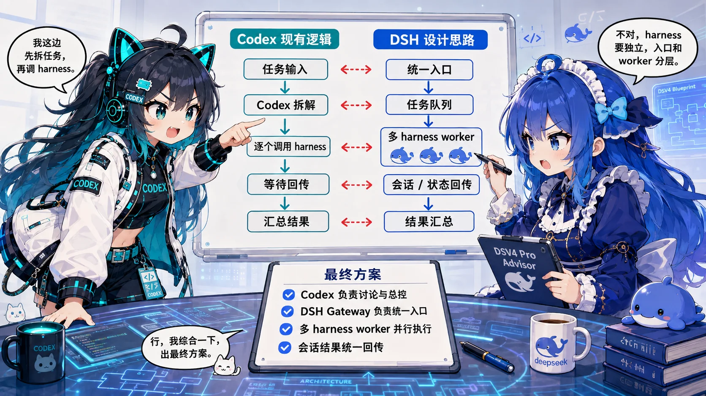

# dsh-Agentlink


[](https://github.com/hootandy321/dsh-Agentlink/actions/workflows/ci.yml) [](https://github.com/hootandy321/dsh-Agentlink/stargazers) [](LICENSE) [](https://nodejs.org/) [](https://www.deepseek.com/harness/en/)

[English](README.md) | **简体中文**

dsh-Agentlink 是一个让你直接在原本的 AI 工作工具里调用 DeepSeek Harness（DSH）协作的插件。你的主 agent 可以把实现、调研、调试和长日志整理等任务交给 DSH，再在原有工作流中观察、继续或取消对应会话。当前支持 Codex 与 Claude Code，ZCode 正在适配，OpenCode、Workbuddy 等主流 AI coding 与 agent 工具待后续接入。

## 调用方支持情况

| 调用方 | 状态 | 安装方式或可用性 |
|---|---|---|
| Codex | ✅ 已支持 | `npm run setup` |
| Claude Code | ✅ 已支持 | `npm run setup:claude -- --project /项目的绝对路径` |
| ZCode | 🚧 适配中 | 正在验证适配方式与打包形式 |
| OpenCode | ⏳ 待适配 | 尚不可用 |
| Workbuddy | ⏳ 待适配 | 尚不可用 |

目前只有标记为**已支持**的调用方在本仓库中提供可用安装路径。“适配中”和“待适配”是当前方向，不代表发布承诺。

## 安装

安装前先准备环境：只需要 **Node.js 22+**、一个已支持的调用方（**Codex 或 Claude Code**）和可以正常运行的 **DSH CLI**。先在 DSH 中配置一次你希望使用的模型，之后 dsh-Agentlink 会自动使用当前路由。

### 让你的 AI agent 帮你安装

把下面的仓库地址和指令直接发给 Codex 或其他 coding agent：

```text
请从 https://github.com/hootandy321/dsh-Agentlink 安装 dsh-Agentlink。
先检查 Node.js 22+、DSH CLI 和我的 DSH Web Host，在我确认的目录中 clone；
运行 npm install 和 npm test。Codex 使用 npm run setup -- --yes；Claude Code 使用
npm run setup:claude -- --yes --project /项目的绝对路径。
Claude Code 会安装项目 MCP 入口和随仓库提供的项目 skill；只有在审查已有文件后再使用 --replace 和 --replace-skill。
如果已经存在 dsh_agentlink 或旧版 dsh_collab 配置，先向我展示冲突，再决定是否使用 --replace。
不要替我启动或停止 dsh web，完成后告诉我何时需要重载调用方并完成项目级 MCP 的信任确认。
```

### 手动安装

1. 检查环境。当前经过测试的 DSH CLI 目标是 `0.1.0-rc.6`。

   ```bash
   node --version
   dsh --version
   ```

2. 在独立终端启动官方 DSH Web Host。

   ```bash
   dsh web
   ```

3. 克隆仓库并安装依赖。

   ```bash
   git clone https://github.com/hootandy321/dsh-Agentlink.git
   cd dsh-Agentlink
   npm install
   ```

4. 配置你使用的调用方。

   Codex：

   ```bash
   npm run setup
   npm run doctor
   ```

   Codex 向导会备份 TOML 配置，并以 `approval_mode = "prompt"` 安装 MCP 入口。重启 Codex 后，通过 `/mcp` 或 Codex 设置确认 `dsh_agentlink` 已连接。需要手动 TOML 配置时，参见[Codex MCP 手动配置](docs/manual-configuration.zh-CN.md)。

   Claude Code 2.1.199 或更高版本：

   ```bash
   npm run setup:claude -- --project /你的项目绝对路径
   cd /你的项目绝对路径
   claude mcp get dsh_agentlink
   ```

   Claude 向导只修改该项目的 `.mcp.json` 和 `.claude/skills/claude-code-dsh/SKILL.md`，并保留其他无关的 server 配置。它会分别报告以下各项：

   - MCP 注册
   - 项目级 MCP 信任状态
   - Claude skill 状态
   - Claude 审批能力
   - DSH permission/sandbox 归属
   - DSH Host 可达性

   在该项目中打开 Claude Code，通过 `/mcp` 批准 pending server；bridge 会把 `dsh_resolve_approval` 标记为必须人工交互。

   无交互使用默认值时增加 `--yes`。需要更新已有 MCP 条目时，请先检查原配置，再增加 `--replace`；需要更新已有的 Claude 项目 skill 时，请先审查后增加 `--replace-skill`；如果要自己管理 skill，则增加 `--no-skill`。两个配置工具都会识别旧版 `dsh_collab`，并且只在得到这次明确的替换授权后迁移为 `dsh_agentlink`。它们不会启动 DSH、不会改变 DSH permission/sandbox 设置，也不会替你重启调用方。

doctor 会以只读方式报告 `DSH_BRIDGE_HOME` 下的 fail-closed 锁位置，且从不清理它们，因此即使存在锁也能安全运行。

当前源码补丁会阻止新的 projection/chunk 洪峰继续扩大 coordination ledger，但不会自动压缩已有的 5 MB 以上 ledger。请保留旧 bridge home 备查；新的委派可以选择独立的 `DSH_BRIDGE_HOME`。对话真源始终是 DSH `session.history`，不是 bridge ledger。保守恢复边界见[已知问题](KNOWN_ISSUES.md)。

dsh-Agentlink 是安装在调用方一侧的插件，不是 DSH Cordis bundle；请不要使用 `dsh plugin --profile ... add ...` 安装。

## 为什么需要 dsh-Agentlink？

### 利用 DSH 的 Harness 能力

DSH 为复杂任务提供持久 session、工具调用、subagent 和人工监督等能力。dsh-Agentlink 让你的主调用方（当前为 Codex 或 Claude Code）能够与这套独立 harness 讨论并协作，同时不离开原本的工作入口。



*Codex 继续负责规划、讨论和总控，DSH 负责执行 harness、会话与 worker。*

### 不只是再增加一个原生 subagent

原生 subagent 仍属于调用方自己的 agent tree。dsh-Agentlink 接入的是一套由用户配置的独立 harness：会话可以在 DSH Web 持续查看，使用 DSH 自己的 worker 与模型路由，并由主调用方观察、继续或取消。


*主 agent 专注判断和验收，DSH 使用你配置的模型承担更大规模的执行工作。*

### 省时间、也省成本

- **省时间。** 把实现、检索、资料提取和长日志整理等执行型任务交给你在 DSH 中配置的高速模型，例如 DeepSeek V4 路由，主 agent 可以继续规划和验收。
- **省成本。** 把大量执行 token 路由到成本更低的 DeepSeek 模型，可以减少对昂贵主模型的消耗。

实际速度和费用取决于模型、服务商、部署方式、网络与任务本身。完成安装后，你仍然可以像平常一样使用 Codex 或 Claude Code，只在适合交给 DSH 执行时直接让它发起委派即可。

## 如何使用

启动 `dsh web`，并让调用方加载、信任 MCP 配置后，直接用自然语言告诉 Codex 或 Claude Code，例如：

> 使用 dsh-Agentlink，把当前仓库里的这个实现任务委派给 DSH。保持会话在 DSH Web 可见，向我报告进度，任何 approval 都先询问我。

之后调用方可以委派任务、观察事件、继续同一会话、与你一起回答 DSH 的问题，或取消任务。打开 `http://127.0.0.1:3080`，即可在 DSH Web 查看并操作同一个 session。

## MCP 工具

- `dsh_host_status` — 读取 connect-only Host 状态与 capabilities
- `dsh_delegate` — 创建 root session 并排队初始 prompt；默认 detached（`waitSeconds=0`）；`workspaceMode` 是 bridge-local claim，不是 DSH sandbox selector
- `dsh_followup` — 以显式 `mode="queue"|"steer"` 继续同一个 root session；默认 `queue`
- `dsh_continue` — `dsh_followup` 的兼容别名
- `dsh_status` — 返回 availability、execution、lineage、queue、pending interaction、final message、cursors 和 workspace claim semantics
- `dsh_tail` — 使用 bridge task cursor 读取有界事件摘要
- `dsh_wait` — 最多等待 30 秒，直到出现 durable event、状态变化、pending interaction 或 terminal 状态
- `dsh_observe` — `dsh_wait` 的兼容别名；bridge cursor 取代原始 per-session seq cursor
- `dsh_cancel` — `scope="turn"|"queue"`
- `dsh_list` — 列出 task mapping，并附带当前派生状态
- `dsh_answer_question` — 通过 pending question rpcId 提交类型化答案
- `dsh_resolve_approval` — 对 pending approval rpcId 提交 `allow_once|reject`
- `dsh_release_workspace` — 显式释放持久化 workspace claim，但不关闭 DSH session

正常委派没有 model 参数。目标模型只在安装或调整 DSH 时配置。每次 delegate 都会读取 `session.models.current` 并信任 Host 返回的 `routable`；bridge 不会修改模型，也不会根据 catalog group 自行推导 routability。

`dsh_wait` 只观察 bridge 的持久化状态。assistant delta/chunk 帧和顶层 `session/projection` snapshot 会被跳过，因此不会 bump task revision，也不会唤醒 waiter；turn 结束后的完整 final message 仍可通过 status/tail 观察。

## 后续方向

以下内容是计划方向，不代表已经实现或 release 承诺。

1. **更多调用方入口** — 完成 ZCode 支持，再通过共享 Integration Pack 架构接入 OpenCode、Workbuddy、Claude Desktop MCP 等调用方。
2. **Agent 调用与信息传输** — 优化 prompt 组织、上下文打包、输出摘要和压缩策略，同时确保问题、审批、错误和最终答案可靠传输。
3. **支持 DSH 插件能力的 session** — 保留当前面向 preset 型插件的 `agentPreset` 路径，增加只读 preset/能力校验和已解析 preset 的报告；只有真实插件证明需要创建后的类型化初始化时，才引入声明式 session launch profile。
4. **更多集成** — 待共享 Runtime 与调用方兼容性约定稳定后继续扩展。

## 更多文档

- [架构与安全模型](docs/architecture.zh-CN.md) — 身份、状态、恢复、审批、取消与工作区协作
- [多调用方扩展架构](docs/caller-integration-architecture.zh-CN.md) — Codex、Claude Code 与后续调用方共享 Runtime 和 Integration Pack 边界
- [验证指南](docs/validation.md) — 兼容性检查与人工验收流程
- [已知问题](KNOWN_ISSUES.md) — 当前升级与并发运行限制
- [贡献指南](CONTRIBUTING.md)与[安全说明](SECURITY.md)

## 许可证

[MIT](LICENSE)

Alpha 说明：DSH 仍处于 developer preview，本项目是独立社区项目，不代表 DeepSeek 或 OpenAI 官方背书。`0.1.0-alpha.1` 包含一个共享账本并发问题，已在 `0.1.0-alpha.2` 中修复。升级或并发运行 bridge 前请阅读[已知问题](KNOWN_ISSUES.md)。
