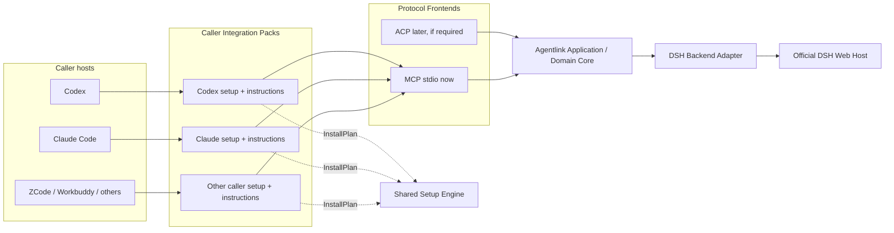

# Multi-caller extension architecture for dsh-Agentlink

Status: Proposed
This English document is authoritative; the Chinese version should remain semantically aligned with it.

## 1. Decision summary

dsh-Agentlink will use one repository, one shared runtime, and multiple Caller Integration Packs. Codex, Claude Code, ZCode, Workbuddy, and other MCP-capable callers should invoke the same Agentlink MCP Runtime instead of duplicating DSH session, event, approval, and recovery logic.

This design separates what is often loosely called an “adapter” into five layers:

1. **Caller Integration Pack**: host detection, configuration planning, Skill/instruction overlays, permission guidance, verification, and reload instructions.
2. **Protocol Frontend**: MCP today; ACP may be considered later only when a first-class external-agent experience requires it.
3. **Application / Domain Core**: caller-neutral task, status, cursor, follow-up, approval, cancellation, and recovery semantics.
4. **Backend Adapter**: maps the core semantics to the official DSH Web Host; DSH is the only backend today.
5. **Runtime Topology**: one stdio process per client today; a future explicit Gateway is a separate deployment decision.

Claude Code is the first new caller used to validate this extension architecture. It is not a new runtime or a separate product branch. Its first integration phase is limited to an Integration Pack and excludes session attach/resume, a Gateway, and any `claude -p` wrapper.

## 2. Goals

- Support multiple AI work tools delegating to DSH from one repository and release train.
- Give every MCP caller the same `dsh_*` tools and safety semantics.
- Add configuration and caller experience for a new host without copying domain logic.
- Implement installer safety once: parsing, conflict detection, dry-run, backup, concurrent-change detection, atomic writes, and verification.
- Keep sessions visible in DSH Web while callers can continue, observe, answer, approve, or cancel work.
- Make compatibility differences explicit instead of hiding version drift in long-lived branches.

## 3. Non-goals

- Agentlink does not manage the `dsh web` process lifecycle.
- Agentlink does not run Claude Code, Codex, or another caller as its backend process.
- Claude Code integration will not be simulated through `claude -p`.
- This phase does not introduce dynamic third-party integration loading, npm workspace splitting, or independent release trains.
- Caller integrations do not add a public per-task model selector; the user continues to configure the model in DSH.
- Claude Code phase 1 does not include session attach/resume, cross-caller takeover, or a resident Gateway.
- Agentlink does not persist conversation bodies locally; DSH session/history remains the content source of truth.

## 4. Terms and responsibilities

| Layer | Owns | Does not own |
|---|---|---|
| Caller Integration Pack | Host detection, configuration scope selection, declarative install planning, host instruction installation/generation, permission guidance, verification, and reload hints | DSH RPC, task state machine, event folding, ledger, or cancellation semantics |
| Protocol Frontend | Maps core use cases to MCP tools or future ACP methods and validates protocol input/output | Host configuration writes or DSH API details |
| Application / Domain Core | Shared task/status/cursor/follow-up/question/approval/cancel/recovery semantics | Codex- or Claude-specific configuration formats and UI copy |
| DSH Backend Adapter | DSH unary API, `events.mux`, history reconciliation, and queue/pending mappings | Starting, stopping, daemonizing, or upgrading `dsh web` |
| Setup Engine | Safe reading, parsing, plan display, conflict handling, backup, concurrency checks, atomic writes, and verification | Deciding caller-specific configuration semantics or executing arbitrary code supplied by an Integration Pack |
| Runtime Topology | Whether Agentlink runs as per-client stdio processes or an explicit shared Gateway | Changing ownership of the DSH Host lifecycle |

The name “Caller Integration Pack” is intentional. For a host that already supports MCP, this layer is not a runtime adapter; it installs the same Runtime correctly into a different host.

## 5. Mapping the current code to the target layers

The current implementation already contains a reusable core. A large directory rewrite is not a prerequisite.

| Current file | Current role | Direction |
|---|---|---|
| `src/bridge-service.ts` | Caller-neutral application service | Keep shared; do not add Claude-only branches |
| `src/mcp-server.ts` | MCP frontend | Keep one shared tool schema; caller differences must not enter tool semantics |
| `src/dsh-client.ts` | DSH unary transport | Treat as part of the DSH backend layer |
| `src/connection-manager.ts` | DSH mux, reconciliation, and pending/queue observation | Treat as DSH backend/coordination shared by every caller |
| `src/event-ledger.ts`, `src/task-store.ts` | Content-free coordination state and recovery indexes | Treat as shared coordination infrastructure |
| `src/workspace-claim.ts` | Cooperative workspace ownership claims | Treat as shared domain/coordination infrastructure |
| `src/index.ts` | stdio composition root and process lifecycle | Keep as the shared Runtime entry point |
| `src/setup-codex.ts` | Codex semantics mixed with safe-write mechanics | Gradually split into a shared Setup Engine and Codex Integration Pack |
| `skill/codex-dsh/SKILL.md` | Shared collaboration rules mixed with Codex-specific expression | Extract a canonical instruction source and generate host artifacts with small caller overlays |

This proposal does not require moving these files immediately. Refactoring should happen incrementally with the first real additional caller while preserving Codex behavior.

Phase 1 must also rewrite the Codex-specific model-facing tool descriptions in `src/mcp-server.ts` as caller-neutral copy without changing tool names, schemas, or behavior.

The existing default state directory `~/.dsh/codex-bridge` and the `DSH_BRIDGE_HOME` environment variable remain compatibility identifiers. The Codex and Claude Integration Packs must point to the same state home by default so that the ledger, task mappings, and workspace claims remain shared. Any future rename requires an explicit migration design; a new caller must not silently select another directory.

## 6. Target architecture



Key constraints:

- Every MCP caller enters the same `createMcpServer(service)` path.
- An Integration Pack cannot instantiate a custom `BridgeService` variant or reimplement the task/session/event state machine.
- The Setup Engine executes only structured configuration operations, never arbitrary script callbacks supplied by a pack.
- If ACP is added later, it is another frontend over the same Application Core, not another DSH bridge.

## 7. Proposed module layout

This is an evolutionary target. The architecture PR does not create empty directories merely to match it.

```text
src/
  domain/                 # task, status, approval, cancel, cursor semantics
  application/            # caller-neutral use cases / BridgeService
  backends/
    dsh/                  # DSH API, mux, history, capability probes
  transports/
    mcp/                  # MCP tool schema and error mapping
    acp/                  # add only when a demonstrated need exists
  integrations/
    contract.ts           # CallerIntegration and capabilities
    codex/
    claude-code/
  setup/
    engine.ts             # the only configuration-writing executor
    operations.ts         # restricted declarative operations

instructions/
  collaboration.md        # canonical shared collaboration rules
  overlays/
    codex.md
    claude-code.md

docs/
  compatibility.md        # tested versions and capability matrix
```

If an integration later has independent dependencies, maintainers, or release cadence, a workspace or separate package can be reconsidered. Directory boundaries alone are not a reason to split packages.

## 8. Caller Integration and installation plans

An Integration Pack describes what should be configured. The shared engine owns how configuration is written safely. A minimal contract could be:

```ts
export interface CallerIntegration {
  readonly id: string;
  readonly displayName: string;
  readonly capabilities: CallerCapabilities;

  detect(context: DetectionContext): Promise<DetectionResult>;
  planInstall(context: InstallContext): Promise<InstallPlan>;
  verify(context: VerificationContext): Promise<VerificationResult>;
  restartHint(context: RestartContext): string;
}

export interface CallerCapabilities {
  mcpStdio: boolean;
  configScopes: readonly string[];
  instructionInstall: "native" | "generated" | "manual";
  humanApprovalPrompt: "supported" | "manual" | "unsupported";
}

export interface InstallPlan {
  callerId: string;
  targetDescription: string;
  operations: readonly ConfigOperation[];
  verification: readonly VerificationStep[];
  warnings: readonly string[];
}

export type ConfigOperation =
  | {
      kind: "upsert-mcp-server";
      path: string;
      serverName: string;
      command: string;
      args: readonly string[];
      env: Readonly<Record<string, string>>;
      conflictPolicy: "fail" | "replace-explicitly";
    }
  | {
      kind: "install-instructions";
      path: string;
      source: string;
      conflictPolicy: "fail" | "replace-explicitly";
    };
```

`ConfigOperation` must remain a reviewable closed set. An Integration Pack must not return shell commands, callbacks, or arbitrary filesystem writes.

The Setup Engine retains the safety behavior already established by the Codex installer:

- Refuse to guess when a target cannot be parsed reliably.
- Do not overwrite a different existing configuration by default.
- Replace only a component-owned target and only after explicit `--replace` intent.
- Preserve unrelated configuration and file permissions.
- Display the plan before writing or support dry-run.
- Reparse and verify before and after the write.
- Detect concurrent changes made after the original read.
- Write a same-directory temporary file and replace atomically.
- Do not restart the caller or start `dsh web` automatically.

## 9. A single source for instructions and Skills

Shared content includes:

- The `dsh_delegate`, `dsh_wait`, `dsh_tail`, typed answer/approval, cancellation, and workspace-release workflow.
- The connect-only boundary.
- DSH history as the authoritative content source.
- The prohibition on automatic approval.
- Workspace claims and the recommendation to use an independent worktree.

A caller overlay describes only:

- How that host discovers or invokes MCP.
- Its permission prompts and configuration scopes.
- Reload, restart, and verification steps.
- Host-specific frontmatter or installation paths.

Generated host files may repeat shared text, but there must be one canonical source. CI or normal tests should verify reproducible generation and the presence of required safety statements; this does not require adding new hashes or frozen baselines.

## 10. State, identity, and safety boundaries

### 10.1 Task and Session

- `taskId` is the explicit coordination handle Agentlink exposes to callers.
- The DSH Host owns `rootSessionId` and descendant sessions.
- DSH `session.history` is authoritative for conversation content.
- Agentlink stores coordination data such as mappings, cursors, watermarks, claims, and pending/queue metadata, but not prompts, answers, tool bodies, or question bodies.
- Caller identity may be retained as diagnostic metadata; it must not create a second task state machine.

### 10.2 Attach / Resume

Creating a new task and attaching to an existing DSH session are separate use cases. A future attach/resume design must define:

- Session existence and authorization checks.
- Root/descendant constraints.
- The source and reconfirmation of the working directory.
- The differences among load, resume, and follow-up.
- The differences among canceling a turn, closing a caller attachment, and closing a DSH session.
- Conflict behavior when several callers observe or write concurrently.

Until those semantics are designed, do not add an optional `sessionId` to `dsh_delegate`.

### 10.3 Approvals and questions

- DSH questions and sandbox escalations continue to require typed responses carrying their request IDs.
- `dsh_followup` cannot answer a question or approval.
- An Integration Pack can expose approvals to a caller, but MCP support does not imply permission to auto-approve them.
- If a host cannot establish a reliable human approval boundary, doctor must report that limitation explicitly. The default DSH or Agentlink safety policy must not be weakened to compensate.

### 10.4 Model configuration

Normal `dsh_delegate` calls do not accept a model argument. Agentlink may read and report the current DSH model/routing state, but users select the model when installing or adjusting DSH. A caller integration must not override it silently.

### 10.5 DSH plugin-aware session launch

DSH has two extension planes that Agentlink must keep separate:

- A **Host/profile bundle** is installed into and started with a user-managed DSH profile. It can register plugins, tools, commands, and Agent Presets. Agentlink remains connect-only: it does not install bundles, select or rewrite the Host profile, or start, stop, or restart `dsh web`.
- An **Agent Preset** is selected for one session through `session.create.agentPreset`. DSH resolves and mounts that composition before the first user prompt, records it with the session, and uses it again when the session is restored. Agentlink already passes a caller-supplied or installation-time default `agentPreset`, so a user-installed plugin that exposes an Agent Preset can already create a plugin-capable session rather than a plain default session.

The current gap is observability and initialization, not a need for a second Runtime. Agentlink does not yet preflight the Host's Agent Preset roster, report the exact resolved preset returned by the Host in delegate/status output, or represent a plugin that needs typed setup after session creation. Until those pieces exist, support means **preset-based plugins installed and configured by the user**; it does not mean arbitrary DSH plugins are automatically discovered or adapted.

The preferred future abstraction is a declarative **Session Launch Profile** consumed by the one shared DSH backend pipeline. A profile may name an Agent Preset, required Host capabilities, a strict allowlist of typed DSH session operations, and postconditions. It is configuration data, not executable plugin code. The fixed launch order is:

1. Read the live Host capability and Agent Preset roster without mutating it.
2. Create the session with the selected Agent Preset.
3. Persist the task/session mapping and acquire the workspace claim immediately.
4. Run only declared, typed session initialization operations supported by the verified Host version.
5. Re-read live session facts and verify the preset, initialization postconditions, and model routability.
6. Send the user's prompt only after those checks succeed.

This ordering prevents a concrete failure: if a plugin requires post-create initialization but Agentlink sends the real prompt first, the session history begins under the wrong capabilities and DSH no longer permits a safe preset swap after the session becomes non-blank. Initialization failure must therefore fail closed before the real prompt, while preserving an already-created task/session and its claim for inspection and explicit release.

Different session startup requirements must be expressed as launch-profile data, not caller-specific branches or alternate `BridgeService` implementations. A Launch Profile must not execute arbitrary shell commands, call untyped plugin endpoints, install or enable Host bundles, mutate global DSH settings, or weaken approvals. If a second verified plugin cannot be expressed as Agent Preset plus official typed session APIs and postconditions, that is the trigger to revisit this contract or add a narrowly reviewed adapter; it is not permission to expose general executable hooks.

Implementation backlog, in order:

1. **Must:** expose the Host-resolved Agent Preset in delegate/status results and add read-only availability, broken-state, and trust reporting based on the Host preset roster.
2. **Should, after a concrete plugin requires it:** define the minimal Session Launch Profile schema, recovery state, typed operation allowlist, and postcondition checks. DSH remains authoritative for live session state; Agentlink stores only the coordination metadata needed to resume an interrupted initialization.
3. **Deferred:** third-party executable launch adapters, automatic plugin installation, custom RPC/command hooks, and per-plugin Runtime forks.

## 11. Runtime topology

### 11.1 Current: per-client stdio

Codex, Claude Code, and other callers each launch their own Agentlink stdio process. This is simple to install, isolates failures, and requires no new service; the tradeoff is that several processes connect to DSH and share the local coordination directory.

This topology remains in place for now, with these requirements:

- stdin EOF, signals, and transport close all stop the connection reliably.
- The shared ledger/store uses cross-process-safe coordination.
- Snapshot and event deduplication do not manufacture false cursors.
- Exiting one process does not cancel the DSH session.

### 11.2 Future: explicit Agentlink Gateway

Consider a user-started `dsh-agentlink serve` only when one or more supported needs appear:

- Two or more callers must observe or take over the same task concurrently.
- Approvals need one cross-caller routing authority.
- One owner is needed for the DSH mux/connection.
- Multi-process locking, deduplication, or recovery remains a product-level limitation.

The Gateway would own Agentlink connection and coordination state, not the lifecycle of the DSH Host. A local HTTP transport would also require explicit designs for localhost binding, authentication, discovery, and upgrades; this proposal does not pre-decide them.

## 12. Versioning and compatibility

Built-in integrations initially ship in one Agentlink release train rather than long-lived per-caller branches.

Compatibility records distinguish at least these axes:

| Dimension | Example | Purpose |
|---|---|---|
| Agentlink version | `0.1.x` | Product and tool-schema version |
| Tested DSH Host version | `0.1.0-rc.6` | Host API and event behavior |
| MCP / SDK generation | `@modelcontextprotocol/sdk` declared as `^1.17.5`, lockfile currently resolves `1.30.0`; sessionful SDK or later stateless specification | Transport and capability negotiation |
| Tested caller version | A specific Codex or Claude Code version | Configuration format and permission behavior |
| Caller capabilities | stdio, config scopes, human approval, instruction installation | Determines what an integration may enable |

Package versions do not substitute for wire compatibility. MCP is moving from the older sessionful lifecycle toward the self-contained per-request model in the 2026-07-28 specification. Agentlink should retain explicit `taskId` handles and capability detection, but it should not migrate the Runtime ahead of actual client and SDK support.

## 13. Delivery phases

### Phase 0: architecture proposal

**Status: completed in PR #6.**

- Submit only this design document.
- Do not create Claude Code implementation files or change the shared tool schema.
- Discuss and confirm the boundaries in the architecture PR before implementation starts.

### Phase 1: extract the shared setup boundary

**Status: implemented in PR #7.**

- Extract the smallest useful Setup Engine and `CallerIntegration` contract from `setup-codex.ts`.
- Make Codex the first built-in integration while preserving its existing user behavior and generated configuration.
- Keep Codex installation behavior equivalent and the existing tests passing.
- Add unit tests for the `InstallPlan` planning/execution boundary, no-op idempotence, and explicit conflict replacement.
- Do not move unrelated runtime files merely for directory symmetry.

### Phase 2: Claude Code Integration Pack

**Status: implemented in PR #7.**

- Use the same MCP Runtime as Codex.
- Detect configuration locations and scopes supported by the verified Claude Code version.
- Produce a declarative install plan and let the shared engine execute it safely.
- Add a Claude-specific instruction overlay, permission guidance, doctor checks, and tests.
- Do not wrap `claude -p`, attach sessions, or start `dsh web`.

### Phase 3: a second new caller

**Status: in progress with ZCode as the next validation target.**

- Validate the contract with ZCode, Workbuddy, or another MCP host.
- Existing community ZCode work, such as `yyz0313`'s `plugin.json` and `SKILL.md` experiment, can be resubmitted upstream as an Integration Pack under this contract once the host behavior is verified.
- Add capability fields only for demonstrated differences; do not design a dynamic plugin system from hypothetical requirements.

### Cross-cutting TODO: DSH plugin-aware session launch

**Status: preset-based sessions are supported; validation and typed initialization are deferred.**

- Preserve `agentPreset` as the native per-session extension point.
- Implement the observability/preflight work in section 10.5 before claiming broad plugin compatibility.
- Introduce a Session Launch Profile only against a verified plugin that cannot be handled by preset selection alone.
- Keep this work inside the shared DSH backend; no caller or plugin gets a private task/session state machine.

### Phase 4: optional protocol or topology expansion

**Status: deferred.**

- Evaluate an ACP frontend when a first-class external-agent experience is required.
- Evaluate an explicit Gateway when the triggers in section 11.2 are met.
- These decisions are independent and must not be bundled by default.

## 14. Claude Code phase-1 acceptance scope

This section records the acceptance boundary implemented by PR #7 and remains the maintenance baseline for the Claude Code Integration Pack.

- Detect whether Claude Code is available and identify the selected configuration scope and target.
- Register the same `dsh-agentlink` stdio Runtime.
- Support dry-run and show the target, server name, command, arguments, and environment variables to be changed.
- Preserve unrelated Claude configuration; reject invalid or unsafe-to-understand configuration.
- Repeating an equivalent setup is a no-op; a conflicting configuration fails unless the user explicitly requests replacement of the component-owned target.
- Generate valid configuration when paths contain spaces.
- Do not create duplicate MCP registrations that point at the same Agentlink state home.
- Explicitly configure or verify the human boundary for `dsh_resolve_approval`; never auto-approve.
- Doctor reports Claude installation, MCP registration, and DSH Host reachability separately; registration does not prove Host reachability.
- Installation only tells the user to reload or restart Claude Code; it does not operate the process.
- The Codex installer and the full existing test suite continue to pass.
- No `claude -p` wrapper, session attach, Gateway, or DSH lifecycle management.

## 15. Architecture acceptance criteria

- Runtime domain logic exists once; the shared layer has no Claude-only task/session branch.
- A Caller Integration returns a declarative plan and has no arbitrary filesystem-write authority.
- Codex and Claude can reuse one Setup Engine with the existing safe-write semantics intact.
- Shared instructions have one canonical source and callers maintain only necessary overlays.
- DSH Host lifecycle, content authority, typed approvals, model configuration, and workspace-claim boundaries remain unchanged.
- Compatibility uses an explicit matrix and capability detection rather than long-lived branches.
- Gateway, ACP, and attach/resume remain deferred behind explicit triggers.

## 16. Risks and deferred decisions

| Risk | Concrete failure | Current treatment |
|---|---|---|
| Integration Pack becomes a second Runtime | A Claude folder begins copying the state machine and DSH API | Responsibility boundaries and review reject that dependency direction |
| Configuration format changes | The installer overwrites or corrupts unrelated user settings | Parse and verify per caller; fail closed when the format is not understood |
| Multiple stdio processes contend | Duplicate events, ledger contention, or orphaned connections | Harden process/shared-state behavior now; evaluate a Gateway only after a trigger is met |
| Approval models differ | One caller bypasses human sandbox escalation | Each integration verifies and reports the human boundary or cannot claim full support |
| Instruction drift | Callers ship inconsistent safety rules | Canonical source plus small overlays and generation/content tests |
| Premature abstraction | Complexity is added for callers that do not yet exist | Implement only interfaces proved necessary by Codex and Claude |
| Plugin startup forks the core state machine | Each plugin or caller creates sessions, initializes tools, and verifies state differently | Use one declarative launch plan and one typed backend pipeline; reject arbitrary executable hooks |
| MCP specification migration | Clients and SDKs implement different protocol generations | Track protocol and caller versions separately, prefer capabilities, and migrate incrementally |

Deferred and undecided: Gateway transport/authentication, ACP packaging, cross-caller task visibility, session attach API, external third-party Integration Packs, executable third-party session-launch adapters, and an independent npm workspace.

## 17. Reference projects and specifications

These references informed the boundaries; they do not imply full behavioral compatibility:

- [DeepSeek Harness Host API proxy](https://github.com/deepseek-ai/deepseek-harness/blob/main/packages/host/apiproxy/README.md), [CLI/profile reference](https://github.com/deepseek-ai/deepseek-harness/blob/main/apps/cli/reference/README.md), and [session persistence notes](https://github.com/deepseek-ai/deepseek-harness/blob/main/packages/session/session-persistence-jsonl/README.md): the basis for separating Host/profile bundles from per-session Agent Presets and for treating the selected preset as durable DSH session state.
- [cc-connect core interfaces](https://github.com/chenhg5/cc-connect/blob/main/core/interfaces.go) and [registry](https://github.com/chenhg5/cc-connect/blob/main/core/registry.go): neutral interfaces, capabilities, and factory separation without copying its complete Supervisor.
- [gpt2agent installer](https://github.com/robotlearning123/gpt2agent/blob/main/gpt2agent/install.py): a direct example of configuring one MCP Runtime for several clients.
- [Scryer](https://github.com/aklos/scryer): separation between a shared MCP core and host enhancements.
- [wshobson/agents cross-harness matrix](https://github.com/wshobson/agents/blob/main/docs/harnesses.md) and [agent-harness](https://github.com/madebywild/agent-harness): canonical instructions projected into host-specific outputs and overlays.
- [ACP session setup](https://agentclientprotocol.com/protocol/v1/session-setup): a future reference for load/resume/close semantics, not a current MCP integration requirement.
- [MCP 2026-07-28 specification](https://modelcontextprotocol.io/specification/2026-07-28) and [release notes](https://blog.modelcontextprotocol.io/posts/2026-07-28/): protocol direction; compatibility with existing clients must be verified separately.
- [Claude Code MCP documentation](https://code.claude.com/docs/en/mcp) and [CLI reference](https://code.claude.com/docs/en/cli-usage): the official basis for the next Claude Integration Pack phase.

The referenced repositories' `main` branches and online documentation may change. The implementation PR must record the verification date and tested versions rather than treating research-time pages as permanent interfaces.
