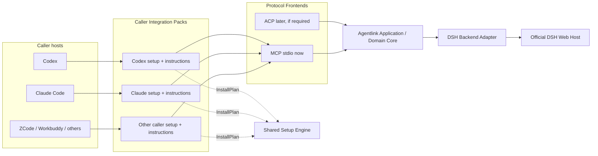

# dsh-Agentlink 多调用方扩展架构

状态：提案（Proposed）
本文件是中文主文档；英文版应与本文件保持语义一致。

## 1. 决策摘要

dsh-Agentlink 采用一个仓库、一个共享运行时和多个调用方集成包。Codex、Claude Code、ZCode、Workbuddy 等调用方只要能够使用 MCP，就应调用同一个 Agentlink MCP Runtime，而不是各自复制一套 DSH 会话、事件、审批和恢复逻辑。

本设计把经常被统称为“adapter”的内容拆成五层：

1. **Caller Integration Pack（调用方集成包）**：安装检测、配置计划、Skill/指令覆盖、权限提示、验证和重启说明。
2. **Protocol Frontend（协议入口）**：当前为 MCP；未来只有在需要一级外部 Agent 体验时才考虑 ACP。
3. **Application / Domain Core（应用与领域核心）**：调用方中立的任务、状态、游标、追问、审批、取消和恢复语义。
4. **Backend Adapter（后端适配器）**：把核心语义映射到官方 DSH Web Host；当前只有 DSH 后端。
5. **Runtime Topology（运行拓扑）**：当前每个客户端启动一个 stdio 进程；未来是否增加显式 Gateway 是独立部署决策。

Claude Code 是用于验证这套扩展架构的第一个新增调用方，不是新的运行时，也不是新的产品分支。其第一阶段接入只做 integration pack，不包含 session attach/resume、Gateway 或 `claude -p` 包装。

## 2. 目标

- 在同一仓库和发布序列中支持多个 AI 工作工具调用 DSH。
- 所有 MCP 调用方共享同一组 `dsh_*` 工具和安全语义。
- 新调用方主要增加配置与使用体验，不复制业务逻辑。
- 安装器安全能力只实现一次：解析、冲突检测、dry-run、备份、并发变更检测、原子写入和验证。
- 保持 DSH Web 中的会话可见，并允许调用方继续、观察、回答、审批或取消任务。
- 让兼容性差异显式可见，不用长期分支隐藏版本漂移。

## 3. 非目标

- 不把 Agentlink 变成管理 `dsh web` 生命周期的服务管理器。
- 不把 Claude Code、Codex 或其他调用方作为 Agentlink 的后端进程运行。
- 不通过 `claude -p` 模拟 Claude Code 集成。
- 不在本阶段实现动态第三方插件加载器、npm workspace 拆包或独立发布列车。
- 不在调用方集成中增加公共模型选择参数；模型继续由用户的 DSH 配置决定。
- 不在 Claude Code 第一阶段顺带实现 session attach/resume、跨调用方接管或常驻 Gateway。
- 不在 Agentlink 本地保存对话正文；DSH session/history 仍是内容事实来源。

## 4. 术语与责任

| 层 | 负责 | 不负责 |
|---|---|---|
| Caller Integration Pack | 检测宿主、选择配置作用域、生成声明式安装计划、安装/生成宿主指令、权限说明、验证、重载提示 | DSH RPC、任务状态机、事件折叠、账本、取消语义 |
| Protocol Frontend | 把核心用例映射为 MCP 工具或未来 ACP 方法；验证协议输入输出 | 宿主配置文件写入、DSH API 细节 |
| Application / Domain Core | task/status/cursor/follow-up/question/approval/cancel/recovery 的公共语义 | Codex/Claude 专属配置格式和 UI 文案 |
| DSH Backend Adapter | DSH unary API、`events.mux`、history reconciliation、queue/pending 映射 | 启动、停止、守护或升级 `dsh web` |
| Setup Engine | 安全读取、解析、计划展示、冲突处理、备份、并发检查、原子写入、验证 | 决定每个宿主的配置语义；执行 integration pack 提供的任意代码 |
| Runtime Topology | 决定 Agentlink 是 stdio 多进程还是显式共享 Gateway | 改变 DSH Host 的生命周期归属 |

“调用方集成包”这个名称是刻意选择的。对于能调用 MCP 的宿主，它不是运行时 adapter；它只是把相同 Runtime 正确安装到不同宿主中。

## 5. 当前代码与目标层的映射

当前实现已经有可复用核心，不需要先进行大规模目录重写。

| 当前文件 | 现有角色 | 后续方向 |
|---|---|---|
| `src/bridge-service.ts` | 调用方中立的应用服务 | 保持公共；不得引入 Claude-only 分支 |
| `src/mcp-server.ts` | MCP frontend | 保持公共工具 schema；调用方差异不得进入工具语义 |
| `src/dsh-client.ts` | DSH unary transport | 归入 DSH backend 概念层 |
| `src/connection-manager.ts` | DSH mux、reconciliation、pending/queue 观察 | 归入 DSH backend/coordination；由所有调用方共享 |
| `src/event-ledger.ts`、`src/task-store.ts` | 内容外的协调状态与恢复索引 | 归入公共 coordination 层 |
| `src/workspace-claim.ts` | 协作式工作区占用声明 | 归入公共 domain/coordination 层 |
| `src/index.ts` | stdio 组合入口和进程生命周期 | 保持公共 Runtime 入口 |
| `src/setup-codex.ts` | Codex 语义与通用安全写入混合 | 逐步拆为共享 Setup Engine + Codex Integration Pack |
| `skill/codex-dsh/SKILL.md` | 公共协作规则与 Codex 表达混合 | 提取规范内容源，再用少量 caller overlay 生成宿主产物 |

本提案不要求立即移动上述文件。重构应随第一个真实调用方接入逐步发生，并保持 Codex 行为不变。

Phase 1 还需把 `src/mcp-server.ts` 中面向模型的 Codex 专属工具描述改为调用方中立措辞，但不改变工具名称、schema 或行为。

现有默认状态目录 `~/.dsh/codex-bridge` 和环境变量 `DSH_BRIDGE_HOME` 作为兼容标识保留。Codex 与 Claude Integration Packs 必须默认指向同一 state home，使 ledger、task mapping 和 workspace claim 保持共享。未来若要改名，必须另行设计显式迁移；不能让新 caller 静默使用另一目录。

## 6. 目标架构



关键约束：

- 所有 MCP 调用方进入同一个 `createMcpServer(service)` 路径。
- 集成包不能实例化自己的 `BridgeService` 变体或重新实现 task/session/event 状态机。
- Setup Engine 只执行结构化配置操作，不执行集成包传入的任意脚本回调。
- ACP 若未来加入，是同一 Application Core 的另一个 frontend，而不是另一套 DSH bridge。

## 7. 建议的模块布局

这是演进目标，不要求在架构 PR 中创建空目录。

```text
src/
  domain/                 # task、状态、审批、取消、游标语义
  application/            # caller-neutral use cases / BridgeService
  backends/
    dsh/                  # DSH API、mux、history、capability probe
  transports/
    mcp/                  # MCP tool schema 与错误映射
    acp/                  # 明确需要时才增加
  integrations/
    contract.ts           # CallerIntegration 与能力描述
    codex/
    claude-code/
  setup/
    engine.ts             # 唯一可写配置的执行器
    operations.ts         # 受限的声明式配置操作

instructions/
  collaboration.md        # 公共协作规则的规范内容源
  overlays/
    codex.md
    claude-code.md

docs/
  compatibility.md        # 已测试版本与能力矩阵
```

如果未来某个 integration 有独立依赖、维护者或发布节奏，再评估 workspace 或独立包；目录边界本身不构成拆包理由。

## 8. Caller Integration 与安装计划

集成包只描述“应该怎样配置”，共享引擎负责“怎样安全写入”。建议的最小接口如下：

```ts
export interface CallerIntegration {
  readonly id: string;
  readonly displayName: string;
  readonly capabilities: CallerCapabilities;

  detect(context: DetectionContext): Promise<DetectionResult>;
  planInstall(context: InstallContext): Promise<InstallPlan>;
  verify(context: VerificationContext): Promise<VerificationResult>;
  restartHint(context: RestartContext): string;
}

export interface CallerCapabilities {
  mcpStdio: boolean;
  configScopes: readonly string[];
  instructionInstall: "native" | "generated" | "manual";
  humanApprovalPrompt: "supported" | "manual" | "unsupported";
}

export interface InstallPlan {
  callerId: string;
  targetDescription: string;
  operations: readonly ConfigOperation[];
  verification: readonly VerificationStep[];
  warnings: readonly string[];
}

export type ConfigOperation =
  | {
      kind: "upsert-mcp-server";
      path: string;
      serverName: string;
      command: string;
      args: readonly string[];
      env: Readonly<Record<string, string>>;
      conflictPolicy: "fail" | "replace-explicitly";
    }
  | {
      kind: "install-instructions";
      path: string;
      source: string;
      conflictPolicy: "fail" | "replace-explicitly";
    };
```

`ConfigOperation` 必须是可检查的封闭集合。Integration Pack 不应返回 shell 命令、函数回调或任意文件写入动作。

Setup Engine 保持现有 Codex 安装器已经具备的安全行为：

- 无法可靠解析时拒绝猜测；
- 默认不覆盖已有不同配置；
- 只有显式 `--replace` 才替换本组件拥有的目标项；
- 保留其他配置内容和文件权限；
- 写入前展示计划或支持 dry-run；
- 写入前后重新解析并验证；
- 检测读取后发生的并发变化；
- 同目录临时文件和原子替换；
- 不自动重启调用方，也不启动 `dsh web`。

## 9. 指令与 Skill 的单一来源

公共内容包括：

- `dsh_delegate`、`dsh_wait`、`dsh_tail`、typed answer/approval、cancel、workspace release 的工作流；
- connect-only 边界；
- DSH history 权威性；
- 审批不得自动放行；
- workspace claim 和独立 worktree 建议。

调用方 overlay 只描述：

- 该宿主怎样发现或调用 MCP；
- 该宿主的权限提示和配置作用域；
- 重载、重启和验证方式；
- 宿主专有的 frontmatter 或目录位置。

生成后的宿主文件可以重复公共文本，但规范内容源只能有一份。CI 或普通测试应检查生成结果可复现和必要安全语句存在，不要求引入新的 hash 或冻结基线机制。

## 10. 状态、身份与安全边界

### 10.1 Task 与 Session

- `taskId` 是 Agentlink 对调用方暴露的显式协调 handle。
- `rootSessionId` 与后代 session 由 DSH Host 持有。
- DSH `session.history` 是对话内容的权威来源。
- Agentlink 只保存映射、游标、水位、claim、pending/queue 元数据等协调信息，不保存 prompt、回答、工具正文或问题正文。
- 调用方身份可以作为诊断元数据，但不能派生另一套任务状态机。

### 10.2 Attach / Resume

“新建任务”和“接入已有 DSH session”是不同用例。未来若实现 attach/resume，应单独定义：

- session 存在性与权限验证；
- root/descendant 约束；
- 工作目录的来源与重新确认；
- load、resume、follow-up 的区别；
- cancel 当前 turn、关闭 caller attachment、关闭 DSH session 的区别；
- 多调用方同时观察或写入时的冲突行为。

在这些语义确定前，不给 `dsh_delegate` 简单增加可选 `sessionId`。

### 10.3 审批与提问

- DSH 问题和 sandbox escalation 必须继续通过 typed request ID 回答。
- `dsh_followup` 不能代替问题或审批响应。
- Integration Pack 只能把审批暴露给调用方；不能把“宿主支持 MCP”解释成“宿主可以自动批准”。
- 若宿主无法可靠建立人工审批边界，doctor 必须明确报告限制；不得通过放宽 DSH 或 Agentlink 的默认策略解决。

### 10.4 模型配置

正常 `dsh_delegate` 不提供 model 参数。Agentlink 读取并报告 DSH 当前模型/可路由状态，但模型选择由用户安装或调整 DSH 时完成。调用方集成不得偷偷覆盖该配置。

## 11. Runtime Topology

### 11.1 当前：每客户端 stdio

Codex、Claude Code 等各自启动一个 Agentlink stdio 进程。优点是安装简单、失败隔离清楚、无需新服务；代价是多个进程会各自连接 DSH，并共享本地协调目录。

当前阶段继续使用该拓扑，并要求：

- stdin EOF、signal 和 transport close 均可靠停止连接；
- 共享 ledger/store 使用跨进程安全的协调方式；
- snapshot 和事件去重不会制造虚假 cursor；
- 一个进程退出不取消 DSH session。

### 11.2 未来：显式 Agentlink Gateway

只有出现以下受支持需求时，才评估用户显式启动的 `dsh-agentlink serve`：

- 两个以上调用方需要同时观察或接手同一任务；
- 需要统一的跨调用方审批路由；
- 需要单一 DSH mux/connection owner；
- 多进程锁、去重或恢复问题持续成为产品级限制。

Gateway 负责 Agentlink 的连接与协调状态，不负责启动、停止或守护 DSH Host。若使用本地 HTTP transport，还必须另行设计 localhost 绑定、认证、发现和升级行为；本提案不提前决定这些细节。

## 12. 版本与兼容性

内置 integration 初期跟随一个 Agentlink 版本发布，不按调用方维护长期分支。

兼容性记录至少区分：

| 维度 | 示例 | 用途 |
|---|---|---|
| Agentlink 版本 | `0.1.x` | 产品与工具 schema 版本 |
| DSH Host 已测试版本 | `0.1.0-rc.6` | Host API 与事件行为 |
| MCP / SDK 时代 | sessionful SDK 或后续无状态规范 | transport 与能力协商 |
| Caller 已测试版本 | Codex/Claude Code 的具体版本 | 安装格式与权限行为 |
| Caller capabilities | stdio、配置作用域、人工审批、指令安装 | 决定 integration 能启用什么 |

包版本不能代替 wire compatibility。MCP 正在从旧的 sessionful lifecycle 向 2026-07-28 的逐请求自描述方向演进；Agentlink 应保留显式 `taskId` 和能力检测，但在实际客户端与 SDK 支持前不贸然迁移 Runtime。

## 13. 分阶段实施

### Phase 0：架构提案

- 只提交本设计文档。
- 不创建 Claude Code 实现文件、不调整公共工具 schema。
- 通过 Draft PR 讨论并确认边界。

### Phase 1：抽取共享安装边界

- 从 `setup-codex.ts` 提取最小 Setup Engine 和 `CallerIntegration` 契约。
- Codex 变成第一个内置 integration，但用户行为和生成配置保持不变。
- Codex 安装结果保持行为等价，现有测试继续通过。
- 为 `InstallPlan` 的计划/执行边界、no-op 幂等性和显式冲突替换增加单元测试。
- 不为了目录整齐搬动无关 runtime 文件。

### Phase 2：Claude Code Integration Pack

- 使用与 Codex 相同的 MCP Runtime。
- 按 Claude Code 官方支持面检测配置位置和作用域。
- 生成声明式安装计划；共享引擎安全执行。
- 添加 Claude 专用 instruction overlay、权限说明、doctor 和测试。
- 不包装 `claude -p`，不实现 session attach，不启动 `dsh web`。

### Phase 3：第二个新增调用方

- 用 ZCode、Workbuddy 或另一 MCP 宿主验证契约是否足够。
- 只有真实差异才扩展能力字段，避免根据想象设计动态插件系统。

### Phase 4：可选协议或拓扑扩展

- 需要一级外部 Agent 体验时评估 ACP frontend。
- 满足第 11.2 节触发条件时评估显式 Gateway。
- 这两项可独立发生，不能相互默认捆绑。

## 14. Claude Code 第一阶段验收范围

本节描述下一实现 PR 的边界，不在架构 PR 中落代码。

- 能检测 Claude Code 是否可用，并明确所选配置作用域/目标。
- 能以相同 `dsh-agentlink` stdio Runtime 注册 MCP server。
- 能 dry-run 并展示将修改的目标、server 名称、命令、参数和环境变量。
- 保留无关 Claude 配置；无效或无法安全理解的配置必须拒绝修改。
- 同配置重复运行是 no-op；冲突配置默认失败，只有显式 replace 才处理本组件目标。
- 路径包含空格时仍生成有效配置。
- 不产生两个指向同一 Agentlink state home 的重复 MCP 注册。
- 明确配置或验证 `dsh_resolve_approval` 的人工边界；不能自动批准。
- doctor 能分别报告 Claude 安装、MCP 注册和 DSH Host 可达性；注册存在不等于 Host 可达。
- 安装结束只提示用户重载/重启 Claude Code，不自动操作进程。
- Codex 安装器与完整测试保持通过。
- 没有 `claude -p` wrapper、session attach、Gateway 或 DSH 生命周期管理。

## 15. 架构验收标准

- Runtime 业务逻辑只保留一份，公共层没有 Claude-only task/session 分支。
- Caller Integration 返回声明式计划，不拥有任意文件写入权限。
- Setup Engine 保留现有安全写入语义，并可被 Codex 与 Claude 复用。
- 公共指令有单一规范来源，caller 只维护必要覆盖。
- DSH Host 生命周期、内容权威性、typed approval、模型配置和 workspace claim 边界保持不变。
- 版本兼容依靠明确矩阵和能力检测，不依靠长期分支。
- Gateway、ACP 和 attach/resume 都有明确触发条件且保持延期状态。

## 16. 风险与延期决策

| 风险 | 具体失败 | 当前处理 |
|---|---|---|
| Integration Pack 变成第二套 Runtime | Claude 目录开始复制状态机和 DSH API | 责任矩阵与审查拒绝该依赖方向 |
| 配置格式升级 | 安装器覆盖或破坏用户无关设置 | 每 caller 解析/验证，无法理解时 fail closed |
| 多 stdio 进程竞争 | 重复事件、账本争用、孤儿连接 | 当前加固进程与共享状态；达到触发条件再评估 Gateway |
| 审批模型不一致 | 某调用方绕过人工 sandbox escalation | integration 必须验证并报告人工边界，否则不宣称完整支持 |
| 指令漂移 | 不同 caller 的安全规则不一致 | 规范源 + 小型 overlay + 生成/内容测试 |
| 过早抽象 | 为尚不存在的调用方增加复杂插件 API | 只实现 Codex 和 Claude 已证明需要的接口 |
| MCP 规范迁移 | 客户端和 SDK 分处不同协议时代 | 分开记录 protocol/caller 版本，能力优先，渐进兼容 |

延期且未决定：Gateway transport/auth、ACP packaging、跨调用方 task visibility、session attach API、外部第三方 integration 包、独立 npm workspace。

## 17. 参考项目与规范

这些资料用于形成边界，不表示 Agentlink 与其全部行为兼容：

- [cc-connect core interfaces](https://github.com/chenhg5/cc-connect/blob/main/core/interfaces.go) 与 [registry](https://github.com/chenhg5/cc-connect/blob/main/core/registry.go)：借鉴中立接口、能力与 factory 分离；不复制其完整 Supervisor。
- [gpt2agent installer](https://github.com/robotlearning123/gpt2agent/blob/main/gpt2agent/install.py)：一个 MCP Runtime 配多个客户端安装器的直接参考。
- [Scryer](https://github.com/aklos/scryer)：共享 MCP core 与宿主增强分离。
- [wshobson/agents cross-harness matrix](https://github.com/wshobson/agents/blob/main/docs/harnesses.md) 与 [agent-harness](https://github.com/madebywild/agent-harness)：规范内容加宿主投影/覆盖的参考。
- [ACP session setup](https://agentclientprotocol.com/protocol/v1/session-setup)：未来 load/resume/close 语义的参考，不是当前 MCP 接入要求。
- [MCP 2026-07-28 specification](https://modelcontextprotocol.io/specification/2026-07-28) 与 [release notes](https://blog.modelcontextprotocol.io/posts/2026-07-28/)：协议演进方向；现有客户端兼容必须单独验证。
- [Claude Code MCP documentation](https://code.claude.com/docs/en/mcp) 与 [CLI reference](https://code.claude.com/docs/en/cli-usage)：下一阶段 Claude Integration Pack 的官方依据。

上述仓库 `main` 分支和在线文档都可能变化。实现 PR 应记录实际验证日期与已测试版本，不把研究时的页面内容当作永久接口。
