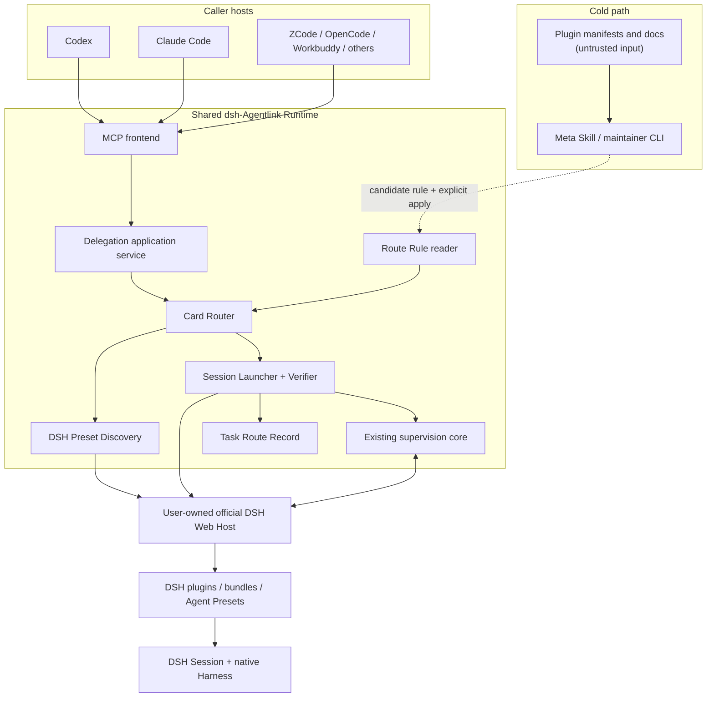
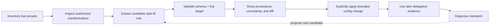

# Plugin-aware DSH routing architecture

**English** | [简体中文](plugin-aware-routing-architecture.zh-CN.md)

- Status: Proposed
- Authority: this English document is authoritative; the Chinese version should remain semantically aligned.
- Goal reference: [Plugin-aware DSH routing requirements](plugin-aware-routing-requirements.md)
- Current-runtime reference: [Architecture and safety model](architecture.md)
- Caller-extension reference: [Multi-caller extension architecture](caller-integration-architecture.md)
- Scope: the first v1 of **Preset-aware routing** (current scope) inside the shared Runtime: a caller-neutral routing layer that chooses and validates an already configured DSH Agent Preset before creating a new supervised task. The broader **Plugin-aware delegation** long-term direction remains the guiding frame but is not v1.

## 1. Decision summary

- **Preset-aware routing v1** is the current scope: Agentlink will choose an already configured DSH Agent Preset inside the shared Runtime, not inside individual Caller Integration Packs. **Plugin-aware delegation** is the long-term direction; v1 deliberately does not optimize task briefs, infer plugin capabilities from prose, or manage plugins.
- The normal path will use an internal deterministic Card Router:
  - it receives the task plus optional compact hints;
  - it reads current local route rules and the live DSH preset roster;
  - it selects one Agent Preset without an LLM or README read;
  - it creates a blank session, verifies the DSH-resolved preset, and only then sends the real task.
- Plugin documentation and broad discovery remain a cold-path maintainer concern:
  - a future Meta Skill or CLI may read documentation and propose route rules;
  - proposed rules remain bounded data and require explicit application;
  - ordinary delegation never executes README instructions.
- The v1 logical model has three objects:
  - **Live Preset Roster**: ephemeral DSH facts read for the current delegation;
  - **Route Rule**: compact internal matching and preset-selection data;
  - **Task Route Record**: content-free metadata describing the selection and resolved outcome.
- A separate persistent Plugin Manifest, Launch Profile, capability graph, catalog cache, or immutable hash snapshot is deferred until a concrete integration proves it necessary.
- v1 chooses and validates a configured Agent Preset; it does **not** optimize the task brief. A constrained **Task Brief Policy** (bounded rewriting or brief shaping inside the Runtime) is deferred to experiments and is out of v1 scope.
- Implementation starts with Phase 1 facts only: add typed preset discovery and requested/resolved preset reporting before automatic selection.
- Public compatibility is preserved:
  - explicit `agentPreset` remains manual selection;
  - no explicit preset and no automatic-routing opt-in retains current DSH-default behavior;
  - automatic routing is an additive, explicitly per-request mode of the existing delegation use case (persistent routing defaults are deferred);
  - ordinary delegation still has no per-task model parameter.

## 2. Architecture route and review perspectives

- Artifact route:
  - this is a code/product architecture specification over the existing Node.js MCP Runtime and DSH backend;
  - it is not a new caller integration, a DSH plugin packaging spec, or a user-interface design.
- Two names are used with distinct meanings:
  - **Preset-aware routing v1** (current scope): choose and validate an existing configured Agent Preset; never rewrite the task brief.
  - **Plugin-aware delegation** (long-term direction): the eventual, speculative frame that assumes broader plugin integration. Its Task Brief Policy debate is out of v1.
- Review roles used to shape the decision:
  - architecture review defined component boundaries, data ownership, and compatibility;
  - critic review challenged transactional claims, fallback safety, caching, canary probing, and over-designed schemas;
  - fact audit checked current Agentlink code, the installed DSH rc.6 API types, and the downloaded rc.7 release contracts;
  - requirements review separated current behavior, v1 obligations, and deferred possibilities.
- User perspective:
  - the user wants their own configured DSH Harness to be used intelligently without choosing a preset for every task;
  - it would feel wrong if the caller repeatedly loaded plugin manuals, silently chose a weaker preset, or changed DSH configuration.
- Caller perspective:
  - Codex, Claude Code, and future callers need one compact delegation contract and one supervision model;
  - they should not contain DSH-plugin-specific routing logic.
- Implementer perspective:
  - the current bridge already forwards an optional preset to `session.create` and owns task supervision;
  - DSH exposes enough facts for preset roster discovery and resolved-preset verification, but not a generic tool/capability attestation API.
- Reviewer perspective:
  - the design should be rejected if it weakens approval, Host lifecycle, content storage, workspace-claim, or explicit-preset semantics;
  - it should also be rejected if it introduces cache/hash/self-tuning machinery before a measured failure requires it.
- Maintainer perspective:
  - route schemas must grow from real presets and failures;
  - current, planned, missing, and unverified capabilities must remain visibly distinct.

## 3. Champion, challenger, and falsifier

### 3.1 Champion: live facts plus a small internal rule set

- Shape:
  - opt-in automatic mode on the existing delegation use case;
  - fresh route-rule read and fresh `agentPreset.list` per automatic delegation;
  - deterministic local matching;
  - `session.create(agentPreset)` plus post-create preset verification;
  - compact Task Route Record;
  - no hot-path LLM, documentation load, cache protocol, or automatic fallback.
- Why selected:
  - it solves the actual token and usability problem with the least new authority;
  - it uses DSH's native session composition rather than duplicating Harness internals;
  - it remains caller-neutral and composes with the current supervision state machine;
  - it is easy to falsify with real presets before adding a platform-sized subsystem.
- Assumptions:
  - a small number of task kinds and signals can route common work reliably;
  - DSH continues to expose the current preset list and resolved preset on session creation/listing;
  - plugin-specific Harness instructions are normally already part of the selected preset.
- Likely failure modes:
  - ambiguous route rules choose an unsuitable preset;
  - a preset changes between roster read and session creation;
  - plugin functionality cannot be inferred from preset identity alone;
  - a maintainer overstates a documentation-derived capability.

### 3.2 Challenger: caller-model discovery on every delegation

- Shape:
  - expose profile search and description tools;
  - let the caller model inspect candidates and choose one before delegating.
- What it optimizes:
  - flexible semantic reasoning without a maintained deterministic rule set;
  - easy experimentation while the plugin ecosystem is very small.
- Why it is not selected:
  - it adds MCP round trips and token cost to every ordinary task;
  - it scales poorly to tens or hundreds of profiles;
  - it makes route quality dependent on truncated prose and caller-model behavior;
  - it places untrusted plugin descriptions closer to the decision authority.
- Condition under which it would beat the champion:
  - representative tasks cannot be routed reliably using compact signals and DSH facts, and the missing distinctions cannot be provided by a narrow typed DSH endpoint or explicit user rules.

### 3.3 Cheapest falsifier

- Prototype inputs:
  - six to ten representative tasks;
  - two built-in presets and, when installed, two routing-suite presets;
  - a small manually authored route file;
  - live preset-list and resolved-preset checks.
- Reject or backpropagate the champion if:
  - correct selection repeatedly requires reading full plugin documentation at task time;
  - the Host cannot reveal the resolved preset;
  - generic tool capabilities are essential but unavailable as typed facts;
  - the same shared router cannot serve Codex and Claude Code;
  - safety decisions would need to trust plugin prose.
- Do not respond to a failed falsifier by automatically adding hashes, embeddings, caches, more prompt text, or self-tuning.
- Live validation compares three delegation shapes so routing improves only from observed handling, never from a presumed brief rewrite:
  - **A**: DSH **default** preset with the raw, unmodified task text;
  - **B**: a **specialized** preset with the raw, unmodified task text;
  - **C**: the same specialized preset with a human-made compact structured brief.
- Only a **material B→C improvement** (measured across the falsifier tasks) is the trigger to evaluate a constrained Task Brief Policy; absence of an improvement keeps the Runtime brief-free.

## 4. Current facts and missing facts

- Release and validation scope as of 2026-08-19:
  - the installed CLI and the live compatibility evidence for this work remain DSH `0.1.0-rc.6`;
  - npm registry metadata reports [DSH `0.1.0-rc.7`](https://www.npmjs.com/package/@deepseek-ai/dsh/v/0.1.0-rc.7) was published on 2026-08-17;
  - the downloaded rc.7 `agent-presets`, `skills`, and `sessions` contracts and schemas used by this design are identical to rc.6;
  - this source/package comparison does not claim that rc.7 runtime behavior has passed Agentlink's live acceptance suite.
- Verified DSH contract facts:
  - `agentPreset.list` returns the current roster with per-preset id, trust, default state, description, and optional `broken` reason, plus roster-level `authorable` and `hasDocument` deployment facts;
  - `agentPreset.select` applies only to a blank session and becomes locked after a turn starts;
  - `agentPreset.read` exists as a privileged composition read and is not required by the hot path;
  - `skill.list(sessionId)` returns a session-scoped skill catalog without creating or resuming the agent;
  - `session.create` accepts an optional `agentPreset` and returns the resolved preset when available;
  - `session.create` also accepts a preallocated `sessionId` and at most one of `workspaceId` or `cwd`; retrying the same caller-owned id and cwd is an idempotent creation path, while a different cwd conflicts;
  - preset discovery rereads its roots, so a new delegation can see additions or removals without an Agentlink catalog service.
- The last `session.create` fact does not create an Agentlink attach/resume contract. Attaching an arbitrary existing DSH session still requires task-mapping, workspace-claim, event-cursor, authorization, and recovery semantics; see [the multi-caller architecture](caller-integration-architecture.md#102-attach--resume).
- Current Agentlink facts:
  - `dsh_delegate` already accepts optional `agentPreset` and forwards it to `session.create`;
  - the bridge already owns task mapping, cooperative workspace claims, model-route checks, prompt submission, status, events, approvals, follow-up, cancellation, and recovery;
  - DSH session/history remains authoritative for content;
  - routing rules, automatic selection, and Task Route Records do not exist yet.
- Facts not currently exposed by the checked rc.6/rc.7 contract surface:
  - a generic per-session tool/capability inventory;
  - a public preset-composition generation id;
  - a preset-catalog revision or change notification;
  - a Host/profile identity suitable for a cross-Host catalog key.
- Consequences:
  - v1 can verify roster presence, broken state, selected preset, resolved preset, and session Skills;
  - v1 cannot honestly label arbitrary claims such as `repo.write`, `subagents.parallel`, or `network=false` as runtime-verified capabilities;
  - local hashes or revisions would fingerprint Agentlink files, not prove which DSH composition was mounted;
  - generic capability attestation remains a possible narrow DSH API proposal, not something Agentlink should infer.

## 5. System context and authority boundaries



- Agentlink owns:
  - interpretation of explicit automatic-routing input;
  - local rule parsing and deterministic selection;
  - fresh DSH preset discovery;
  - launch verification and typed routing diagnostics;
  - content-free route metadata;
  - existing supervision semantics.
- DSH owns:
  - plugin and bundle installation;
  - Agent Preset composition and mounting;
  - model and provider routing;
  - tool, Skill, worker, permission, sandbox, session, and history behavior;
  - DSH Web visibility and human interaction.
- Caller Integration Packs own:
  - installing the same MCP Runtime into each caller;
  - caller-specific instructions for opting into automatic routing;
  - permission and reload guidance.
- A future Meta Skill may own cognition about documentation, but not arbitrary execution authority.

## 6. Component architecture

### 6.1 MCP frontend

- Continues to expose the shared `dsh_*` tool family.
- The component retains the name `Card Router`, while its formal v1 input objects are Route Rules; no separate `RouteCard` type is required.
- Validates the mutually exclusive selection modes:
  - explicit `agentPreset`;
  - explicit automatic-routing request;
  - neither, which preserves DSH-default behavior.
- Does not contain plugin-specific logic or route scores.
- Returns only a compact selection digest in normal operation.

### 6.2 Delegation application service

- Orchestrates the existing delegation lifecycle.
- Calls the Card Router only when automatic routing is explicitly requested.
- Treats the router output as a requested preset, not as proof of a mounted Harness.
- After DSH creates a session, persists the normal task mapping before any later setup check so every created session has a recoverable task handle.
- Continues into workspace claim, model-route, prompt, and wait behavior only after preset verification.

### 6.3 Route Rule reader

- Reads the small **active rule store** (only applied, validated rules; see 6.9).
- v1 should reread the rule set for each automatic delegation:
  - file I/O for roughly one hundred compact rules is cheap;
  - this keeps user changes visible across long-lived caller processes;
  - it avoids inventing cache invalidation before profiling shows a need.
- Parsing is fail-closed:
  - malformed or unsupported configuration does not fall back to guessed behavior;
  - an automatic request returns a typed configuration error;
  - an automatic request with no route-rule configuration returns `routing_not_configured`;
  - explicit and DSH-default delegation remain independently available.
- Exposes a bounded read-only health summary for doctor and Host status:
  - `missing`, `valid`, or `invalid` configuration state;
  - rule count when valid;
  - parse error code and live-preset-eligibility gaps (missing/broken target ids) when available;
  - no route bodies, plugin documentation, automatic repair, or Host mutation.
- The reader reads only the **active rule store**; it never reads candidates or proposals.
- Only an explicit apply moves a candidate into the active store; the Runtime never auto-applies a candidate and executes no writer callback from a plugin.

### 6.4 Card Router

- Accepts:
  - RoutingHints (typed, finite);
  - requested workspace claim mode;
  - active route rules (never candidates);
  - live preset roster.
- Produces:
  - selected rule id;
  - requested Agent Preset;
  - deterministic reason code and bounded decision facts;
  - no side effect.
- Does not:
  - call DSH mutation APIs;
  - call an LLM or embedding service;
  - read documentation or proposals;
  - read or apply candidate rules;
  - change model, permissions, approval, sandbox, network, or credentials;
  - automatically fall back in v1.

### 6.5 DSH Preset Discovery adapter

- Wraps the DSH `agentPreset.list` fact surface.
- Normalizes only fields DSH actually reports.
- Preserves the wire-aligned optional `broken` reason instead of inventing `brokenReason`.
- Keeps roster-level `authorable` and `hasDocument` as deployment diagnostics: they are not per-preset capabilities and do not affect route eligibility.
- Keeps `trust` as provenance metadata and never converts it into a permission guarantee.
- Does not use `agentPreset.read` in the hot path.
- May use `skill.list` after session creation for diagnostics, but not as a substitute for a generic tool inventory.

### 6.6 Session Launcher and Verifier

- Receives the requested preset from explicit selection, automatic routing, or no preset for DSH default.
- Calls the existing session-creation path once; non-idempotent creation is not automatically retried.
- Does not expose DSH's optional `sessionId` or `workspaceId` as an attach/resume shortcut; v1 automatic routing creates a new Agentlink task through the existing cwd-based flow.
- Persists the normal task mapping **and** the initial Task Route Record atomically together after session creation; an initial persistence failure stops before any claim or prompt.
- Runs a first resolved-preset check against the preset returned by `session.create` or the fresh session summary.
- Runs claim and model-route checks next, then immediately re-reads the resolved preset and runs a second equality check right before `session.prompt`.
- The final check-to-prompt window is an irreducible TOCTOU (see the hot-path sequence); the desired future is a DSH `expectedPreset`/generation condition on the prompt, with no local composition hash.
- Stops before the real prompt on an automatic mismatch or unobservable preset, while returning the task/session identifiers for the unprompted session.
- Treats an unobservable resolved preset as unsupported for automatic routing on that Host version; manual and DSH-default behavior follow requirement 9's exact rules.
- Preserves the current behavior when workspace claim acquisition races after session creation:
  - retain the unprompted task/session mapping;
  - return the conflict and recovery information;
  - do not silently run without a claim.

### 6.7 Task Route Record

- Stores only coordination metadata needed after process restart.
- Does not enter the event ledger as conversation content.
- Logical ownership belongs with task coordination; the implementation may reuse existing atomic TaskStore mechanisms or a separate content-free record.
- The physical file layout is an implementation choice, not frozen by this proposal.

### 6.8 Meta Skill and maintainer CLI

- Remain outside the normal MCP hot path.
- May perform user-authorized cold-path work:
  - inventory presets;
  - inspect plugin manifests and documentation;
  - propose a candidate rule;
  - show provenance and uncertainty;
  - validate syntax and live target existence;
  - show a diff and explicitly apply it;
  - diagnose rule and Host disagreement.
- Must not:
  - execute README-provided commands;
  - install or enable a Host bundle as an implied routing action;
  - modify DSH global safety settings;
  - inject credentials;
  - auto-publish changes;
  - change a running session's preset.

### 6.9 Active rule store vs candidate/proposal store

- There are two distinct local stores:
  - **active rule store**: the single source the hot-path router reads; it contains only explicitly applied, validated rules;
  - **candidate/proposal store**: proposed, generated, or maintainer-drafted rules that are not yet active.
- Applying a candidate moves it (as bounded data, after explicit user authorization) into the active rule store; no candidate ever affects the hot path until it has been applied.

### 6.10 Phase 2.5 non-AI maintainer helpers

- Small **non-AI**, deferred helpers make the two-store split usable without a model:
  - `list-presets`: enumerate the live roster read-only;
  - `route init`: scaffold an empty active rule store;
  - `route validate`: check a candidate's schema and live target existence without touching the active store;
  - `route doctor`: read-only health diagnostics over both stores.
- These remain deferred, non-AI cold-path commands; they are not part of the v1 hot path and no candidate affects the hot path.

## 7. v1 logical data model

### 7.1 Live Preset Roster

- The roster is ephemeral and DSH-owned.
- An illustrative normalized shape is:

```ts
interface LivePresetRoster {
  presets: LivePresetFact[];
  authorable: boolean;
  hasDocument: boolean;
}

interface LivePresetFact {
  id: string;
  trust: "system" | "user";
  isDefault: boolean;
  name?: string;
  description?: string;
  broken?: string;
}
```

- `broken` is the DSH-provided reason a preset cannot currently compose a session. The preset remains visible for management, but the router must not offer it.
- `authorable` means the deployment has a configured root where a new preset can be written. `hasDocument` means the Host can hand a preset directory to a native opener. Neither exposes a Host path, describes one specific preset, nor proves routing safety.
- The roster is created for one routing attempt and is not persisted as a second catalog source of truth.

### 7.2 RoutingHints

The v1 hot path uses one compact vocabulary owned by the shared Runtime. RoutingHints are **runtime-owned finite types**: the Core does not inspect or reinterpret any free-text field.

```ts
type TaskKind =
  | "implementation"
  | "review"
  | "debugging"
  | "log-analysis"
  | "research"
  | "planning"
  | "documentation"
  | "testing"
  | "general";

type TaskScale =
  | "small"
  | "medium"
  | "large"
  | "huge";

type Parallelism = "none" | "low" | "medium" | "high" | "explicit";

type Evidence =
  | "none-required"
  | "local-verification"
  | "review-required"
  | "external-evidence";

type OptimizationIntent = "speed" | "balanced" | "quality" | "cost";

interface RoutingHints {
  kind?: TaskKind;
  scale?: TaskScale;
  parallelism?: Parallelism;
  evidence?: Evidence;
  optimizationIntent?: OptimizationIntent;
}
```

- The five fields are the complete finite vocabulary. The Core reads only these typed values; it never inspects free-text task prose to invent an open signal.
- Automatic mode requires **at least one valid supplied hint dimension** unless an active catch-all rule explicitly covers the delegation. An automatic request with no valid supplied hint dimension and without an active catch-all fails closed (never guessed).
- Because a caller model may translate the same natural-language task into different hint tuples, there is **no guarantee that equal prose yields equal hints**. The deterministic guarantee is only: equal normalized hints + equal active rules + equal live roster produce the same route selection.
- No open signal invention: callers, rule files, and Core all reference only the typed vocabulary; nothing invents a new signal string at task time.
- One canonical Runtime definition must feed the MCP schema, route-rule validation, generated caller guidance, and tests. Codex, Claude Code, and later callers do not define their own aliases.
- The Agentlink release version is the compatibility boundary for this vocabulary; v1 does not add a second vocabulary version field or let a route file redefine it.
- The MCP schema exposes these enums directly, so the caller does not need to read the route file, preset roster, or plugin documentation to form a valid request.
- Unknown object fields or enum values return `routing_hints_invalid`; v1 does not lowercase, translate, synonym-map, or reinterpret arbitrary strings.
- Route rules may reference only the same core vocabulary. They cannot extend it by adding open strings.
- A future plugin-specific vocabulary requires a separate design for bounded discovery, namespacing, caller distribution, schema/version drift, and context cost. Until then, specialized presets are described using the core values or selected explicitly.
- RoutingHints express task fit only. They do not select a model, grant authority, prove safety, alter the workspace claim, or change DSH sandbox, approval, network, credentials, tools, or plugin state.

### 7.3 Route Rule

- The following shape is illustrative and intentionally not a frozen public contract:

```ts
interface RouteRule {
  id: string;
  agentPreset: string;
  priority: number;
  matches: {
    kind?: TaskKind;
    kinds?: TaskKind[];
    scale?: TaskScale;
    parallelism?: Parallelism;
    evidence?: Evidence;
    optimizationIntent?: OptimizationIntent;
    excludes?: (TaskKind | TaskScale)[];
  };
  catchAll?: boolean;
  source: "builtin" | "user";
  reason?: string;
}
```

- Design constraints:
  - `agentPreset` is the only v1 launch operation;
  - every match value is validated against the shared v1 enums; an unknown rule value makes the configuration invalid rather than becoming a private caller dialect;
  - `catchAll` is an explicit rule that covers an automatic request lacking a valid hint; without an active catch-all such a request fails closed;
  - `workspaceClaimMode` stays a request-level Agentlink field unless a demonstrated route requirement needs an eligibility constraint;
  - arbitrary initialization and postcondition arrays are absent;
  - plugin docs and credentials are absent;
  - a separate Launch Profile should be extracted only after a real preset needs reviewed typed initialization beyond `agentPreset`.

### 7.4 Task Route Record

The exact content-free shape:

```ts
type VerificationState =
  | "not-required"     // no equality check performed (DSH default)
  | "verified"         // requested == resolved observed, or manual match
  | "unavailable"      // resolved preset unobservable (manual: legacy continue; automatic: fail closed)
  | "failed";          // mismatch of requested vs resolved, recorded with a failureCode

type LaunchStage =
  | "session-created"
  | "preset-verified"
  | "launch-failed"
  | "prompt-sent";

interface TaskRouteRecord {
  taskId: string;
  selectionMode: "dsh-default" | "manual" | "automatic";
  routeRuleId?: string;
  requestedPreset?: string;
  resolvedPreset?: string;
  verification: VerificationState;
  launchStage: LaunchStage;
  promptSent: boolean;
  failureCode?: string;
  failureReason?: string;
  recordedAt: string; // ISO timestamp when the initial record was persisted
}
```

- Lifecycle: the initial record is persisted atomically with the task mapping at `launchStage="session-created"`. As the launcher proceeds the record is updated in place; at the end of the launch it is terminal with `launchStage` and `promptSent` reflecting the actual outcome. `launchStage="launch-failed"` plus `promptSent=false` is the terminal **launch-failed** coordination state. There are no intermediate public launch stages: the only observable stages are `session-created`, `preset-verified`, `launch-failed`, and `prompt-sent`. A requested-vs-resolved mismatch is not a separate enum value: it is `verification="failed"` with the concrete `failureCode` recorded.

- `dsh_status` must render the launch-failed terminal coordination state (`promptSent=false`, non-empty `failureCode`) as a typed failure rather than starting a blank session. `dsh_host_status` does not report this per-task terminal coordination state.

- The record intentionally omits:
  - prompt, response, tool, question, or approval bodies;
  - plugin documentation;
  - generic capability claims;
  - a local hash that pretends to identify the DSH-mounted composition.

## 8. Public delegation contract

- The selected v1 direction is to extend the existing delegation use case rather than introduce a second primary tool immediately.
- Illustrative input:

```json
{
  "prompt": "Implement the fix and run the focused tests",
  "cwd": "/repo",
  "workspaceMode": "exclusive-write",
  "routing": {
    "mode": "auto",
    "hints": {
      "kind": "implementation",
      "scale": "large",
      "parallelism": "high",
      "evidence": "local-verification",
      "optimizationIntent": "speed"
    }
  }
}
```

- Compatibility rules:
  - `agentPreset` present, no `routing.mode=auto`: manual preset selection;
  - explicit per-request `routing.mode=auto` present, no `agentPreset`: automatic selection for this request only;
  - neither present: current DSH-default behavior;
  - both present: `routing_request_ambiguous` due to ambiguous authority;
  - automatic selection is always an explicit per-request opt-in; persistent routing defaults (a stored default mode) are deferred and are not a v1 input;
  - public automatic-routing input does not accept `sessionId` or `workspaceId`; DSH wire support for preallocated creation does not define Agentlink attach/resume;
  - no `model` field is added.
- The shared MCP schema carries the compact hint enums above. It does not embed route rules, the live preset roster, plugin descriptions, or a dynamic per-user vocabulary.
- The existing public MCP field may remain `workspaceMode`; this document uses “workspace claim mode” as the conceptual name so it is not confused with DSH sandbox control.
- Illustrative normal result extension:

```json
{
  "taskId": "dsh_...",
  "routing": {
    "selectionMode": "automatic",
    "routeRuleId": "fast-implementation",
    "requestedPreset": "router-standard",
    "resolvedPreset": "router-standard",
    "verification": "verified",
    "reasonCode": "matched_kind_scale_parallelism"
  }
}
```

- The exact field names remain an implementation-PR decision.
- A separate `dsh_delegate_auto` becomes preferable only if:
  - the combined schema becomes confusing to caller models;
  - different approval or tool exposure is required;
  - compatibility testing shows existing clients mishandle the optional routing object.
- Detailed explanation should first be available through status/doctor or an explicit diagnostic mode; a new always-loaded MCP tool is not required until its value outweighs tool-schema context cost.

## 9. Hot-path sequence

```mermaid
sequenceDiagram
    participant C as Caller
    participant B as Agentlink BridgeService
    participant R as Card Router
    participant H as DSH Host
    participant S as Existing Supervisor

    C->>B: dsh_delegate(task, routing.mode=auto, hints)
    B->>B: Read and validate current Route Rules
    B->>H: agentPreset.list
    H-->>B: Live Preset Roster
    B->>R: select(hints, rules, roster)
    R-->>B: ruleId + requestedPreset + reason
    B->>H: session.create(cwd, agentPreset)
    H-->>B: sessionId + resolved agentPreset
    B->>S: Atomically persist task mapping + initial Task Route Record
    B->>B: First resolved-preset check (requested vs resolved)
    alt mismatch or unobservable (automatic) or initial persistence failed
        B-->>C: Typed failure + task/session ids; claim and real prompt not issued
    else first check passes
        B->>S: Acquire workspace claim
        S->>H: Read live model route / perform existing checks
        B->>H: Re-read resolved preset immediately before prompt
        B->>B: Second equality check (requested vs re-read resolved)
        alt second check fails
            B-->>C: Typed failure + task/session ids; prompt not issued
        else second check passes
            S->>H: session.prompt(real task)
            S-->>C: taskId + compact routing digest
        end
    end
```

- The two equality checks are the launch safety net, not a transaction. **Initial Task Route Record persistence failure or an automatic mismatch/unobservable preset stops before prompt.**
- The final check-to-`session.prompt` window is an **irreducible TOCTOU**: Agentlink still cannot atomically bind the observed preset to the subsequent prompt. The desired future is a DSH `expectedPreset`/generation condition carried into `session.prompt`; until DSH offers it, the second re-read is the narrow mitigation and no local composition hash is used as a Host transaction boundary.
- A route-rule change after the current call parsed its rule does not mutate the in-flight decision:
  - the current call uses its parsed rule value and verifies the actual preset;
  - the next call rereads the rule file;
  - no local hash is presented as a Host transaction boundary.
- A Web user may still change DSH state concurrently; fresh reads and typed failures remain the mitigation.

## 10. Deterministic routing algorithm

- Input normalization:
  - RoutingHints fields are already typed and validated; there is no free-text to inspect;
  - automatic mode requires at least one valid supplied hint dimension; v1 does not silently default an automatic request to a generic hint without an active catch-all.

- All rules in the active route file are active (there is no separate enable toggling within it). Matching is a two stage process.

- **Stage 1 eligibility** — a rule is eligible when its target preset exists in the live roster, is not reported broken, the rule is syntactically valid, exclusion values do not match, any Host-version constraint is satisfied, and no rule requires a safety effect Agentlink cannot verify or authorize.

- **Stage 2 semantic rank** — eligible rules are ranked by:
  1. **kind specificity**: a rule matching the exact requested kind ranks above a rule matching a broader kind set that still contains it;
  2. **positive matching evidence/signal count**: the number of additional typed fields (`scale`, `parallelism`, `evidence`, `optimizationIntent`) on the rule that equal the request;
  3. **explicit priority**: a higher configured `priority` value wins among otherwise equal matches.

- Equal semantic tuples (same kind specificity, same positive field count, same priority) produce **`ambiguous_route`**; the rule `id` is used only as a stable diagnostic order, never to decide an ambiguous tie.
- No-match behavior:
  - return `no_eligible_route` with bounded reason codes;
  - do not silently use the DSH default;
  - the caller or user can retry without automatic routing to deliberately request DSH-default behavior.
- Confidence:
  - v1 does not need a numeric probability;
  - a result can report a small enum such as `exact`, `ranked`, or `ambiguous` if tests show it helps;
  - an ambiguous tie fails with `ambiguous_route` rather than exposing every card.

## 11. Trust, capabilities, and safety effects

- Provenance levels serve different purposes:
  - **DSH-observed**: roster presence, broken state, resolved preset, session Skill list;
  - **user-configured**: the user's instruction that a preset is suitable for certain task kinds;
  - **maintainer-proposed**: a candidate extracted from documentation and not yet applied;
  - **documentation-inferred**: explanatory evidence only, never a permission or absence-of-side-effects proof.
- v1 route eligibility may use user-configured task fit plus DSH-observed preset availability.
- v1 must not call these generic capabilities “verified” unless a typed DSH observation directly supports them.
- DSH `trust="system"|"user"` is provenance, not a safety level.
- Workspace coordination remains separate:
  - request `workspaceMode` controls Agentlink cooperative claims;
  - it does not select or verify DSH sandbox mode;
  - a route rule cannot use it to claim the session is read-only.
- Approval remains separate:
  - route selection never changes DSH approval policy;
  - a selected preset may still request an approval;
  - Agentlink continues to require typed explicit resolution and never auto-allows.
- Fallback remains disabled in v1 because Agentlink cannot currently prove equivalence of sandbox, tools, network access, approval behavior, and cost across arbitrary presets.

## 12. Cold-path learning and maintenance flow



- The Meta Skill imitates the human “read once, remember compactly, reopen on failure” workflow.
- Candidate generation may use a model because it is cold-path, user-visible maintenance work.
- Core code remains responsible for:
  - typed DSH facts;
  - schema validation;
  - bounded file writes;
  - conflict detection;
  - live target verification;
  - explicit application.
- Feedback is initially human and external-evidence based:
  - test outcomes;
  - expected file changes;
  - user reselection;
  - caller acceptance or rework.
- The DSH final message alone is not a success label.
- Online self-modification, automatic weight updates, shadow routing, and telemetry storage remain deferred.

## 13. State, storage, and concurrency

- Source-of-truth separation:
  - DSH owns live preset and session facts;
  - route rules express local user/maintainer routing intent;
  - Task Route Records preserve content-free delegation decisions;
  - DSH history owns conversation content.
- Route-rule reading:
  - fresh per automatic call in v1;
  - the hot path reads only the **active rule store**, never the candidate/proposal store;
  - no file watcher, TTL, `listChanged`, or background poll required;
  - a missing active store may mean “no configured auto routes,” while malformed content is a typed configuration error;
  - no candidate or proposal affects the hot path.
- Route configuration health:
  - doctor and `dsh_host_status` expose the current read-only state as missing, valid, or invalid;
  - valid health may include a bounded rule count; invalid health includes a stable parse/validation code;
  - live diagnosis may name target preset ids that are currently missing or broken;
  - the health path never repairs the file, starts or reconfigures DSH, or returns documentation bodies.
- Route-rule writing:
  - initially manual or through an explicit maintainer command;
  - proposals and generated candidates live in a **separate candidate/proposal store** until explicitly applied;
  - a programmatic writer must preserve unrelated data, detect conflicts, and use an atomic same-directory replacement;
  - no plugin-provided arbitrary writer callback;
  - only an explicit apply moves a candidate into the active store.
- Multiple caller processes:
  - each process performs its own fresh read and DSH discovery;
  - each process shares the existing task, claim, and ledger state home;
  - no singleton router or Gateway is required.
- TOCTOU:
  - `agentPreset.list -> session.create` cannot be made atomic by Agentlink;
  - the final check-to-`session.prompt` window is an irreducible TOCTOU;
  - a future DSH generation id (**`expectedPreset`/generation condition carried into the prompt**) is the desired mitigation but is not simulated with a local hash.
- Task Route Record persistence:
  - must use the same fail-closed local-filesystem assumptions as other coordination state;
  - must not be treated as a DSH content or capability source;
  - its initial write should be coupled to normal task setup so a routed session is not prompted without the diagnostic identity promised by this feature;
  - Git history, package versions, and DSH session ids cannot reconstruct the per-task selection mode or rule reason after restart, which is why ordinary tests and version records are insufficient substitutes for this small record.

## 14. Errors and observability

- Proposed routing error vocabulary:
  - `routing_config_invalid`;
  - `routing_not_configured`;
  - `routing_hints_invalid`;
  - `ambiguous_route`;
  - `no_eligible_route`;
  - `preset_not_found`;
  - `preset_broken`;
  - `resolved_preset_mismatch`;
  - `routing_verification_unavailable` when the Host cannot expose the resolved preset required by automatic routing;
  - existing `host_unreachable`, workspace conflict, model-route, and prompt errors remain distinct.

- Error priority matrix — when several conditions co-occur, only the highest-priority error is reported:
  1. **no matching rule** (including no active catch-all for a hint-less automatic request): `no_eligible_route`;
  2. **unique best target missing**: `preset_not_found`;
  3. **unique best target broken**: `preset_broken`;
  4. **multiple matching candidates all unavailable** with bounded per-candidate rejection reasons: `no_eligible_route` with bounded reasons.

- `routing_not_configured` is reserved for absent or invalid routing configuration, not for a first matrix result. It is not used when the only problem is that no rule matches.

- `routing_request_ambiguous` is reserved exclusively for the manual-plus-auto authority conflict (`routing.mode=auto` with an explicit `agentPreset`); it is **not** used for the ambiguous-route case, which returns `ambiguous_route`.
- Every error should state:
  - the stage that failed;
  - whether a DSH session was created;
  - whether the real prompt was sent (`promptSent`);
  - selected/requested/resolved preset ids when safe and available;
  - safe next actions.

- Automatic/manual/default verification behavior (exact):
  - **automatic**: a missing/unobservable resolved preset, or a resolved preset that does not equal the requested preset, **fails closed** (`routing_verification_unavailable` or `resolved_preset_mismatch`); the prompt is not sent.
  - **manual**: an observable mismatch fails closed (`resolved_preset_mismatch`); a legacy Host where the resolved preset is unobservable may continue with `verification="unavailable"` recorded.
  - **DSH default** (no explicit preset, no auto mode): no equality check is performed; the actual resolved preset is still recorded in the Task Route Record as observed.
- Normal success observability:
  - selection mode;
  - selected rule and preset;
  - resolved preset;
  - verification state;
  - task id.
- Detailed rule bodies, all candidates, plugin documentation, and scoring traces are diagnostic-only and bounded.

## 15. Mapping to the current codebase

- Evolution should be incremental; no broad directory rewrite is required first.
- Likely ownership:
  - `src/mcp-server.ts`
    - validate optional routing input and expose compact output;
    - keep caller-neutral wording.
  - `src/bridge-service.ts`
    - orchestrate manual/default/automatic selection modes;
    - preserve the existing session, mapping, claim, route, prompt, and wait sequence.
  - a new narrow router module
    - parse normalized rule data;
    - apply deterministic matching;
    - return a side-effect-free decision.
  - `src/dsh-client.ts` or a narrow DSH backend helper
    - expose typed `agentPreset.list` and resolved-preset facts without leaking wire details to the router.
  - existing task coordination storage
    - add content-free route metadata without changing the event ledger into a transcript.
  - a future maintainer CLI/Skill
    - remain optional and outside normal MCP tool context.
- Dependency direction:

```text
Caller Integration Pack
        ↓
Shared MCP Frontend
        ↓
Delegation Application Service
        ↓
Card Router ← Route Rules
        ↓
DSH Backend Discovery / Session Launcher
        ↓
Existing Supervision Core
```

- Prohibited dependency direction:
  - router importing Codex or Claude setup code;
  - caller packs importing DSH wire clients;
  - Meta Skill mutating task state directly;
  - plugin-specific code forking `BridgeService`.

## 16. Delivery phases and implementation backlog

### Phase 0: requirements and architecture

- Priority: `must`
- Value:
  - establishes the product promise and rejects over-designed or unsafe PRs.
- Deliverables:
  - this requirements document;
  - this architecture document;
  - links from the README and caller-extension architecture.
- Continue when:
  - reviewers agree on opt-in compatibility, live facts, fail-closed launch, and deferred scope.

### Phase 1: observation and narrow DSH fact adapter

- Priority: `must`
- Value:
  - proves Agentlink can read the live roster and report requested/resolved presets without automatic selection.
- Work:
  - add typed preset-list support to the DSH adapter;
  - preserve `broken` and expose roster-level `authorable` / `hasDocument` only as diagnostics;
  - make requested/resolved preset visible in the existing delegate/status result where appropriate;
  - add mock Host tests for present, missing, broken, and mismatched presets.
- Risk:
  - DSH version drift.
- Continue when:
  - supported/tested Host versions return sufficient facts;
  - a mismatch is proven to stop before prompt.
- Compatibility note:
  - rc.7 is source/package-audited for this fact surface but remains live-unverified until the normal disposable-workspace acceptance run is completed against an rc.7 Host.
- Backprop when:
  - resolved preset cannot be observed reliably.

### Phase 2: opt-in deterministic routing

- Priority: `must`
- Dependencies:
  - Phase 1 facts;
  - the shared v1 task-hint vocabulary and minimal route-rule schema.
- Work:
  - implement fresh route-rule loading;
  - publish the same controlled hint enums through MCP validation and generated caller guidance;
  - implement side-effect-free deterministic selection;
  - extend existing delegation with mutually exclusive auto/manual/default modes;
  - persist Task Route Record;
  - add read-only route-configuration health to the existing doctor and `dsh_host_status` surfaces;
  - return compact routing diagnostics.
- Risk:
  - incorrect route choices or schema overfitting.
- Continue when:
  - representative table tests and live operator tasks select predictably;
  - no README or candidate catalog enters the hot path.
- Backprop when:
  - compact task hints cannot distinguish real target presets.

### Phase 2.5: non-AI maintainer helpers (deferred)

- Priority: `should` (deferred, non-AI, cold-path only)
- Dependencies:
  - stable Phase 2 active-rule-store behavior.
- Work:
  - `list-presets`;
  - `route init`;
  - `route validate`;
  - `route doctor`.
- These helpers are deliberately non-AI and do not affect the hot path; they only make the **active vs candidate/proposal store** split usable by hand. They remain deferred until a maintainer need is demonstrated.

- Priority: `should`
- Dependencies:
  - stable experience with manually written v1 rules.
- Work:
  - richer inventory and maintainer-oriented doctor commands beyond the v1 route-health summary;
  - candidate-rule generation from authorized docs;
  - provenance and uncertainty display;
  - explicit diff/apply through a bounded writer.
- Risk:
  - prompt injection or scope creep into Host repair.
- Continue when:
  - generated output remains candidate-only and applies no arbitrary action.

### Phase 4: richer typed facts

- Priority: `could`
- Trigger:
  - real presets cannot be routed or diagnosed using roster, resolved preset, and Skills.
- Work:
  - propose or adopt a narrow DSH read-only capability endpoint;
  - add only the fields required by demonstrated failures.
- Stop condition:
  - the only available source is untrusted prose; do not present inferred data as verified.

### Deferred: optimization platform

- Priority: `defer`
- Includes:
  - Task Brief Policy (bounded brief rewriting/shaping), deferred to experiments — not a v1 route concern;
  - catalog revision/change events;
  - cache/TTL policy;
  - canary probing;
  - safe fallback proof;
  - semantic retrieval;
  - shadow routing;
  - self-tuning and outcome telemetry;
  - separate Launch Profile and immutable snapshots.
- Reconsider only with measured latency, correctness, or compatibility failures.

## 17. Verification plan

- This section describes how to prove the product outcomes in [requirements section 10](plugin-aware-routing-requirements.md#10-v1-acceptance-criteria); it does not create a second set of requirements.
- Static and unit checks:
  - route schema accepts supported data and rejects executable/unknown shapes;
  - MCP hints and route rules accept the same controlled values;
  - omitted hints receive neutral defaults, and unknown hint fields or values return `routing_hints_invalid`;
  - hard filters and semantic ranking are table-driven and deterministic;
  - explicit/manual/default modes remain distinct;
  - equal semantic tuples return `ambiguous_route`; the rule id is only a diagnostic order and never decides a tie;
  - no match and malformed config fail closed.
- Mock Host integration tests:
  - roster present, missing, broken, and changed between calls;
  - session create returns expected, missing, or mismatched resolved preset;
  - prompt is never sent after a required verification failure;
  - workspace conflict preserves the unprompted task/session report;
  - non-idempotent create/prompt calls are not retried.
- Storage tests:
  - Task Route Record survives process restart;
  - it contains no prompt, response, tool, question, approval, documentation, or credential bodies;
  - concurrent task records retain existing coordination guarantees.
- API and compatibility tests:
  - current explicit `agentPreset` behavior remains;
  - no routing request preserves DSH-default behavior;
  - Codex and Claude integrations consume the same MCP schema;
  - caller-specific setup code does not enter routing logic.
- Compatibility evidence:
  - record rc.6 live results separately from rc.7 source/package comparison;
  - do not promote rc.7 to live-tested support until the operator acceptance suite passes against an rc.7 Host.
- External-interference tests:
  - change the mock roster after selection or return a different resolved preset at creation;
  - assert a mapped unprompted session, typed failure, and `promptSent=false`;
  - assert the router does not silently reselect after the non-idempotent session creation.
- Context-economy checks:
  - normal result is bounded to the selected digest;
  - no full rule catalog or README is loaded or returned;
  - any explain mode bounds candidates and text.
- Live operator acceptance:
  - use a disposable workspace;
  - run six to ten representative tasks across three routing shapes:
    - **A** — DSH default preset, raw task text;
    - **B** — a specialized preset, raw task text;
    - **C** — the same specialized preset with a human-made compact structured brief;
  - include built-in and available routing-suite presets;
  - verify DSH Web session visibility;
  - capture selected and resolved preset, test outcome, files changed, follow-up count, and manual reselection;
  - compare B against A, and C against B; a **material B→C improvement is the only trigger to evaluate a constrained Task Brief Policy**;
  - release workspace claims after inspection.
- Required commands after implementation:

```bash
npm run check
npm pack --dry-run --ignore-scripts
```

- Live DSH checks remain operator acceptance and must not start, stop, or reconfigure the user's Host.

## 18. Supervision and backpropagation

- Main Codex supervisor retains responsibility for:
  - approving the implementation scope;
  - checking public API compatibility;
  - reviewing trust, approval, workspace, Host lifecycle, and content-storage boundaries;
  - independently running the repository checks;
  - deciding whether live DSH acceptance is safe and authorized;
  - release and publication decisions.
- Suitable child-agent lanes:
  - route-schema and deterministic-router implementation;
  - mock Host fixtures and table-driven tests;
  - English/Chinese documentation synchronization;
  - read-only DSH API fact audit.
- Sequential work:
  - public schema selection before generated caller instructions;
  - DSH fact adapter before automatic routing;
  - route persistence before restart tests;
  - safety review before live operator acceptance.
- RAF runtime mapping:
  - `raf-dispatch`: assign bounded modules/tests with explicit file ownership;
  - `raf-verify`: inspect diffs, run type/tests, confirm prompt-not-sent failures, and compare docs;
  - `raf-backprop`: return to requirements/architecture when DSH facts or real routes contradict assumptions.
- Return to goal setting when:
  - the product objective changes from selecting configured presets to managing/installing DSH plugins;
  - automatic routing is no longer opt-in or the user requests autonomous Host repair;
  - a new telemetry or optimization product is proposed.
- Return to architecture when:
  - DSH lacks facts needed for safe launch verification;
  - a real plugin requires typed initialization beyond preset selection;
  - caller differences require different routing semantics;
  - fallback equivalence or capability attestation becomes a real requirement.
- Stay inside implementation when:
  - a deterministic matcher, parser, error mapping, or ordinary test fails without changing the contract.

## 19. Risks and deferred decisions

| Risk | Concrete failure | Selected treatment |
|---|---|---|
| Cards become prompt content | Every caller turn receives dozens of descriptions | Keep cards internal; return only the selected digest |
| Local declaration is mistaken for DSH truth | A rule claims a preset/capability that is absent | Fresh roster plus post-create verification; typed failure |
| “Atomic launch” is overclaimed | Preset changes between list and create | State the TOCTOU boundary; verify after create |
| Workspace claim is mistaken for sandbox | Caller says a DSH session is read-only when it is not | Keep claim semantics explicit and separate |
| Silent fallback changes behavior | User expects routing-suite but receives default code preset | No automatic fallback in v1 |
| Meta Skill executes untrusted docs | README prompt injection runs commands or changes policy | Candidate data only; bounded core writer and explicit apply |
| Multiple callers diverge | Codex and Claude implement different route ranking | Router exists only in shared Runtime |
| Caller and rule vocabularies drift | Caller emits `multi_file` while a rule expects `multi-file`, so every automatic route misses | One Runtime-owned enum source feeds MCP, rule validation, caller guidance, and tests; unknown values fail closed |
| Shared route file is malformed | Every caller's automatic delegation fails with no visible explanation | Fail closed and expose read-only route health through doctor and Host status |
| Schema expands ahead of evidence | Capability graph and launch hooks become another plugin runtime | Add fields only for demonstrated presets/failures |
| Cache creates stale selections | A long-lived process misses a user preset update | Fresh roster/rules in v1; profile before caching |
| Route metadata becomes telemetry | Local state accumulates prompts and success history | Content-free Task Route Record only |

- Deferred exact decisions:
  - route configuration filename and location;
  - physical active vs candidate/proposal rule store layout;
  - physical Task Route Record storage;
  - final MCP field names;
  - dedicated explain tool versus doctor/status mode;
  - route-rule distribution and third-party contribution model;
  - bounded plugin-specific hint vocabulary and its discovery/distribution contract;
  - constrained Task Brief Policy (triggered only by a material B→C falsifier result);
  - typed task adapter operations;
  - DSH capability endpoint proposal;
  - caching, change notification, fallback, canary, and self-tuning.

## 20. Recommended next stage

- Use this document and the [requirements](plugin-aware-routing-requirements.md) as the sole routing design input for the first implementation PR.
- Start with Phase 1 only:
  - typed `agentPreset.list` discovery;
  - requested/resolved preset reporting;
  - mismatch-before-prompt tests.
- Do not implement automatic selection until those facts are proven in the shared Runtime.
- After Phase 1 passes review, proceed to Phase 2 with a deliberately small manually authored rule set and the falsifier tasks.

## 21. References

- [DSH repository](https://github.com/deepseek-ai/deepseek-harness) — official Host, preset, Skill, and session implementation source.
- [VS Code activation events](https://code.visualstudio.com/api/references/activation-events) — reference for lightweight declarations and activation only when needed.
- [Anthropic Agent Skills overview](https://platform.claude.com/docs/en/agents-and-tools/agent-skills/overview) — reference for progressive disclosure; Agentlink goes further by keeping all unselected cards outside normal caller context.
- [MCP caching draft](https://modelcontextprotocol.io/specification/draft/server/utilities/caching) — future design inspiration only; its TTL and change-notification semantics are not evidence that DSH exposes a preset catalog revision.
- [MCP tools specification](https://modelcontextprotocol.io/specification/2025-06-18/server/tools) — reference for treating server-provided descriptions and annotations as untrusted input.
- [Voyager](https://arxiv.org/abs/2305.16291) — long-term reference for verified skill reuse and feedback; not a justification for runtime self-modification in v1.
