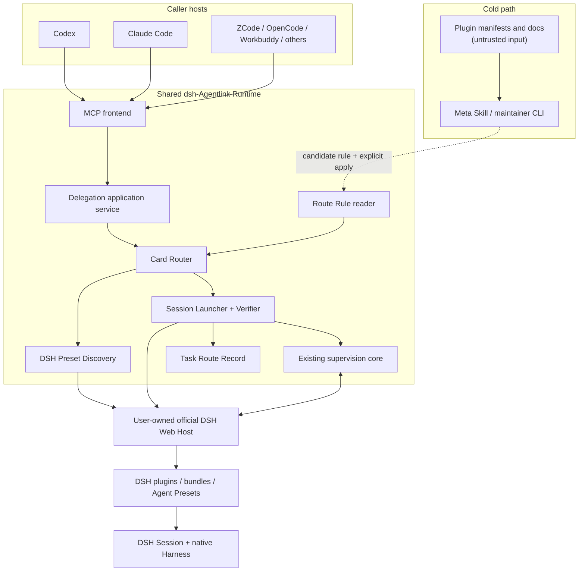
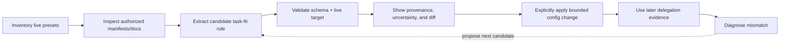

# 插件感知的 DSH 路由架构

[English](plugin-aware-routing-architecture.md) | **简体中文**

- 状态：提议中
- 权威版本：英文文档为准；中文版本应保持语义对齐。
- 目标参考：[插件感知的 DSH 路由需求](plugin-aware-routing-requirements.zh-CN.md)
- 当前运行时参考：[架构与安全模型](architecture.zh-CN.md)
- 调用方扩展参考：[多调用方扩展架构](caller-integration-architecture.zh-CN.md)
- 范围：一个调用方中立的路由层，在创建新的受监督任务之前选择一个已经配置好的 DSH Agent Preset。

## 1. 决策摘要

- Agentlink 会在共享 Runtime 内加入插件感知路由，而不是放进各个 Caller Integration Pack。
- 正常路径会使用内部确定性的 Card Router：
  - 接收任务和可选的紧凑 hint；
  - 读取当前本地路由规则和实时 DSH preset roster；
  - 不调用 LLM、不读取 README，直接选择一个 Agent Preset；
  - 创建空白 session，验证 DSH 实际解析出的 preset，然后才发送真实任务。
- 插件文档和广泛发现仍属于冷路径维护工作：
  - 未来 Meta Skill 或 CLI 可以读取文档并提出 route rule；
  - 提议的规则仍是受限数据，必须显式应用；
  - 普通委派永不执行 README 指令。
- v1 逻辑模型包含三个对象：
  - **Live Preset Roster**：为当前委派读取的临时 DSH 事实；
  - **Route Rule**：紧凑的内部匹配和 preset 选择数据；
  - **Task Route Record**：描述选择和解析结果的无内容元数据。
- 独立持久的 Plugin Manifest、Launch Profile、能力图、catalog cache 或不可变 hash snapshot 都推迟到有具体集成证明必要时再做。
- 实现只从 Phase 1 的事实面开始：先增加 typed preset discovery 和 requested/resolved preset reporting，再实现自动选择。
- 保持公共兼容性：
  - 显式 `agentPreset` 仍表示手动选择；
  - 没有显式 preset 且没有自动路由 opt-in 时，保留当前 DSH 默认行为；
  - 自动路由是现有委派用例的增量模式；
  - 普通委派仍没有每任务 `model` 参数。

## 2. 架构路线与评审视角

- 产物路线：
  - 这是针对现有 Node.js MCP Runtime 和 DSH 后端的代码/产品架构规格；
  - 它不是新的调用方集成、DSH 插件打包规格或用户界面设计。
- 用于形成决策的评审角色：
  - 架构评审定义组件边界、数据所有权和兼容性；
  - 批判评审挑战事务性声明、fallback 安全、缓存、canary probe 和过度设计的 schema；
  - 事实审计检查当前 Agentlink 代码和已安装 DSH rc.6 API 类型；
  - 需求评审区分当前行为、v1 义务和推迟的可能性。
- 用户视角：
  - 用户希望自己的 DSH Harness 配置能被智能使用，而不是每个任务都手选 preset；
  - 如果调用方反复加载插件手册、静默选择较弱 preset 或修改 DSH 配置，体验就是错误的。
- 调用方视角：
  - Codex、Claude Code 和未来调用方需要一个紧凑的委派契约和一个监督模型；
  - 它们不应包含 DSH 插件专用路由逻辑。
- 实现者视角：
  - 当前 bridge 已能把可选 preset 转发给 `session.create`，并负责任务监督；
  - DSH 暴露了足够事实来发现 preset roster 和验证 resolved preset，但没有通用工具/能力证明 API。
- 评审者视角：
  - 如果设计削弱 approval、Host 生命周期、内容存储、workspace claim 或显式 preset 语义，应拒绝；
  - 如果在实测失败需要之前引入 cache/hash/self-tuning 机制，也应拒绝。
- 维护者视角：
  - route schema 必须从真实 preset 和真实失败中增长；
  - 当前、计划中、缺失和未验证能力必须保持清晰区分。

## 3. Champion、Challenger 与 Falsifier

### 3.1 Champion：实时事实加小型内部规则集

- 形态：
  - 在现有委派用例上增加 opt-in 自动模式；
  - 每次自动委派都重新读取 route rule，并重新调用 `agentPreset.list`；
  - 本地确定性匹配；
  - `session.create(agentPreset)` 加创建后 preset 验证；
  - 紧凑的 Task Route Record；
  - 热路径不调用 LLM、不加载文档、不使用缓存协议、不自动 fallback。
- 选择原因：
  - 用最少的新权限解决实际 token 和易用性问题；
  - 使用 DSH 原生 session composition，而不是复制 Harness 内部机制；
  - 保持调用方中立，并能组合当前监督状态机；
  - 在加入平台级子系统前，容易用真实 preset 证伪。
- 假设：
  - 少量 task kind 和 signal 可以可靠路由常见工作；
  - DSH 继续暴露当前 preset list，以及 session 创建/列表中的 resolved preset；
  - 插件专用 Harness 指令通常已经是所选 preset 的一部分。
- 可能失败模式：
  - 模糊 route rule 选择了不合适的 preset；
  - preset 在 roster 读取和 session 创建之间变化；
  - 仅靠 preset identity 无法推断插件功能；
  - 维护者夸大了从文档推断出的能力。

### 3.2 Challenger：每次委派都让调用方模型发现

- 形态：
  - 暴露 profile search 和 description 工具；
  - 让调用方模型检查候选并在委派前选择。
- 优化目标：
  - 不维护确定性规则集也能灵活语义推理；
  - 插件生态很小时容易实验。
- 不选择原因：
  - 每个普通任务都会增加 MCP 往返和 token 成本；
  - 扩展到几十或上百个 profile 时表现很差；
  - route 质量依赖被截断的说明文本和调用方模型行为；
  - 让不可信插件说明更接近决策权限。
- 它超过 champion 的条件：
  - 代表性任务无法用紧凑 signal 和 DSH 事实可靠路由，并且缺失区分无法由窄 typed DSH endpoint 或显式用户规则提供。

### 3.3 最便宜的证伪器

- 原型输入：
  - 六到十个代表性任务；
  - 两个内置 preset，以及安装时的两个 routing-suite preset；
  - 一个小型手写 route 文件；
  - 实时 preset-list 和 resolved-preset 检查。
- 在以下情况下拒绝 champion 或回传修正：
  - 正确选择反复需要在任务时读取完整插件文档；
  - Host 无法揭示 resolved preset；
  - 通用工具能力是必要的，但无法作为 typed fact 获得；
  - 同一个共享 router 无法同时服务 Codex 和 Claude Code；
  - 安全决策需要信任插件说明文本。
- 不要因为证伪失败就自动添加 hash、embedding、cache、更多 prompt 文本或 self-tuning。

## 4. 当前事实与缺失事实

- 已在 2026-08-18 针对已安装 DSH `0.1.0-rc.6` 类型表面验证：
  - `agentPreset.list` 返回当前 roster，字段包括 id、trust、default state、description 和 broken state；
  - `agentPreset.select` 只适用于空白 session，turn 开始后会 locked；
  - `agentPreset.read` 作为特权 composition read 存在，但热路径不需要；
  - `skill.list(sessionId)` 返回 session 范围内的 skill catalog，不会创建或恢复 agent；
  - `session.create` 接收可选 `agentPreset`，并在可用时返回 resolved preset；
  - preset discovery 会重新读取 roots，因此新的委派可以在没有 Agentlink catalog service 的情况下看到新增或删除。
- 当前 Agentlink 事实：
  - `dsh_delegate` 已经接收可选 `agentPreset` 并转发给 `session.create`；
  - bridge 已负责任务映射、协作式 workspace claim、model-route checks、prompt submission、status、events、approvals、follow-up、cancellation 和 recovery；
  - DSH session/history 仍是内容权威来源；
  - routing rules、automatic selection 和 Task Route Records 还不存在。
- DSH rc.6 当前未暴露的事实：
  - 通用的每 session 工具/能力清单；
  - 公共 preset-composition generation id；
  - preset-catalog revision 或 change notification；
  - 适合作为跨 Host catalog key 的 Host/profile identity。
- 后果：
  - v1 可以验证 roster presence、broken state、selected preset、resolved preset 和 session Skills；
  - v1 不能诚实地把 `repo.write`、`subagents.parallel` 或 `network=false` 等任意声明标记为 runtime-verified capabilities；
  - 本地 hash 或 revision 只能 fingerprint Agentlink 文件，不能证明 DSH 挂载了哪个 composition；
  - 通用 capability attestation 仍是可能的窄 DSH API 提案，不应由 Agentlink 推断。

## 5. 系统上下文与权限边界



- Agentlink 负责：
  - 解释显式自动路由输入；
  - 本地规则解析和确定性选择；
  - 实时 DSH preset discovery；
  - launch verification 和 typed routing diagnostics；
  - 无内容 route metadata；
  - 现有监督语义。
- DSH 负责：
  - 插件和 bundle 安装；
  - Agent Preset composition 和 mounting；
  - model 和 provider routing；
  - tool、Skill、worker、permission、sandbox、session 和 history 行为；
  - DSH Web 可见性和人类交互。
- Caller Integration Pack 负责：
  - 把同一个 MCP Runtime 安装到各调用方；
  - 调用方专用的自动路由 opt-in 指令；
  - 权限和 reload 指引。
- 未来 Meta Skill 可以负责关于文档的认知，但不拥有任意执行权限。

## 6. 组件架构

### 6.1 MCP frontend

- 继续暴露共享的 `dsh_*` 工具族。
- 组件继续命名为 `Card Router`，但正式的 v1 输入对象统一为 Route Rules；不需要再定义单独的 `RouteCard` 类型。
- 验证互斥选择模式：
  - 显式 `agentPreset`；
  - 显式自动路由请求；
  - 两者都没有，即保留 DSH 默认行为。
- 不包含插件专用逻辑或 route score。
- 正常运行只返回紧凑选择摘要。

### 6.2 Delegation application service

- 编排现有委派生命周期。
- 只有显式请求自动路由时才调用 Card Router。
- 将 router 输出视为 requested preset，而不是 mounted Harness 的证明。
- DSH 创建 session 后，在任何后续 setup check 之前保存正常 task mapping，确保每个已创建 session 都有可恢复的 task handle。
- 只有 preset verification 通过后，才继续 workspace claim、model-route、prompt 和 wait 行为。

### 6.3 Route Rule reader

- 读取小型本地声明式规则集。
- v1 应为每次自动委派重新读取规则集：
  - 读取约一百条紧凑规则的文件 I/O 成本很低；
  - 这能让用户修改在长生命周期调用方进程中可见；
  - 避免在 profiling 证明需要之前发明 cache invalidation。
- 解析 fail-closed：
  - malformed 或 unsupported 配置不会 fallback 到猜测行为；
  - 自动请求返回 typed configuration error；
  - 自动请求在没有 route-rule 配置时返回 `routing_not_configured`；
  - 显式委派和 DSH-default 委派仍可独立使用。
- 未来 Agentlink 自有 writer 必须使用受限 conflict detection 和 atomic replacement；Runtime 不执行来自插件的 writer callback。

### 6.4 Card Router

- 接收：
  - normalized task hints；
  - requested workspace claim mode；
  - 当前 route rules；
  - 当前 live preset roster。
- 产出：
  - selected rule id；
  - requested Agent Preset；
  - deterministic reason code 和受限 decision facts；
  - 无副作用。
- 不会：
  - 调用 DSH mutation API；
  - 调用 LLM 或 embedding service；
  - 读取文档；
  - 修改 model、permission、approval、sandbox、network 或 credentials；
  - 在 v1 自动 fallback。

### 6.5 DSH Preset Discovery adapter

- 包装 DSH `agentPreset.list` 事实表面。
- 只规范化 DSH 实际报告的字段。
- 将 `trust` 保持为 provenance metadata，绝不转换成 permission guarantee。
- 热路径不使用 `agentPreset.read`。
- session 创建后可以使用 `skill.list` 做诊断，但不能把它当成通用 tool inventory 的替代品。

### 6.6 Session Launcher and Verifier

- 接收来自显式选择、自动路由或 DSH default 的 requested preset。
- 调用现有 session-creation path 一次；非幂等创建不会自动重试。
- Session 创建后保存正常 task mapping 和初始 Task Route Record。
- 检查 `session.create` 或 fresh session summary 返回的 preset。
- selected 与 resolved 不匹配时，在 workspace claim 和真实 prompt 前停止，同时返回该未发送 prompt session 的 task/session 标识。
- 如果无法观察 resolved preset，则该 Host version 不支持自动路由；manual 和 DSH-default 兼容路径继续遵守现有行为。
- 保留 workspace claim acquisition 在 session 创建后发生竞争时的当前行为：
  - 保留未发送 prompt 的 task/session mapping；
  - 返回冲突和恢复信息；
  - 不在没有 claim 的情况下静默运行。

### 6.7 Task Route Record

- 只存储进程重启后需要的协调元数据。
- 不作为对话内容进入 event ledger。
- 逻辑所有权属于 task coordination；实现可以复用现有 atomic TaskStore 机制，也可以使用独立的无内容 record。
- 物理文件布局是实现选择，本提案不冻结。

### 6.8 Meta Skill and maintainer CLI

- 保持在普通 MCP 热路径之外。
- 可以执行用户授权的冷路径工作：
  - inventory presets；
  - 检查 plugin manifests 和 documentation；
  - 提出 candidate rule；
  - 显示 provenance 和 uncertainty；
  - 验证语法和 live target 存在；
  - 显示 diff 并显式应用；
  - 诊断 rule 和 Host 分歧。
- 不得：
  - 执行 README 提供的命令；
  - 把安装或启用 Host bundle 当成隐含 routing action；
  - 修改 DSH 全局安全设置；
  - 注入 credentials；
  - auto-publish changes；
  - 修改 running session 的 preset。

## 7. v1 逻辑数据模型

### 7.1 Live Preset Roster

- roster 是临时的，且归 DSH 所有。
- 示例 normalized shape：

```ts
interface LivePresetFact {
  id: string;
  trust: "system" | "user";
  isDefault: boolean;
  name?: string;
  description?: string;
  brokenReason?: string;
}
```

- 它只为一次 routing attempt 创建，不作为第二个 catalog source of truth 持久化。

### 7.2 Route Rule

- 以下 shape 只是示例，刻意不是冻结的 public contract：

```ts
interface RouteRule {
  id: string;
  agentPreset: string;
  activation: {
    taskKinds?: string[];
    signals?: string[];
    excludes?: string[];
  };
  routing?: {
    priority?: number;
    preference?: "speed" | "balanced" | "quality";
  };
  provenance: {
    source: "builtin" | "user" | "maintainer-proposal";
  };
  reason?: string;
}
```

- 设计约束：
  - `agentPreset` 是 v1 唯一 launch operation；
  - `taskKinds`、`signals` 和 `excludes` 表达 routing fit，不表达 security facts；
  - 除非有已证明的 route requirement 需要 eligibility constraint，否则 `workspaceClaimMode` 保持为 request-level Agentlink 字段；
  - 不包含任意 initialization 和 postcondition arrays；
  - 不包含 plugin docs 和 credentials；
  - 只有真实 preset 需要经过评审的 typed initialization，且超出 `agentPreset` 时，才提取独立 Launch Profile。

### 7.3 Task Route Record

```ts
interface TaskRouteRecord {
  taskId: string;
  selectionMode: "dsh-default" | "manual" | "automatic";
  routeRuleId?: string;
  requestedPreset?: string;
  resolvedPreset?: string;
  verification: "verified" | "partial" | "failed";
  reasonCode?: string;
  recordedAt: string;
}
```

- record 刻意省略：
  - prompt、response、tool、question 或 approval bodies；
  - plugin documentation；
  - generic capability claims；
  - 伪装成能识别 DSH-mounted composition 的本地 hash。

## 8. 公共委派契约

- v1 选择方向是扩展现有委派用例，而不是立即引入第二个 primary tool。
- 示例输入：

```json
{
  "prompt": "Implement the fix and run the focused tests",
  "cwd": "/repo",
  "workspaceMode": "exclusive-write",
  "routing": {
    "mode": "auto",
    "taskHints": {
      "kind": "implementation",
      "signals": ["multi-file", "tests-required"],
      "preference": "speed"
    }
  }
}
```

- 兼容规则：
  - 存在 `agentPreset`，没有 `routing.mode=auto`：手动 preset selection；
  - 存在 `routing.mode=auto`，没有 `agentPreset`：自动 selection；
  - 两者都没有：当前 DSH-default 行为；
  - 两者都存在：因 authority ambiguous 返回 `invalid_request`；
  - 不增加 `model` 字段。
- 现有公开 MCP 字段可以继续叫 `workspaceMode`；本文使用“workspace claim mode”作为概念名称，避免把它误解为 DSH sandbox control。
- 示例普通结果扩展：

```json
{
  "taskId": "dsh_...",
  "routing": {
    "selectionMode": "automatic",
    "routeRuleId": "fast-implementation",
    "requestedPreset": "router-standard",
    "resolvedPreset": "router-standard",
    "verification": "verified",
    "reasonCode": "task_kind_and_signals"
  }
}
```

- 准确字段名留给 implementation PR 决定。
- 只有以下情况才更适合单独的 `dsh_delegate_auto`：
  - combined schema 让调用方模型困惑；
  - 需要不同 approval 或 tool exposure；
  - 兼容性测试显示现有客户端错误处理可选 routing object。
- 详细 explanation 应优先通过 status/doctor 或显式 diagnostic mode 提供；除非价值超过 tool-schema context 成本，否则不需要新的 always-loaded MCP tool。

## 9. 热路径序列

```mermaid
sequenceDiagram
    participant C as Caller
    participant B as Agentlink BridgeService
    participant R as Card Router
    participant H as DSH Host
    participant S as Existing Supervisor

    C->>B: dsh_delegate(task, routing=auto)
    B->>B: Read and validate current Route Rules
    B->>H: agentPreset.list
    H-->>B: Live Preset Roster
    B->>R: select(taskHints, rules, roster)
    R-->>B: ruleId + requestedPreset + reason
    B->>H: session.create(cwd, agentPreset)
    H-->>B: sessionId + resolved agentPreset
    B->>S: Persist task mapping + initial route metadata
    B->>B: Verify requested == resolved
    alt mismatch or missing fact required by policy
        B-->>C: Typed failure + task/session ids; claim and real prompt not issued
    else verified
        B->>S: Acquire workspace claim
        S->>H: Read live model route / perform existing checks
        S->>H: session.prompt(real task)
        S-->>C: taskId + compact routing digest
    end
```

- “Verify requested == resolved” 是创建后的安全检查，不是事务。
- 当前调用解析 rule 后，route-rule 变化不会修改 in-flight decision：
  - 当前调用使用已解析的 rule value，并验证实际 preset；
  - 下一次调用重新读取 rule file；
  - 不把本地 hash 表述为 Host transaction boundary。
- Web 用户仍可能并发修改 DSH 状态；fresh reads 和 typed failures 仍是缓解措施。

## 10. 确定性路由算法

- 输入规范化：
  - unknown task hints 按实现 schema 拒绝或忽略，绝不执行；
  - 字符串只为匹配而规范化，不解释为命令；
  - task hints 不能授予 permission。
- Hard eligibility：
  - 目标 `agentPreset` 存在于 live roster；
  - 目标未被报告为 broken；
  - rule enabled 且语法有效；
  - exclusion signals 不匹配；
  - 显式支持的 Host-version constraint 满足；
  - 没有 rule 要求 Agentlink 无法验证或授权的 safety effect。
- Soft scoring：
  - 精确 task-kind match；
  - positive signal matches；
  - 配置的 priority；
  - rule 显式支持时的可选 speed/balanced/quality preference。
- Tie-breaking：
  - 更高 hard/soft match score；
  - 更高 explicit priority；
  - 更多 exact signal matches；
  - 以字典序更小的 rule id 作为最终确定性 tie-break。
- No-match 行为：
  - 返回 `no_eligible_route` 和受限 reason codes；
  - 不静默使用 DSH default；
  - 调用方或用户可以不使用自动路由重试，以显式请求 DSH-default 行为。
- Confidence：
  - v1 不需要 numeric probability；
  - 如果测试显示有帮助，可以报告 `exact`、`ranked` 或 `ambiguous` 这样的小枚举；
  - ambiguous ties 可以失败并请求澄清，而不是暴露所有 card。

## 11. Trust、capabilities 与 safety effects

- Provenance levels 服务不同目的：
  - **DSH-observed**：roster presence、broken state、resolved preset、session Skill list；
  - **user-configured**：用户指示某 preset 适合特定 task kinds；
  - **maintainer-proposed**：从文档提取、尚未应用的候选；
  - **documentation-inferred**：只作解释性证据，永远不是 permission 或 absence-of-side-effects proof。
- v1 route eligibility 可以使用 user-configured task fit 加 DSH-observed preset availability。
- 除非 typed DSH observation 直接支持，否则 v1 不得把这些 generic capabilities 称为 “verified”。
- DSH `trust="system"|"user"` 是 provenance，不是 safety level。
- Workspace coordination 保持独立：
  - request `workspaceMode` 控制 Agentlink cooperative claims；
  - 它不选择或验证 DSH sandbox mode；
  - route rule 不能用它声明 session 是 read-only。
- Approval 保持独立：
  - route selection 永不修改 DSH approval policy；
  - selected preset 仍可能请求 approval；
  - Agentlink 继续要求 typed explicit resolution，且永不 auto-allow。
- v1 禁用 fallback，因为 Agentlink 当前无法证明任意 preset 之间的 sandbox、tools、network access、approval behavior 和 cost 等价。

## 12. 冷路径学习与维护流程



- Meta Skill 模仿人类“读一次、紧凑记住、失败时再打开”的工作流。
- Candidate generation 可以使用模型，因为它是冷路径、用户可见的维护工作。
- Core code 仍负责：
  - typed DSH facts；
  - schema validation；
  - bounded file writes；
  - conflict detection；
  - live target verification；
  - explicit application。
- Feedback 初始阶段基于人类和外部证据：
  - test outcomes；
  - expected file changes；
  - user reselection；
  - caller acceptance or rework。
- DSH final message 单独不能作为 success label。
- Online self-modification、automatic weight updates、shadow routing 和 telemetry storage 继续推迟。

## 13. State、storage 与 concurrency

- Source-of-truth separation：
  - DSH 拥有 live preset 和 session facts；
  - route rules 表达本地用户/维护者 routing intent；
  - Task Route Records 保存无内容 delegation decisions；
  - DSH history 拥有 conversation content。
- Route-rule reading：
  - v1 每次自动调用都 fresh read；
  - 不需要 file watcher、TTL、`listChanged` 或 background poll；
  - missing file 可以表示“没有 configured auto routes”，而 malformed content 是 typed configuration error。
- Route-rule writing：
  - 初始阶段手动完成，或通过显式 maintainer command 完成；
  - programmatic writer 必须保留无关数据、检测冲突，并使用同目录 atomic replacement；
  - 不允许 plugin-provided arbitrary writer callback。
- 多调用方进程：
  - 每个进程执行自己的 fresh read 和 DSH discovery；
  - 每个进程共享现有 task、claim 和 ledger state home；
  - 不需要 singleton router 或 Gateway。
- TOCTOU：
  - `agentPreset.list -> session.create` 无法由 Agentlink 做成原子操作；
  - post-create preset verification 是窄缓解措施；
  - 未来 DSH generation id 可以改进诊断，但不使用本地 hash 模拟。
- Task Route Record persistence：
  - 必须使用和其他 coordination state 一样的 fail-closed local-filesystem 假设；
  - 不得被视为 DSH content 或 capability source；
  - 初始写入应与正常 task setup 耦合，不能在缺少本功能承诺的诊断 identity 时向 routed session 发送 prompt；
  - Git history、package versions 和 DSH session ids 无法在重启后重建 per-task selection mode 或 rule reason，因此普通 tests 和 version records 不能替代这条小型记录。

## 14. Errors 与 observability

- 提议的 routing error vocabulary：
  - `routing_config_invalid`；
  - `routing_not_configured`；
  - `routing_request_ambiguous`；
  - `no_eligible_route`；
  - `preset_not_found`；
  - `preset_broken`；
  - `resolved_preset_mismatch`；
  - Host 无法暴露自动路由所需 resolved preset 时的 `routing_verification_unavailable`；
  - 现有 `host_unreachable`、workspace conflict、model-route 和 prompt errors 保持独立。
- 每个 error 应说明：
  - 失败 stage；
  - 是否创建了 DSH session；
  - 是否发送了真实 prompt；
  - 安全且可用时的 selected/requested/resolved preset ids；
  - 安全 next actions。
- 正常成功 observability：
  - selection mode；
  - selected rule 和 preset；
  - resolved preset；
  - verification state；
  - task id。
- 详细 rule bodies、所有 candidates、plugin documentation 和 scoring traces 只用于 diagnostic，并且必须 bounded。

## 15. 映射到当前代码库

- 演进应增量进行；不需要先做大范围目录重写。
- 可能的 ownership：
  - `src/mcp-server.ts`
    - 验证可选 routing input 并暴露 compact output；
    - 保持 caller-neutral wording。
  - `src/bridge-service.ts`
    - 编排 manual/default/automatic selection modes；
    - 保留现有 session、mapping、claim、route、prompt 和 wait sequence。
  - 新的窄 router module
    - parse normalized rule data；
    - apply deterministic matching；
    - 返回 side-effect-free decision。
  - `src/dsh-client.ts` 或窄 DSH backend helper
    - 暴露 typed `agentPreset.list` 和 resolved-preset facts，不把 wire details 泄漏给 router。
  - 现有 task coordination storage
    - 增加无内容 route metadata，不把 event ledger 改成 transcript。
  - 未来 maintainer CLI/Skill
    - 保持 optional，并在普通 MCP tool context 之外。
- Dependency direction：

```text
Caller Integration Pack
        ↓
Shared MCP Frontend
        ↓
Delegation Application Service
        ↓
Card Router ← Route Rules
        ↓
DSH Backend Discovery / Session Launcher
        ↓
Existing Supervision Core
```

- Prohibited dependency direction：
  - router import Codex 或 Claude setup code；
  - caller packs import DSH wire clients；
  - Meta Skill 直接 mutate task state；
  - plugin-specific code fork `BridgeService`。

## 16. Delivery phases 与 implementation backlog

### Phase 0：requirements and architecture

- Priority：`must`
- Value：
  - 建立 product promise，并拒绝过度设计或不安全的 PR。
- Deliverables：
  - 本 requirements document；
  - 本 architecture document；
  - README 和 caller-extension architecture 中的链接。
- Continue when：
  - reviewers 同意 opt-in compatibility、live facts、fail-closed launch 和 deferred scope。

### Phase 1：observation and narrow DSH fact adapter

- Priority：`must`
- Value：
  - 证明 Agentlink 可以读取 live roster，并在没有 automatic selection 的情况下报告 requested/resolved presets。
- Work：
  - 给 DSH adapter 增加 typed preset-list support；
  - 在适当位置让 requested/resolved preset 在现有 delegate/status result 中可见；
  - 为 present、missing、broken 和 mismatched presets 增加 mock Host tests。
- Risk：
  - DSH version drift。
- Continue when：
  - supported/tested Host versions 返回足够事实；
  - mismatch 被证明会在 prompt 前停止。
- Backprop when：
  - resolved preset 无法可靠观察。

### Phase 2：opt-in deterministic routing

- Priority：`must`
- Dependencies：
  - Phase 1 facts；
  - agreed minimal route-rule schema。
- Work：
  - 实现 fresh route-rule loading；
  - 实现 side-effect-free deterministic selection；
  - 使用互斥 auto/manual/default modes 扩展现有 delegation；
  - persist Task Route Record；
  - 返回 compact routing diagnostics。
- Risk：
  - route choices 错误或 schema overfitting。
- Continue when：
  - representative table tests 和 live operator tasks 能可预测选择；
  - hot path 不进入 README 或 candidate catalog。
- Backprop when：
  - compact task hints 无法区分真实目标 preset。

### Phase 3：maintainer CLI and candidate rules

- Priority：`should`
- Dependencies：
  - 手写 v1 rules 的体验稳定。
- Work：
  - inventory 和 doctor commands；
  - 从 authorized docs 生成 candidate-rule；
  - provenance 和 uncertainty display；
  - 通过 bounded writer 显式 diff/apply。
- Risk：
  - prompt injection 或 scope creep 到 Host repair。
- Continue when：
  - generated output 保持 candidate-only，且不应用任意 action。

### Phase 4：richer typed facts

- Priority：`could`
- Trigger：
  - 真实 preset 无法用 roster、resolved preset 和 Skills 进行路由或诊断。
- Work：
  - 提议或采用窄 DSH read-only capability endpoint；
  - 只增加由已证明失败要求的字段。
- Stop condition：
  - 唯一可用来源是不可信 prose；不要把 inferred data 表述为 verified。

### Deferred：optimization platform

- Priority：`defer`
- Includes：
  - catalog revision/change events；
  - cache/TTL policy；
  - canary probing；
  - safe fallback proof；
  - semantic retrieval；
  - shadow routing；
  - self-tuning and outcome telemetry；
  - separate Launch Profile and immutable snapshots。
- 只有在有 measured latency、correctness 或 compatibility failures 时才重新考虑。

## 17. Verification plan

- 本节说明如何证明[需求文档第 10 节](plugin-aware-routing-requirements.zh-CN.md#10-v1-验收标准)中的产品结果，不建立第二套需求。
- Static and unit checks：
  - route schema 接收 supported data，并拒绝 executable/unknown shapes；
  - hard filters 和 scoring 是 table-driven 且 deterministic；
  - explicit/manual/default modes 保持 distinct；
  - ties deterministic；
  - no match 和 malformed config fail closed。
- Mock Host integration tests：
  - roster present、missing、broken，以及两次调用之间变化；
  - session create 返回 expected、missing 或 mismatched resolved preset；
  - required verification failure 后绝不发送 prompt；
  - workspace conflict 保留 unprompted task/session report；
  - non-idempotent create/prompt calls 不重试。
- Storage tests：
  - Task Route Record 经 process restart 后仍存在；
  - 它不包含 prompt、response、tool、question、approval、documentation 或 credential bodies；
  - concurrent task records 保持现有 coordination guarantees。
- API and compatibility tests：
  - 当前显式 `agentPreset` 行为保持不变；
  - 无 routing request 保留 DSH-default behavior；
  - Codex 和 Claude integrations 使用同一个 MCP schema；
  - caller-specific setup code 不进入 routing logic。
- External-interference tests：
  - selection 后改变 mock roster，或让 creation 返回不同的 resolved preset；
  - 断言得到 mapped unprompted session、typed failure 和 `promptSent=false`；
  - 断言 router 不会在非幂等 session creation 后静默重选。
- Context-economy checks：
  - 正常结果 bounded 到 selected digest；
  - 不加载或返回完整 rule catalog 或 README；
  - 任何 explain mode 都限制 candidates 和 text。
- Live operator acceptance：
  - 使用 disposable workspace；
  - 运行六到十个 representative tasks；
  - 包含 built-in 和可用 routing-suite presets；
  - 验证 DSH Web session visibility；
  - 捕获 selected 和 resolved preset、test outcome、files changed、follow-up count 和 manual reselection；
  - inspection 后释放 workspace claims。
- 实现后的必需命令：

```bash
npm run check
npm pack --dry-run --ignore-scripts
```

- Live DSH checks 仍属于 operator acceptance，且不得启动、停止或重新配置用户的 Host。

## 18. Supervision and backpropagation

- Main Codex supervisor 保留以下责任：
  - 批准 implementation scope；
  - 检查 public API compatibility；
  - 评审 trust、approval、workspace、Host lifecycle 和 content-storage boundaries；
  - 独立运行 repository checks；
  - 决定 live DSH acceptance 是否安全且已授权；
  - release 和 publication decisions。
- 适合 child-agent lanes：
  - route-schema 和 deterministic-router implementation；
  - mock Host fixtures 和 table-driven tests；
  - 英文/中文 documentation synchronization；
  - read-only DSH API fact audit。
- Sequential work：
  - public schema selection 先于 generated caller instructions；
  - DSH fact adapter 先于 automatic routing；
  - route persistence 先于 restart tests；
  - safety review 先于 live operator acceptance。
- RAF runtime mapping：
  - `raf-dispatch`：分配 bounded modules/tests，并明确 file ownership；
  - `raf-verify`：检查 diffs、运行 type/tests、确认 prompt-not-sent failures，并比较 docs；
  - `raf-backprop`：当 DSH facts 或 real routes 与假设矛盾时回到 requirements/architecture。
- Return to goal setting when：
  - product objective 从选择 configured presets 变成管理/安装 DSH plugins；
  - automatic routing 不再是 opt-in，或用户请求 autonomous Host repair；
  - 提出新的 telemetry 或 optimization product。
- Return to architecture when：
  - DSH 缺少 safe launch verification 所需事实；
  - 真实插件需要 preset selection 之外的 typed initialization；
  - caller 差异要求不同 routing semantics；
  - fallback equivalence 或 capability attestation 成为真实需求。
- Stay inside implementation when：
  - deterministic matcher、parser、error mapping 或普通 test 失败，但不改变 contract。

## 19. Risks and deferred decisions

| Risk | Concrete failure | Selected treatment |
|---|---|---|
| Cards become prompt content | 每个 caller turn 都收到几十条 description | Cards 保持内部；只返回 selected digest |
| Local declaration is mistaken for DSH truth | rule 声称一个不存在的 preset/capability | Fresh roster 加 post-create verification；typed failure |
| “Atomic launch” is overclaimed | preset 在 list 和 create 之间变化 | 声明 TOCTOU boundary；create 后验证 |
| Workspace claim is mistaken for sandbox | 调用方声称 DSH session 是 read-only，但实际不是 | claim semantics 保持显式且分离 |
| Silent fallback changes behavior | 用户期望 routing-suite，却收到 default code preset | v1 不自动 fallback |
| Meta Skill executes untrusted docs | README prompt injection 运行命令或修改 policy | 只允许 candidate data；bounded core writer 和 explicit apply |
| Multiple callers diverge | Codex 和 Claude 实现不同 route scoring | Router 只存在于 shared Runtime |
| Schema expands ahead of evidence | Capability graph 和 launch hooks 变成另一个 plugin runtime | 只为已证明 presets/failures 增加字段 |
| Cache creates stale selections | 长生命周期进程漏掉用户 preset 更新 | v1 fresh roster/rules；缓存前先 profiling |
| Route metadata becomes telemetry | 本地 state 累积 prompts 和 success history | 只使用无内容 Task Route Record |

- 推迟的精确决策：
  - route configuration 文件名和位置；
  - 物理 Task Route Record storage；
  - 最终 MCP field names；
  - dedicated explain tool 还是 doctor/status mode；
  - route-rule distribution 和第三方 contribution model；
  - typed task adapter operations；
  - DSH capability endpoint proposal；
  - caching、change notification、fallback、canary 和 self-tuning。

## 20. Recommended next stage

- 使用本文档和[需求文档](plugin-aware-routing-requirements.zh-CN.md)作为第一个 implementation PR 的唯一 routing design input。
- 只从 Phase 1 开始：
  - typed `agentPreset.list` discovery；
  - requested/resolved preset reporting；
  - mismatch-before-prompt tests。
- 在共享 Runtime 中证明这些事实前，不实现 automatic selection。
- Phase 1 通过 review 后，再用刻意小型的手写规则集和 falsifier tasks 进入 Phase 2。

## 21. References

- [DSH repository](https://github.com/deepseek-ai/deepseek-harness) — 官方 Host、preset、Skill 和 session 实现源码。
- [VS Code activation events](https://code.visualstudio.com/api/references/activation-events) — 轻量声明和按需 activation 的参考。
- [Anthropic Agent Skills overview](https://platform.claude.com/docs/en/agents-and-tools/agent-skills/overview) — progressive disclosure 参考；Agentlink 进一步让所有未选中的 card 留在普通 caller context 之外。
- [MCP caching draft](https://modelcontextprotocol.io/specification/draft/server/utilities/caching) — 仅作为未来设计启发；其 TTL 和 change-notification 语义不能证明 DSH 暴露了 preset catalog revision。
- [MCP tools specification](https://modelcontextprotocol.io/specification/2025-06-18/server/tools) — 将 server-provided descriptions 和 annotations 视为 untrusted input 的参考。
- [Voyager](https://arxiv.org/abs/2305.16291) — verified skill reuse 和 feedback 的长期参考；不是 v1 runtime self-modification 的理由。
