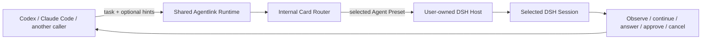

# Plugin-aware DSH routing requirements

**English** | [简体中文](plugin-aware-routing-requirements.zh-CN.md)

- Status: Proposed
- Authority: this English document is authoritative; the Chinese version should remain semantically aligned.
- Scope: product requirements for selecting an appropriate user-configured DSH Agent Preset without making the caller relearn every installed plugin for every task.
- Related architecture:
  - [Plugin-aware routing architecture](plugin-aware-routing-architecture.md)
  - [Multi-caller extension architecture](caller-integration-architecture.md)
  - [Current architecture and safety model](architecture.md)

## 1. Executive overview

- dsh-Agentlink must let a caller such as Codex or Claude Code delegate work to the most suitable DSH Harness configuration while preserving the existing supervision workflow.
- A user's DSH environment can contain very different plugins, tools, Skills, workers, and Agent Presets. The caller cannot assume that every user's `code`, `standard`, or third-party preset has the same behavior.
- The normal delegation path must therefore use a compact internal routing index rather than loading every plugin README or Profile Card into the caller model's context.
- The product outcome is:
  - users configure or teach Agentlink how their DSH presets should be used;
  - the caller supplies the task and, only when requested, compact task hints;
  - Agentlink selects a preset locally, verifies the live DSH result, and starts the session;
  - the caller continues to observe, follow up, answer, approve, cancel, and release the task through the existing `dsh_*` supervision surface;
  - normal delegation does not expose the complete plugin catalog or spend model tokens rereading documentation.
- The first implementation must be deliberately narrow:
  - routing is opt-in and compatible with the current `dsh_delegate` behavior;
  - selection is deterministic and does not call another model;
  - DSH facts are reread for each automatic delegation;
  - no default cache, catalog revision, content hash, canary session, automatic fallback, or self-tuning loop is required.

## 2. Problem statement

- DSH is extensible by design:
  - users can install different plugins and bundles;
  - presets can expose different tools, Skills, workers, prompts, and orchestration behavior;
  - two presets with similar names can have materially different performance, cost, side effects, or task fit.
- The current Agentlink interface can pass an explicit `agentPreset`, but the caller must already know which preset to choose.
- Three naive solutions do not scale:
  - loading every plugin description into the caller context wastes tokens and eventually truncates the information needed for selection;
  - rereading every README for every task increases latency and treats untrusted prose as runtime truth;
  - always using the DSH default preset leaves specialized Harness capabilities unused.
- The system needs a middle layer that behaves like learned human knowledge:
  - detailed documentation is read during installation, onboarding, maintenance, or diagnosis;
  - a compact routing representation is used during ordinary work;
  - documentation is reopened only when the representation is missing, stale, ambiguous, or contradicted by live behavior.

## 3. Goal contract

- Primary objective:
  - maximize useful use of each user's configured DSH Harness capabilities without adding material token or interaction cost to ordinary caller workflows.
- User-visible success:
  - a user can enable automatic routing once and then delegate normally;
  - the selected DSH session is visible in DSH Web and remains fully supervisable through Agentlink;
  - the result says which preset was requested and which preset DSH actually resolved;
  - failures explain whether the route was missing, unavailable, broken, or resolved differently.
- Product constraints:
  - DSH remains the owner of plugins, Agent Presets, models, sessions, tools, Skills, permissions, and sandbox behavior;
  - Agentlink remains connect-only and does not start, stop, daemonize, reconfigure, or upgrade `dsh web`;
  - all callers use the same Agentlink Runtime and routing behavior;
  - Agentlink does not persist conversation bodies or plugin README bodies as task state;
  - existing approval, question, cancellation, recovery, cursor, and workspace-claim semantics remain unchanged.
- Authority boundary:
  - automatic routing may choose among already configured presets under explicit routing rules;
  - it may not install plugins, change Host configuration, widen permissions, change approval policy, inject credentials, publish code, or reinterpret a cooperative workspace claim as a DSH sandbox setting;
  - operations outside those boundaries require a separate, explicit maintenance workflow and the user's authority.

## 4. Terminology

- **DSH plugin or bundle**
  - DSH-owned software and configuration that can contribute tools, Skills, workers, commands, or Agent Presets.
  - It is source material for learning a route, not the unit that Agentlink launches.
- **Agent Preset**
  - The DSH-owned session composition selected during `session.create`.
  - It is the v1 launch unit for routing.
- **Live Preset Roster**
  - The ephemeral result of reading the current DSH Agent Preset list.
  - It is a live fact, not an Agentlink-maintained catalog copy.
- **Route Rule**
  - A compact Agentlink-internal rule that maps task signals to an existing Agent Preset.
  - It is compiled knowledge, not a README summary and not normal caller-model context.
  - “Route Card” is the earlier conceptual name; v1 uses `Route Rule` as the formal data-object name. The `Card Router` component consumes Route Rules.
- **Task hint**
  - Optional caller-provided structured information such as task kind, required evidence, scale, or parallelism preference.
  - It must not grant permissions or override safety boundaries.
- **Task Route Record**
  - Content-free coordination metadata recording what this delegation requested, selected, and resolved.
  - It supports diagnosis after process restart without duplicating DSH conversation content.
- **Meta Skill / maintainer workflow**
  - A cold-path workflow that can inspect documentation, propose route rules, diagnose mismatches, and show changes for confirmation.
  - It does not participate in every ordinary delegation.
- **Workspace claim mode**
  - Agentlink's cooperative coordination claim, currently `exclusive-write` or `read-only`.
  - It is not a DSH permission preset or sandbox guarantee.

## 5. Current state and target state

| Concern | Current state | v1 target | Later possibility |
|---|---|---|---|
| Caller support | Shared MCP Runtime; caller integrations are separate setup packs | One caller-neutral routing behavior | Other protocol frontends over the same core |
| Preset selection | Caller may provide `agentPreset`; omission uses DSH default | Explicit preset remains; opt-in automatic selection is added | Learned or semantic fallback after evidence |
| Preset discovery | DSH rc.6 exposes `agentPreset.list` | Read it immediately before each automatic delegation | Change events or bounded caching if profiling proves a need |
| Session verification | `session.create` can resolve and return a preset | Compare selected and resolved preset before sending the real task | Typed capability endpoint if DSH exposes one |
| Skill discovery | DSH rc.6 exposes `skill.list(sessionId)` | Use only for post-create diagnosis where relevant | Broader typed session capability inventory |
| Plugin understanding | No Agentlink routing knowledge base | User/maintainer-authored compact route rules | Meta Skill-assisted candidate generation |
| Normal prompt cost | Caller must already know the preset | No README or full candidate list in the hot path | Local semantic retrieval only for demonstrated ambiguity |
| Fallback | DSH default or caller choice | No silent automatic fallback | Explicit, safety-equivalent fallback if it becomes provable |

## 6. User and operator journeys

- Initial setup or adaptation:
  - the user installs and configures DSH plugins and presets using DSH-owned mechanisms;
  - a user, maintainer, or Meta Skill inspects the available presets and plugin documentation;
  - it proposes a compact route rule;
  - Agentlink validates the rule shape and confirms that its target preset currently exists;
  - the user explicitly applies the rule.
- Ordinary automatic delegation:
  - the caller sends the task, cwd, workspace claim mode, and optional task hints;
  - Agentlink rereads current route rules and the live DSH preset roster;
  - it deterministically chooses one preset;
  - it creates a DSH session and verifies the resolved preset;
  - only then does it send the real task prompt;
  - the caller receives `taskId` plus a compact selection result.
- Explicit delegation:
  - the caller specifies `agentPreset` as it does today;
  - Agentlink does not override that choice with automatic routing;
  - explicit selection remains observable and verifiable.
- Diagnosis:
  - a route that no longer points to a live preset fails with a typed reason;
  - a preset that resolves differently fails before the real prompt is sent;
  - the user can inspect the selected rule and current roster without loading all route cards into every model turn.
- Maintenance:
  - documentation reading, plugin inspection, candidate generation, probing, and rule changes happen outside the normal delegation path;
  - a maintenance workflow shows proposed changes before applying them;
  - changes affect later delegations, not an already running DSH session.

## 7. Functional requirements

### FR-01: Caller-neutral behavior

- Automatic routing must live in the shared Runtime, not in Codex-, Claude Code-, ZCode-, or Workbuddy-specific Integration Packs.
- Every supported caller must observe the same routing inputs, outputs, errors, and safety behavior for the same Runtime version.
- Caller integrations may teach their host how to supply task hints, but they must not copy or replace the router.

### FR-02: Backward-compatible selection modes

- Existing delegation with an explicit `agentPreset` must remain supported.
- Delegation without `agentPreset` and without an explicit automatic-routing request must preserve the current DSH-default behavior.
- Automatic routing must require an explicit opt-in mode in v1.
- A request that provides both an explicit preset and automatic routing must fail as ambiguous rather than silently choosing one.
- Normal delegation must not gain a public model selector; model routing remains DSH-owned.

### FR-03: Fresh live discovery

- Immediately before automatic selection, Agentlink must read the current DSH Agent Preset roster.
- The router must reject a target that is absent or marked broken.
- A Host reachability failure must remain `host_unreachable`; it must not be misreported as “no matching route.”
- v1 must not depend on an Agentlink-maintained copy of the DSH roster as its source of truth.

### FR-04: Compact route rules

- A route rule must contain only information needed for matching and launch selection.
- A route rule may include:
  - stable local rule id;
  - target Agent Preset id;
  - task kinds and positive signals;
  - exclusion signals;
  - deterministic priority;
  - optional human-readable short reason;
  - provenance indicating whether the rule was written by the user, shipped by Agentlink, or proposed by a maintenance workflow.
- A route rule must not contain:
  - arbitrary shell commands or executable callbacks;
  - credentials;
  - full plugin documentation;
  - arbitrary initialization copied from a README;
  - claims that a workspace claim controls the DSH sandbox.
- Route rules are internal routing inputs. They are not loaded wholesale into caller-model context.

### FR-05: Deterministic, model-free hot-path routing

- The normal router must not invoke an LLM, embedding service, or remote search.
- It must first apply hard eligibility checks, then deterministic scoring and tie-breaking.
- The same task hints, route rules, and live roster must yield the same selected preset.
- Approximately one hundred rules must remain practical with ordinary in-memory filtering; v1 does not require a vector database or bitset index.

### FR-06: Staged fail-closed launch

- Agentlink must not claim that selection and Host launch are transactionally atomic.
- It must use a staged flow:
  - read fresh roster;
  - select a rule and preset;
  - create a blank DSH session with that preset;
  - save the normal `taskId -> sessionId` mapping and an initial Task Route Record for the created session;
  - compare the preset DSH reports with the selected preset;
  - continue into workspace claim, model-route verification, and prompt delivery only when the required checks pass.
- If DSH resolves another preset, Agentlink must not send the real task prompt.
- If the supported Host cannot expose a resolved preset for an automatic selection, Agentlink must report that automatic routing is unsupported for that Host rather than treating the launch as verified.
- A post-create verification failure must return the created task/session identifiers so the unprompted DSH session remains inspectable and recoverable.
- If a workspace claim conflicts after session creation, the existing unprompted task/session recovery behavior must be retained.

### FR-07: Minimal prompt transport

- The selected Agent Preset should carry its own Harness instructions.
- Agentlink must send the user's task without appending all plugin documentation or all route candidates.
- A future task adapter may add compact preset-specific structure only after a demonstrated plugin requires it and the format has typed, reviewed boundaries.
- Questions, approvals, errors, and final responses remain governed by the existing supervision and content-authority model.

### FR-08: Compact selection result and explainability

- A successful automatic delegation must report at least:
  - `taskId`;
  - selection mode;
  - selected route-rule id;
  - selected Agent Preset;
  - DSH-resolved Agent Preset;
  - a short machine-readable reason code.
- The normal result must not include every candidate or full route-rule body.
- Detailed candidate comparison should be available only through an explicit diagnostic or explain operation.
- Manual selection must be identified as manual rather than being presented as an automatic decision.

### FR-09: Typed failure diagnosis

- The first implementation must distinguish at least:
  - automatic routing not configured;
  - no eligible route;
  - route rule invalid;
  - selected preset not found;
  - selected preset broken;
  - Host unreachable;
  - DSH-resolved preset mismatch;
  - Host cannot expose the resolved preset required by automatic routing;
  - ambiguous explicit-plus-automatic request;
  - existing workspace-claim conflict.
- A diagnostic response may suggest safe next actions, but it must not install, reconfigure, approve, or publish anything automatically.

### FR-10: No silent fallback in v1

- If an explicit preset is unavailable, Agentlink must fail and preserve the user's choice.
- If an automatic route becomes unavailable, Agentlink must return a typed diagnosis rather than silently switching to the DSH default or another preset.
- Future fallback requires a separate design proving that it does not widen permissions, network access, workspace effects, approval behavior, cost class, or user intent.

### FR-11: Cold-path learning and maintenance

- The normal Runtime must not read plugin README files for every task.
- A maintenance workflow may:
  - inventory live presets;
  - inspect user-authorized plugin files and documentation;
  - propose compact route rules;
  - validate rule syntax and target existence;
  - show a diff;
  - apply a user-approved change through a bounded writer;
  - diagnose a failed or degraded rule.
- A maintenance workflow must treat third-party documentation as untrusted input.
- It must not execute arbitrary setup hooks or alter DSH Host configuration without a separate explicit operation and user authority.

### FR-12: Route metadata and restart diagnosis

- Each automatically routed task must retain content-free metadata sufficient to answer:
  - whether selection was manual, DSH-default, or automatic;
  - which rule and preset were selected;
  - which preset DSH resolved;
  - whether launch verification passed.
- Route metadata must not contain prompts, responses, tool bodies, question bodies, approval bodies, README content, or credentials.
- DSH session/history remains the only source of truth for conversation content.

### FR-13: Supervision remains unchanged

- An automatically selected task must support the same status, tail, wait, follow-up, typed question answer, typed approval resolution, cancellation, and workspace release operations as a manually selected task.
- Routing success must not imply task success.
- Closing a caller or Agentlink process must not cancel or delete the DSH session.
- A user interacting through DSH Web remains an external actor whose changes must be reconciled using live DSH state.

## 8. Non-functional requirements

### NFR-01: Token economy

- Normal automatic routing must add no complete plugin README and no full route catalog to caller-model context.
- The normal selection digest should remain short enough to be a status result rather than a second planning prompt.
- Token targets are engineering budgets, not compatibility guarantees; they must be measured before being advertised.

### NFR-02: Latency and scale

- v1 must perform only local rule parsing/matching plus the DSH calls already required for live discovery and launch.
- One hundred route rules must not require a specialized database or an additional model call.
- Caching may be introduced only after measurement shows that fresh roster/rule reads materially affect delegation latency.

### NFR-03: Safety and trust

- Documentation-derived or maintainer-inferred functionality may help nominate a route, but must never grant permissions or prove the absence of side effects.
- DSH's `trust` field identifies preset provenance; it must not be presented as a sandbox or permission guarantee.
- Agentlink must never auto-allow DSH approval requests.
- `workspaceClaimMode` must remain explicitly cooperative and must never be described as controlling DSH permissions.
- Route selection must not modify DSH model, permission, approval, network, credential, or plugin settings.

### NFR-04: Reliability and concurrency

- Multiple Agentlink stdio processes may share one state home and Host as defined by the existing architecture.
- A route-rule write performed by an Agentlink maintenance tool must use bounded, conflict-aware, atomic local-file update behavior.
- Runtime reads must fail closed on malformed route configuration rather than guessing.
- The roster-read-to-session-create race cannot be eliminated with current DSH APIs; post-create verification is the required mitigation.

### NFR-05: Compatibility

- The routing feature must not require a new long-lived branch or caller-specific Runtime release.
- The first implementation must record the tested Agentlink, DSH Host, MCP SDK, and caller versions.
- Those tested versions belong in operator acceptance evidence or release/compatibility notes; they are diagnostic evidence, not a new runtime gate by themselves.
- Unknown DSH behavior must be reported as unverified rather than generalized from one local run.
- Host API additions such as capability lists, catalog revisions, or change notifications must remain optional until implemented and tested by DSH.

### NFR-06: Privacy and storage

- Local route rules may contain compact matching metadata and short operator-authored reasons.
- Task Route Records may contain ids, selection mode, preset ids, verification state, and timestamps.
- Neither store may become a transcript, plugin-document mirror, prompt cache, telemetry warehouse, or credential store.

### NFR-07: Maintainability

- The router must be a caller-neutral application component with a narrow interface.
- DSH discovery and launch details must remain behind the DSH backend boundary.
- Route schemas should grow only for requirements demonstrated by real presets or callers.
- A separate persistent Launch Profile object must not be introduced until a real integration requires typed initialization or postconditions beyond preset selection.

## 9. Safety invariants

- Agentlink remains connect-only and never owns `dsh web` lifecycle.
- Automatic routing never changes the configured DSH model.
- Automatic routing never changes or infers the DSH sandbox from an Agentlink workspace claim.
- Automatic routing never auto-answers questions or auto-allows approvals.
- Automatic routing never installs, enables, updates, or removes DSH plugins or bundles.
- Automatic routing never executes instructions copied from third-party documentation.
- Automatic routing never silently falls back in v1.
- A mismatch between selected and resolved preset stops before the real task prompt.
- DSH history remains authoritative for conversation content.
- Existing workspace claim and independent-worktree guidance remains in force.

## 10. v1 acceptance criteria

- Compatibility:
  - existing explicit `agentPreset` requests retain their current semantics;
  - requests with neither an explicit preset nor automatic routing retain DSH-default semantics;
  - all existing bridge tests continue to pass.
- Selection:
  - representative tasks map deterministically to expected presets using only route rules and task hints;
  - tied scores resolve deterministically;
  - an automatic request with no configured route rules returns `routing_not_configured`, while explicit and DSH-default delegation remain available;
  - malformed rules fail closed;
  - absent or broken presets are never selected.
- Launch:
  - the bridge reads the live roster before an automatic delegation;
  - `session.create` receives the selected preset;
  - a mismatched resolved preset prevents the real prompt from being sent;
  - an automatic route with no observable resolved preset does not proceed as verified;
  - a mismatched but already created session retains a task mapping and failed-verification route record;
  - a roster change or Web-side preset change observed between selection and creation produces a typed failure with `promptSent=false` rather than silent reselection;
  - a claim conflict preserves the existing unprompted task/session recovery information.
- Context economy:
  - the ordinary MCP result contains only the selected route digest;
  - no README or full candidate list is loaded into the caller context;
  - the DSH task prompt does not receive unrelated plugin documentation.
- Safety:
  - route rules cannot add arbitrary executable initialization;
  - automatic routing does not touch Host lifecycle, model, permissions, approvals, or plugin installation;
  - Task Route Records contain no conversation or documentation bodies.
- Supervision:
  - automatically routed tasks work with existing status, wait, tail, follow-up, question, approval, cancel, and release flows;
  - the selected and resolved preset remain inspectable after an Agentlink process restart.
- Live operator acceptance:
  - test six to ten representative tasks against a disposable workspace and at least two built-in presets;
  - when installed, include routing-suite presets such as `router-standard` or `router-spec` as optional test subjects;
  - verify the created sessions remain visible in DSH Web;
  - record selected preset, resolved preset, execution outcome, external test evidence, and any manual reselection;
  - do not treat the DSH final message alone as proof of task success.

## 11. Cheapest falsifier

- Before implementing a broad profile platform, build a narrow prototype with:
  - six to ten representative tasks;
  - two to four real presets;
  - a small hand-written route-rule file;
  - live `agentPreset.list` discovery;
  - post-create resolved-preset verification;
  - no README reads in the hot path.
- The v1 architecture is falsified if:
  - reliable selection repeatedly requires full plugin documentation at task time;
  - the DSH APIs cannot reveal which preset was actually resolved;
  - presets cannot be distinguished without a generic capability inventory;
  - route selection cannot remain caller-neutral;
  - a required safety property depends on untrusted plugin prose.
- A falsifier result should backpropagate to architecture rather than trigger more hashes, caches, embeddings, or prompt text.

## 12. Non-goals and deferred capabilities

- Not in v1:
  - automatic plugin installation or Host profile repair;
  - automatic canary sessions in normal delegation;
  - generic tool/capability attestation;
  - catalog revisions, source hashes, frozen Launch Profile snapshots, or cache invalidation protocols;
  - vector databases, embeddings, bitset indexes, or an LLM router;
  - automatic fallback;
  - online self-tuning, shadow routing, success scoring, or telemetry collection;
  - arbitrary per-plugin task compilers or initialization hooks;
  - mutation of a running session's Agent Preset;
  - a new Agentlink Gateway, attach/resume semantics, or another task state machine;
  - a public per-task model selector.
- Reconsider a deferred capability only when a concrete failure cannot be handled by current DSH facts, explicit configuration, version records, deterministic matching, types, or ordinary tests.

## 13. Requirement traceability

| Requirement group | Architecture owner |
|---|---|
| FR-01, FR-02, FR-13 | Shared MCP frontend and delegation application service |
| FR-03, FR-06 | DSH preset discovery and session launch verifier |
| FR-04, FR-05 | Route registry and deterministic Card Router |
| FR-07, FR-08, FR-09 | Delegation result and diagnostic mapping |
| FR-10 | Routing policy and safety boundary |
| FR-11 | Cold-path maintainer workflow |
| FR-12 | Content-free Task Route Record |
| NFR-01, NFR-02 | Hot-path budget and prototype measurements |
| NFR-03, safety invariants | Shared domain core and review policy |
| NFR-04, NFR-06 | Existing state/locking infrastructure plus bounded route storage |
| NFR-05, NFR-07 | Compatibility matrix and incremental module boundaries |

## 14. Decision status

- Accepted as the requirements baseline:
  - internal cards rather than caller-visible plugin descriptions;
  - hot-path router and cold-path maintainer split;
  - Agent Preset as the v1 launch unit;
  - fresh DSH roster read and post-create verification;
  - opt-in, deterministic, model-free routing;
  - no silent fallback and no new security authority.
- Deliberately not frozen:
  - exact route-rule file location and syntax;
  - exact MCP field names for opting into automatic routing;
  - whether explainability is a dedicated tool or a diagnostic mode;
  - the physical storage location for Task Route Records.
- Those details should be selected in the implementation PR and judged against the requirements and acceptance criteria above.
