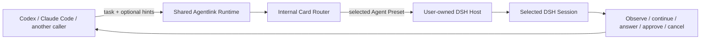

# 插件感知的 DSH 路由需求

[English](plugin-aware-routing-requirements.md) | **简体中文**

- 状态：提议中
- 权威版本：英文文档为准；中文版本应保持语义对齐。
- 范围：产品需求。目标是在不要求调用方为每个任务重新学习所有已安装插件的前提下，选择合适的用户已配置 DSH Agent Preset。
- 相关架构：
  - [插件感知路由架构](plugin-aware-routing-architecture.zh-CN.md)
  - [多调用方扩展架构](caller-integration-architecture.zh-CN.md)
  - [当前架构与安全模型](architecture.zh-CN.md)

## 1. 执行总览

- dsh-Agentlink 必须允许 Codex、Claude Code 等调用方把工作委派给最合适的 DSH Harness 配置，同时保留现有监督工作流。
- 用户的 DSH 环境可能包含差异很大的插件、工具、Skills、workers 和 Agent Presets。调用方不能假设每个用户的 `code`、`standard` 或第三方 preset 具有相同行为。
- 因此，普通委派路径必须使用紧凑的内部路由索引，而不是把每个插件 README 或 Profile Card 加载到调用方模型上下文中。
- 产品结果是：
  - 用户配置或教会 Agentlink 如何使用自己的 DSH presets；
  - 调用方提供任务，并且只在需要时提供由 MCP schema 暴露的共享 Agentlink 词表里的紧凑 task hints；
  - Agentlink 在本地选择 preset，验证实时 DSH 结果，然后启动 session；
  - 调用方继续通过现有 `dsh_*` 监督界面观察、继续、回答、审批、取消和释放任务；
  - 普通委派不会暴露完整插件目录，也不会消耗模型 token 反复阅读文档。
- **长期方向与当前范围有别。**“Plugin-aware delegation”是长期方向；“Preset-aware routing v1”是当前范围。v1 在已经配置好的 DSH Agent Presets 中选择，并不致力于选择或加载插件。
- v1 以可忽略的调用方上下文成本选择一个已配置的 DSH Agent Preset，验证实时启动，并保留监督；它不优化 preset-specific 任务简报。**Task Brief Policy 延后到实验。**
- Core 从不解析自由文本 prompt。调用方模型输出 normalized hints。确定性只适用于相等的 normalized hints、rules 和 live roster。
- 第一版实现必须刻意收窄：
  - 路由是显式启用的，并且兼容当前 `dsh_delegate` 行为；
  - 选择过程是确定性的，不调用另一个模型；
  - 每次自动委派都重新读取 DSH 事实；
  - 不要求默认缓存、目录 revision、内容 hash、canary session、自动 fallback 或自调优循环。

## 2. 问题陈述

- DSH 天生可扩展：
  - 用户可以安装不同插件和 bundles；
  - presets 可以暴露不同工具、Skills、workers、prompts 和编排行为；
  - 名称相似的两个 presets 在性能、成本、副作用或任务匹配度上可能存在实质差异。
- 当前 Agentlink 接口可以传入显式 `agentPreset`，但调用方必须事先知道该选择哪个 preset。
- 三种朴素方案无法扩展：
  - 把所有插件描述加载到调用方上下文会浪费 token，并最终截断选择所需信息；
  - 每个任务都重新阅读所有 README 会增加延迟，并把不可信 prose 当作运行时真相；
  - 总是使用 DSH 默认 preset 会让专用 Harness 能力闲置。
- 系统需要一个类似人类已学习知识的中间层：
  - 详细文档在安装、onboarding、维护或诊断时阅读；
  - 日常工作使用紧凑路由表示；
  - 只有当表示缺失、过期、有歧义或被实时行为反驳时，才重新打开文档。

## 3. 目标契约

- 主要目标：
  - 在不为普通调用方工作流增加明显 token 或交互成本的前提下，最大化利用每个用户已配置的 DSH Harness 能力。
- 用户可见的成功标准：
  - 用户可以启用一次自动路由，然后照常委派；
  - 被选择的 DSH session 在 DSH Web 中可见，并且仍可通过 Agentlink 完整监督；
  - 结果说明请求了哪个 preset，以及 DSH 实际解析了哪个 preset；
  - 失败说明路由是缺失、不可用、broken，还是解析结果不同。
- 产品约束：
  - DSH 继续拥有 plugins、Agent Presets、models、sessions、tools、Skills、permissions 和 sandbox 行为；
  - Agentlink 继续保持 connect-only，不启动、停止、daemonize、重新配置或升级 `dsh web`；
  - 所有调用方使用同一个 Agentlink Runtime 和路由行为；
  - Agentlink 不把对话正文或插件 README 正文作为任务状态持久化；
  - 现有 approval、question、cancellation、recovery、cursor 和 workspace-claim 语义保持不变。
- 权限边界：
  - 自动路由可以在显式路由规则下，从已经配置好的 presets 中选择；
  - 它不能安装插件、修改 Host 配置、扩大权限、修改 approval policy、注入 credentials、发布代码，或把协作式 workspace claim 解释为 DSH sandbox 设置；
  - 超出这些边界的操作需要单独、显式的维护工作流和用户授权。

## 4. 术语

- **DSH plugin or bundle**
  - DSH 拥有的软件和配置，可以贡献 tools、Skills、workers、commands 或 Agent Presets。
  - 它是学习路由的源材料，不是 Agentlink 启动的单位。
- **Agent Preset**
  - 在 `session.create` 时选择的、由 DSH 拥有的 session composition。
  - 它是 v1 路由的启动单位。
- **Live Preset Roster**
  - 读取当前 DSH Agent Preset 列表得到的临时结果。
  - 它是实时事实，不是 Agentlink 维护的目录副本。
- **Route Rule**
  - Agentlink 内部的紧凑规则，把任务信号映射到现有 Agent Preset。
  - 它是编译后的知识，不是 README 摘要，也不是普通调用方模型上下文。
  - “Route Card” 是早期概念名称；v1 统一使用 `Route Rule` 作为正式数据对象名，`Card Router` 组件负责消费 Route Rules。
  - v1 **closed typed hints**：`kind`、`scale`、`parallelism`、`evidence`、`optimizationIntent`。`optimizationIntent` 是 intent，不是性能保证。除非存在显式 catch-all rule，否则 `auto` 需要有效 hints；Meta Skill 不能发明信号。
- **Task hint**
  - 调用方可选提供的结构化信息。v1 的 **closed typed hint set** 是 `kind`、`scale`、`parallelism`、`evidence`、`optimizationIntent`。
  - **Core 从不解析自由文本 prompt。**调用方模型输出 **normalized hints**。确定性只适用于相等的 normalized hints、rules 和 live roster。
  - `optimizationIntent` 是 **intent，不是性能保证**。**自动 hint 语义是非矛盾的**：普通缺失 hints 可以按文档归一化，但没有任何有效 hint 的自动路由必须失败，除非存在显式 catch-all rule；`auto` 需要有效 hints，除非存在显式 catch-all rule；**Meta Skill 不能发明信号**。
  - v1 core values 是一组小型、由 Agentlink 拥有的受控词表（[受控词表](plugin-aware-routing-architecture.zh-CN.md#72-受控任务-hints)），通过共享 MCP schema 暴露，并被所有调用方集成和 route-rule validator 原样消费。
  - Route files 和调用方集成不能发明同义词或私有 core values；plugin-specific extension vocabulary 延后，直到它有有界的发现和分发契约。
  - 它不能授予权限或覆盖安全边界。
- **Task Route Record**
  - 不含内容的协调元数据，记录本次委派请求、选择和解析了什么。
  - 它支持进程重启后的诊断，不复制 DSH 对话内容。
- **Meta Skill / maintainer workflow**
  - 冷路径工作流，可以检查文档、提出路由规则、诊断不匹配，并展示变更供确认。
  - 它不参与每次普通委派。
- **Workspace claim mode**
  - Agentlink 的协作式协调声明，目前是 `exclusive-write` 或 `read-only`。
  - 它不是 DSH permission preset 或 sandbox 保证。

## 5. 当前状态与目标状态

| 关注点 | 当前状态 | v1 目标 | 后续可能性 |
|---|---|---|---|
| 调用方支持 | 共享 MCP Runtime；调用方集成是独立 setup packs | 一套调用方中立的路由行为 | 基于同一 core 的其他协议前端 |
| Preset 选择 | 调用方可以提供 `agentPreset`；省略则使用 DSH 默认值 | 保留显式 preset；增加显式启用的自动选择 | 有证据后再做学习式或语义 fallback |
| Preset 发现 | DSH rc.6 暴露 `agentPreset.list`；相关 rc.7 release contract 已 source/package-audited 为相同，live validation pending | 每次自动委派前立即读取 | 若性能分析证明需要，再加入变更事件或有界缓存 |
| Session 验证 | `session.create` 可以解析并返回 preset | 发送真实任务前比较 selected 和 resolved preset | 如果 DSH 暴露 typed capability endpoint，再使用它 |
| Session addressing | DSH `session.create` 接受预分配的 `sessionId`，并接受 `workspaceId` 或 `cwd` 之一 | 自动路由保留现有 new-task 路径；不把这些字段暴露为 attach/resume inputs | 单独设计 task、claim、cursor 和 recovery 语义后再考虑 attach/resume |
| Skill 发现 | DSH rc.6 和 rc.7 暴露相同的 `skill.list(sessionId)` contract | 只在相关的 post-create 诊断中使用 | 更广泛的 typed session capability inventory |
| 插件理解 | 没有 Agentlink 路由知识库 | 用户或维护者编写的紧凑 route rules | Meta Skill 辅助生成候选 |
| Hint vocabulary | 没有 routing-hint contract | 一组紧凑、Runtime-owned enum，由 MCP schema、validators、tests 和生成的 caller guidance 共享 | 仅在单独设计发现/分发机制后，才支持有界 plugin-specific extension vocabulary |
| 普通 prompt 成本 | 调用方必须已经知道 preset | 热路径不包含 README 或完整候选列表 | 仅在证明存在歧义时使用本地语义检索 |
| Fallback | DSH 默认值或调用方选择 | 不做静默自动 fallback | 若可证明安全等价，再做显式 fallback |

## 6. 用户与运维路径

- 初始设置或适配：
  - 用户用 DSH 拥有的机制安装并配置 DSH plugins 和 presets；
  - 用户、维护者或 Meta Skill 检查可用 presets 和插件文档；
  - 它提出一条紧凑 route rule；
  - Agentlink 验证规则形状，并确认目标 preset 当前存在；
  - 用户显式应用该规则。
- 普通自动委派：
  - 调用方发送任务、cwd、workspace claim mode 和可选 task hints；
  - Agentlink 重新读取当前 route rules 和实时 DSH preset roster；
  - 它确定性选择一个 preset；
  - 它创建 DSH session 并验证 resolved preset；
  - 只有此后才发送真实任务 prompt；
  - 调用方收到 `taskId` 和紧凑选择结果。
- 显式委派：
  - 调用方像今天一样指定 `agentPreset`；
  - Agentlink 不用自动路由覆盖该选择；
  - 显式选择仍然可观察、可验证。
- 诊断：
  - 不再指向实时 preset 的 route 返回 typed reason；
  - 解析结果不同的 preset 在发送真实 prompt 前失败；
  - 用户可以检查被选中的规则和当前 roster，而无需在每个模型 turn 中加载所有 route cards。
- 维护：
  - 文档阅读、插件检查、候选生成、探测和规则变更都发生在普通委派路径之外；
  - 维护工作流在应用前展示拟议变更；
  - 变更影响后续委派，不影响已经运行的 DSH session。

## 7. 功能需求

### FR-01：调用方中立行为

- 自动路由必须位于共享 Runtime 中，而不是 Codex、Claude Code、ZCode 或 Workbuddy 专属 Integration Packs 中。
- 对于同一 Runtime 版本，每个受支持调用方必须观察到相同的路由输入、输出、错误和安全行为。
- 调用方集成可以教自己的 host 如何提供共享 task hints，但不能定义 caller-specific vocabulary、复制或替换 router。

### FR-02：向后兼容的选择模式

- 现有带显式 `agentPreset` 的委派必须继续支持。
- 不带 `agentPreset` 且不带显式自动路由请求的委派，必须保留当前 DSH-default 行为。
- v1 中，自动路由必须要求显式 opt-in mode。
- **`auto` 是每次委派显式请求（`routing.mode=auto`）；持久默认值延后。**
- 同时提供显式 preset 和自动路由的请求必须以歧义失败，而不是静默选择其中一个。
- 普通委派不能新增公开 model selector；model routing 仍由 DSH 拥有。
- 虽然 DSH creation wire 接受预分配的 `sessionId`，并接受 `workspaceId` 或 `cwd` 之一，但自动路由必须使用 Agentlink 现有 new-task flow。在单独 coordination design 定义 task mapping、claims、event cursors、authorization 和 recovery 前，这些 wire fields 不能暴露为 attach/resume 参数。

### FR-03：新鲜的实时发现

- 自动选择前，Agentlink 必须立即读取当前 DSH Agent Preset roster。
- router 必须拒绝不存在或标记为 broken 的目标。
- adapter 必须保留 DSH 可选的 `broken` reason 用于诊断。Roster-level `authorable` 和 `hasDocument` facts 可以由 doctor 或 maintainer workflow 报告，但不能影响 hot-path eligibility，也不能被误表述为 per-preset capabilities。
- Host 可达性失败必须继续是 `host_unreachable`；不能误报为“没有匹配路由”。
- v1 不能依赖 Agentlink 维护的 DSH roster 副本作为真相来源。

### FR-04：紧凑 route rules

- route rule 必须只包含匹配和启动选择所需的信息。
- route rule 可以包含：
  - 稳定的本地 rule id；
  - 目标 Agent Preset id；
  - task kinds 和正向信号；
  - 排除信号；
  - 确定性 priority；
  - 可选的人类可读短原因；
  - provenance，说明该规则由用户编写、由 Agentlink 随包提供，还是由维护工作流提出。
- v1 使用封闭的类型化分类法，route rule 中的匹配与启动选择仅能引用五类受控值：kind、scale、parallelism、evidence、optimizationIntent。不允许任意插件自定义信号；未知值会让 rule configuration invalid，且不能静默按同义词归一化。
- route rule 不能包含：
  - 任意 shell commands 或 executable callbacks；
  - credentials；
  - 完整插件文档；
  - 从 README 复制的任意 initialization；
  - 声称 workspace claim 控制 DSH sandbox 的内容。
- route rules 是内部路由输入。它们不会整体加载到调用方模型上下文。

### FR-05：确定性、无模型的热路径路由

- 普通 router 不能调用 LLM、embedding service 或 remote search。
- 它必须先应用硬性 eligibility checks，然后进行确定性 scoring 和 tie-breaking。
- 相同的 task hints、route rules 和 live roster 必须得到相同的 selected preset。
- 确定性限定在相等的 normalized hints、相等的 rules 和 live roster；它不延伸到自由文本 prompt 或模型生成的 prose。
- **语义相等的候选产生 `ambiguous_route`；rule ids 只用于稳定地排列诊断。**`routing_request_ambiguous` 表示 manual + auto 冲突。active-file 中所有 rules 都是 active；确定性适用于同一 normalized hints 和 live roster 下的每一条被应用规则。
- 一个 canonical Runtime definition 必须生成或验证 MCP enums、route-rule schema、caller guidance 和 table tests。Caller packs 从这个 shared contract 学习词表，不需要用户的完整 rule file 或 plugin catalog。
- 缺失 hints 归一化为文档化的中性默认值。未知字段或未知受控值以 typed routing-hint error 失败；v1 不静默接受任意字符串。
- 大约一百条规则必须能通过普通内存过滤实际处理；v1 不要求 vector database 或 bitset index。

### FR-06：分阶段 fail-closed 启动

- **自动验证语义**（automatic）：缺失的 resolved preset 或 resolved mismatch 都会阻止真实 prompt；验证按情况为 `failed` / `unavailable`（当 Host 无法为自动选择暴露 resolved preset 时为 `unavailable`）。
- **手动验证语义**（manual）：可观察的不匹配会阻止真实 prompt；只有无法观察 resolved preset 的 legacy Host 才能以 verification=unavailable 继续。Manual selection 标识为 manual，不呈现为自动决策。
- **默认验证语义**（DSH-default）：不验证请求的 preset；在可观察时记录实际 resolved preset，不针对请求的 preset 做相等测试。
- **Manual verification = unavailable 兼容性**：当 Host 无法暴露 resolved preset 时，manual selection 仍受支持且兼容（verification-unavailable），而 automatic selection fail closed。
- Agentlink 不能声称选择和 Host 启动是事务性原子的。
- 它必须使用分阶段流程：
  - 读取新鲜 roster；
  - 选择 rule 和 preset；
  - 使用该 preset 创建空白 DSH session；
  - 为已创建的 session 保存正常的 `taskId -> sessionId` 映射和初始 Task Route Record；
  - 比较 DSH 报告的 preset 和 selected preset；
  - 只有在必要检查通过时，才继续 workspace claim、model-route verification 和 prompt delivery。
- 如果 DSH 解析出另一个 preset，Agentlink 不能发送真实任务 prompt。
- 如果受支持 Host 无法暴露自动选择所需的 resolved preset，Agentlink 必须报告该 Host 不支持自动路由，不能把此次启动标为 verified。
- Post-create verification 失败时必须返回已经创建的 task/session 标识，使未发送 prompt 的 DSH session 仍可检查和恢复。
- 如果 session 创建后发生 workspace claim 冲突，必须保留现有未发送 prompt 的 task/session 恢复行为。

### FR-07：最小 prompt 传输

- 被选择的 Agent Preset 应该携带自己的 Harness instructions。
- Agentlink 必须发送用户任务，而不附加所有插件文档或所有 route candidates。
- 只有当某个已验证插件确实需要 preset-specific structure，并且格式具有 typed、已审查边界时，未来 task adapter 才可以添加紧凑结构。
- Questions、approvals、errors 和 final responses 继续由现有监督和内容权威模型管理。

### FR-08：紧凑选择结果与可解释性

- 成功的自动委派必须至少报告：
  - `taskId`；
  - selection mode；
  - selected route-rule id；
  - selected Agent Preset；
  - DSH-resolved Agent Preset；
  - 短 machine-readable reason code。
- 普通结果不能包含每个候选或完整 route-rule body。
- 详细候选比较只能通过显式 diagnostic 或 explain operation 获取。
- 手动选择必须标识为 manual，而不能呈现为自动决策。

### FR-09：Typed failure diagnosis

- **错误优先级：显式有序矩阵。**
  - no matching rule -> `no_eligible_route`；
  - 唯一最优匹配规则但目标缺失 -> `preset_not_found`；
  - 唯一最优匹配规则但目标 broken -> `preset_broken`；
  - 多个匹配候选但全都不可用 -> `no_eligible_route`，并带有有界的拒绝原因（每个 reason 按顺序是短的有界 code + 简短原因，不是整个候选列表）。
- **Active rule files 与 candidates 有别。**Active rules 只存在于 active route file 中；candidates 单独存储，直到用户显式应用，否则永不影响 Runtime。`list-presets`、`route init`、`validate` 和 `doctor` 是非 AI helpers；`route init` 只输出带注释的 skeleton，不推断任何 rule。只有用户显式应用后 rules 才生效。
- 第一版实现必须至少区分：
  - automatic routing 未配置；
  - task hints 对当前共享词表 invalid；
  - no eligible route；
  - route rule invalid；
  - selected preset not found；
  - selected preset broken；
  - Host unreachable；
  - DSH-resolved preset mismatch；
  - Host 无法暴露 automatic routing 所需的 resolved preset；
  - ambiguous explicit-plus-automatic request；
  - existing workspace-claim conflict。
- diagnostic response 可以建议安全的下一步操作，但不能自动安装、重新配置、审批或发布任何内容。

### FR-10：v1 不做静默 fallback

- 如果显式 preset 不可用，Agentlink 必须失败并保留用户选择。
- 如果自动路由不可用，Agentlink 必须返回 typed diagnosis，而不是静默切换到 DSH 默认值或另一个 preset。
- 未来 fallback 需要单独设计，并证明它不会扩大 permissions、network access、workspace effects、approval behavior、cost class 或用户意图。

### FR-11：冷路径学习与维护

- 普通 Runtime 不能为每个任务读取插件 README。
- 维护工作流可以：
  - inventory live presets；
  - 报告 roster-level `authorable` 和 `hasDocument` deployment facts，但不能把它们当作 route-safety evidence；
  - 检查用户授权的插件文件和文档；
  - 提出紧凑 route rules；
  - 验证 rule syntax 和 target existence；
  - 展示 diff；
  - 通过 bounded writer 应用用户批准的变更；
  - 诊断失败或退化的 rule。
- Doctor 和 Host-status diagnostics 必须把 route configuration health 报告为 missing、valid 或 invalid，并在可用时带上有界 rule counts 和 target-preset problems。它们是只读的，不能修复 rule file 或 Host。
- 维护工作流必须把第三方文档视为不可信输入。
- 它不能执行任意 setup hooks，或在没有单独显式操作和用户授权的情况下修改 DSH Host 配置。

### FR-12：路由元数据与重启诊断

- **持久的 Task Route Record 生命周期，精确且无内容。**record 只存储：`selectionMode`、`routeRuleId?`、`requestedPreset?`、`resolvedPreset?`、`verification`（`not-required|verified|unavailable|failed`）、`launchStage`（`session-created|preset-verified|launch-failed|prompt-sent`）、`promptSent`、`failureCode?`、`recordedAt`。`launch-failed` 状态是终极协调失败；`dsh_status` 必须暴露它。初始 record 持久化在**实际 prompt 发送之前**是必需的；`dsh_status` 必须把 `launch-failed` 暴露为终极协调失败。
- **初始 record 无法持久化就不发送 prompt**：如果已创建 session 的初始 Task Route Record 无法持久化，则不得继续 prompt delivery，从而保留一个未发送 prompt、可检查、可恢复的 session。
- **priority 和有界拒绝原因**：错误有定义的优先级顺序和有界拒绝原因；见 FR-09。
- **Phase 2.5 helpers 延后，是非 AI helpers，不是 v1 公开行为**：`list-presets`、`route init`、`validate`、`doctor`。它们不跑在普通委派热路径中，也不是 v1 公开 routing contract 的一部分。
- 每个自动路由任务必须保留不含内容的元数据，足以回答：
  - 选择是 manual、DSH-default 还是 automatic；
  - 选择了哪条 rule 和哪个 preset；
  - DSH 解析了哪个 preset；
  - launch verification 是否通过。
- Route metadata 不能包含 prompts、responses、tool bodies、question bodies、approval bodies、README content 或 credentials。
- DSH session/history 仍是对话内容的唯一真相来源。

### FR-13：监督保持不变

- 自动选择的任务必须支持与手动选择任务相同的 status、tail、wait、follow-up、typed question answer、typed approval resolution、cancellation 和 workspace release 操作。
- 路由成功不代表任务成功。
- 关闭调用方或 Agentlink 进程不能取消或删除 DSH session。
- 用户通过 DSH Web 交互仍然是外部 actor，其变更必须使用实时 DSH state 对账。

## 8. 非功能需求

### NFR-01：Token 经济性

- 普通自动路由不能向调用方模型上下文添加完整插件 README 或完整 route catalog。
- 普通 selection digest 应保持足够短，作为 status result，而不是第二个 planning prompt。
- Token targets 是工程预算，不是兼容性保证；广告宣传前必须先测量。

### NFR-02：延迟与规模

- v1 必须只执行本地 rule parsing/matching，加上 live discovery 和 launch 已需的 DSH calls。
- 一百条 route rules 不能要求专用数据库或额外模型调用。
- 只有当测量显示新鲜 roster/rule reads 会实质影响委派延迟时，才可以引入缓存。

### NFR-03：安全与信任

- 从文档推导或维护者推断的功能可以帮助提名 route，但绝不能授予权限或证明不存在副作用。
- DSH 的 `trust` 字段标识 preset provenance；不能把它呈现为 sandbox 或 permission guarantee。
- Agentlink 绝不能自动允许 DSH approval requests。
- `workspaceClaimMode` 必须保持明确的协作式含义，绝不能描述为控制 DSH permissions。
- Route selection 不能修改 DSH model、permission、approval、network、credential 或 plugin settings。

### NFR-04：可靠性与并发

- 多个 Agentlink stdio 进程可以按现有架构定义，共享一个 state home 和 Host。
- 由 Agentlink 维护工具执行的 route-rule 写入，必须使用有界、冲突感知、原子的本地文件更新行为。
- Runtime reads 在 route 配置畸形时必须 fail closed，而不是猜测。
- 同一个畸形 shared rule file 可能阻塞所有 caller process 中的自动路由，因此 doctor 和 Host status 必须直接暴露该配置失败，而不是让用户从反复出现的 `routing_config_invalid` 结果中推断。
- 在当前 DSH APIs 下，roster-read-to-session-create 竞态无法消除；post-create verification 是必要缓解措施。

### NFR-05：兼容性

- 路由功能不能要求新的长期分支或调用方专属 Runtime release。
- 第一版实现必须记录测试过的 Agentlink、DSH Host、MCP SDK 和 caller versions。
- DSH rc.7 已于 2026-08-17 发布。本设计使用的 `agentPreset`、`skill` 和 `session.create` release contracts 与已安装 rc.6 package 相同，但在常规 live compatibility suite 跑完前，rc.7 runtime behavior 仍未验证。
- 这些已测试版本应写入运维验收证据或 release/compatibility notes；它们本身是诊断证据，不构成新的 runtime gate。
- 未知 DSH 行为必须报告为 unverified，不能从一次本地运行泛化。
- Host API additions，例如 capability lists、catalog revisions 或 change notifications，在 DSH 实现并测试前必须保持可选。

### NFR-06：隐私与存储

- 本地 route rules 可以包含紧凑匹配元数据和短的 operator-authored reasons。
- Task Route Records 可以包含 ids、selection mode、preset ids、verification state 和 timestamps。
- 两种存储都不能变成 transcript、plugin-document mirror、prompt cache、telemetry warehouse 或 credential store。

### NFR-07：可维护性

- router 必须是调用方中立的应用组件，并拥有窄接口。
- DSH discovery 和 launch 细节必须保留在 DSH backend 边界之后。
- Route schemas 只应为真实 presets 或 callers 证明过的需求增长。
- 在真实集成需要 preset selection 之外的 typed initialization 或 postconditions 前，不能引入单独持久的 Launch Profile 对象。

## 9. 安全不变量

- Agentlink 保持 connect-only，永不拥有 `dsh web` lifecycle。
- 自动路由永不修改已配置的 DSH model。
- 自动路由永不根据 Agentlink workspace claim 修改或推断 DSH sandbox。
- 自动路由永不自动回答 questions 或自动允许 approvals。
- 自动路由永不安装、启用、更新或移除 DSH plugins 或 bundles。
- 自动路由永不执行从第三方文档复制的指令。
- 自动路由在 v1 中永不静默 fallback。
- selected 和 resolved preset 不匹配时，在真实任务 prompt 前停止。
- DSH history 仍是对话内容权威来源。
- 现有 workspace claim 和 independent-worktree guidance 继续有效。

## 10. v1 验收标准

- 兼容性：
  - 现有显式 `agentPreset` 请求保留当前语义；
  - 既没有显式 preset 也没有自动路由的请求保留 DSH-default 语义；
  - 所有现有 bridge tests 继续通过。
- 选择：
  - 代表性任务仅使用 route rules 和 task hints，确定性映射到预期 presets；
  - MCP task-hint schema 和 route-rule validator 在 Codex 与 Claude Code 中接受同一组受控值；
  - 缺失 hints 归一化为文档化的中性值，而未知字段或 enum values 返回 `routing_hints_invalid`；
  - tied scores 确定性解析；
  - 自动路由请求在没有配置 route rules 时返回 `routing_not_configured`，同时显式委派和 DSH-default 委派仍可使用；
  - malformed rules fail closed；
  - doctor 或 Host status 区分报告 missing、valid 和 malformed route configuration；
  - absent 或 broken presets 永不被选择。
- 启动：
  - bridge 在自动委派前读取 live roster；
  - `session.create` 收到 selected preset；
  - resolved preset 不匹配会阻止真实 prompt 发送；
  - 自动路由无法观察 resolved preset 时，不会继续并伪装成 verified；
  - 已创建但 resolved preset 不匹配的 session 仍保留 task mapping 和 failed-verification route record；
  - selection 与 creation 之间观察到 roster 变化或 Web 侧 preset 变化时，返回 `promptSent=false` 的 typed failure，而不是静默重选；
  - claim conflict 保留现有未发送 prompt 的 task/session 恢复信息。
- 上下文经济性：
  - 普通 MCP result 只包含 selected route digest；
  - 不把 README 或完整候选列表加载到调用方上下文；
  - DSH task prompt 不接收无关插件文档。
- 安全：
  - route rules 不能添加任意 executable initialization；
  - 自动路由不触碰 Host lifecycle、model、permissions、approvals 或 plugin installation；
  - Task Route Records 不包含对话或文档正文。
- 监督：
  - 自动路由任务可使用现有 status、wait、tail、follow-up、question、approval、cancel 和 release flows；
  - Agentlink 进程重启后，selected 和 resolved preset 仍可检查。
- 实时运维验收：
  - 针对 disposable workspace 和至少两个 built-in presets 测试六到十个代表性任务；
  - 若已安装 routing-suite，则把 `router-standard` 或 `router-spec` 等 presets 作为可选测试对象；
  - 验证创建的 sessions 仍在 DSH Web 可见；
  - 记录 selected preset、resolved preset、execution outcome、external test evidence 和任何 manual reselection；
  - 不把 DSH final message 本身当作任务成功证明。
  - 在针对 rc.7 Host 完成 disposable-workspace live run 前，保持 rc.7 为 source-audited but runtime-unverified。

## 11. 最便宜的证伪器

- 在实现宽泛 profile platform 前，先构建一个窄 prototype，包含：
  - 六到十个代表性任务；
  - 两到四个真实 presets；
  - 一个小型手写 route-rule 文件；
  - 实时 `agentPreset.list` discovery；
  - post-create resolved-preset verification；
  - 热路径不读取 README。
- 如果出现以下情况，则 v1 架构被证伪：
  - 可靠选择反复要求在任务时读取完整插件文档；
  - DSH APIs 不能暴露实际解析了哪个 preset；
  - 没有通用 capability inventory 就无法区分 presets；
  - route selection 无法保持调用方中立；
  - 某个必要安全属性依赖不可信插件 prose。
- 证伪结果应反向传播到架构，而不是触发更多 hashes、caches、embeddings 或 prompt text。

## 12. 非目标与延后能力

- v1 不包含：
  - 自动插件安装或 Host profile 修复；
  - 普通委派中的 automatic canary sessions；
  - 通用 tool/capability attestation；
  - catalog revisions、source hashes、frozen Launch Profile snapshots 或 cache invalidation protocols；
  - vector databases、embeddings、bitset indexes 或 LLM router；
  - 自动 fallback；
  - online self-tuning、shadow routing、success scoring 或 telemetry collection；
  - 任意 per-plugin task compilers 或 initialization hooks；
  - 修改运行中 session 的 Agent Preset；
  - 把 DSH `sessionId` 或 `workspaceId` 暴露为新的 Agentlink Gateway、attach/resume 语义或另一套 task state machine 的捷径；
  - route-file-defined 或 caller-specific core hint strings；未来 extension vocabulary 需要显式、有界的发现和分发设计；
  - 公开的 per-task model selector。
- 只有当某个具体失败无法被当前 DSH facts、显式配置、version records、确定性 matching、types 或普通 tests 处理时，才重新考虑延后能力。

## 13. 需求可追踪性

| 需求组 | 架构负责人 |
|---|---|
| FR-01, FR-02, FR-13 | Shared MCP frontend and delegation application service |
| FR-03, FR-06 | DSH preset discovery and session launch verifier |
| FR-04, FR-05 | Route registry and deterministic Card Router |
| FR-07, FR-08, FR-09 | Delegation result and diagnostic mapping |
| FR-10 | Routing policy and safety boundary |
| FR-11 | Cold-path maintainer workflow |
| FR-12 | Content-free Task Route Record |
| NFR-01, NFR-02 | Hot-path budget and prototype measurements |
| NFR-03, safety invariants | Shared domain core and review policy |
| NFR-04, NFR-06 | Existing state/locking infrastructure plus bounded route storage |
| NFR-05, NFR-07 | Compatibility matrix and incremental module boundaries |

## 14. 决策状态

- 接受为需求基线：
  - 使用 internal cards，而不是调用方可见的插件描述；
  - hot-path router 和 cold-path maintainer 分离；
  - Agent Preset 作为 v1 启动单位；
  - 新鲜 DSH roster read 和 post-create verification；
  - opt-in、确定性、无模型路由；
  - 一组紧凑、Runtime-owned v1 task-hint vocabulary，通过 MCP schema 共享；
  - 不做静默 fallback，不增加新的安全权限。
- 有意不冻结：
  - route-rule 文件的确切位置和语法；
  - 启用自动路由的确切 MCP 字段名；
  - explainability 是 dedicated tool 还是 diagnostic mode；
  - Task Route Records 的物理存储位置。
- 这些细节应在实现 PR 中选择，并根据以上需求和验收标准评判。
